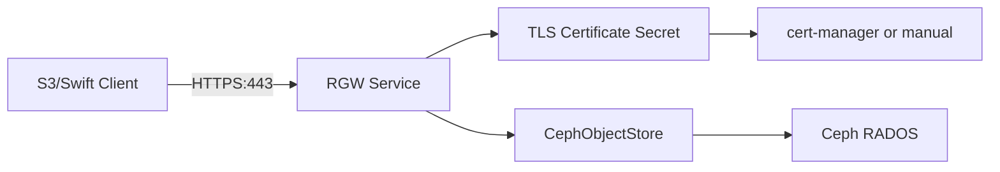

# How to Configure CephObjectStore Security with TLS in Rook

Author: [nawazdhandala](https://www.github.com/nawazdhandala)

Tags: Rook, Ceph, Kubernetes, ObjectStore, TLS, Security, RGW, HTTPS

Description: Learn how to configure TLS for a Rook CephObjectStore RGW, including certificate management with cert-manager, manual secrets, and client verification.

---

Enabling TLS on a Rook `CephObjectStore` ensures all S3 and Swift traffic between clients and RGW is encrypted in transit. Rook supports both manually managed certificates and cert-manager-issued certificates.

## TLS Architecture



## Option 1: Manual Certificate Secret

Create a TLS secret with your certificate and private key:

```bash
kubectl create secret tls rgw-tls-cert \
  --cert=path/to/tls.crt \
  --key=path/to/tls.key \
  -n rook-ceph
```

Reference the secret in the `CephObjectStore`:

```yaml
apiVersion: ceph.rook.io/v1
kind: CephObjectStore
metadata:
  name: my-store
  namespace: rook-ceph
spec:
  metadataPool:
    failureDomain: host
    replicated:
      size: 3
  dataPool:
    failureDomain: host
    replicated:
      size: 3
  preservePoolsOnDelete: true
  gateway:
    # Disable HTTP when TLS is enabled in production
    port: 80
    securePort: 443
    instances: 2
    sslCertificateRef: rgw-tls-cert
    resources:
      requests:
        cpu: "500m"
        memory: "1Gi"
      limits:
        cpu: "2"
        memory: "2Gi"
```

## Option 2: cert-manager Certificate

Create a cert-manager `Certificate` resource targeting the RGW service:

```yaml
apiVersion: cert-manager.io/v1
kind: Certificate
metadata:
  name: rgw-cert
  namespace: rook-ceph
spec:
  secretName: rgw-tls-cert
  issuerRef:
    name: cluster-issuer
    kind: ClusterIssuer
  dnsNames:
    - rook-ceph-rgw-my-store.rook-ceph.svc
    - rook-ceph-rgw-my-store.rook-ceph.svc.cluster.local
    - s3.example.com
  duration: 8760h
  renewBefore: 720h
```

Then reference the same secret name in the `CephObjectStore`:

```yaml
gateway:
  securePort: 443
  instances: 2
  sslCertificateRef: rgw-tls-cert
```

## HTTPS-Only Configuration

To disable plain HTTP and enforce HTTPS:

```yaml
gateway:
  # port: 80   <-- comment out or remove to disable HTTP
  securePort: 443
  instances: 2
  sslCertificateRef: rgw-tls-cert
```

## Verify TLS is Working

```bash
# Check RGW pods have the cert mounted
kubectl get pods -n rook-ceph -l app=rook-ceph-rgw
kubectl describe pod -n rook-ceph <rgw-pod-name> | grep -A5 "Volumes"

# Test HTTPS endpoint
kubectl exec -n rook-ceph deploy/rook-ceph-tools -- \
  curl -v --cacert /etc/ssl/certs/ca-certificates.crt \
  https://rook-ceph-rgw-my-store.rook-ceph.svc:443/

# Test with AWS CLI (skip verify for self-signed)
aws s3 ls --endpoint-url https://rook-ceph-rgw-my-store.rook-ceph.svc:443 \
  --no-verify-ssl
```

## Updating the Certificate

When a certificate is renewed or replaced:

```bash
# Update the secret (cert-manager handles this automatically)
kubectl create secret tls rgw-tls-cert \
  --cert=new-tls.crt \
  --key=new-tls.key \
  -n rook-ceph \
  --dry-run=client -o yaml | kubectl apply -f -

# Restart RGW pods to pick up the new cert
kubectl rollout restart deployment -n rook-ceph -l app=rook-ceph-rgw
```

## Configuring S3 Clients to Trust the CA

For applications inside the cluster using a custom CA:

```yaml
# ConfigMap with custom CA cert
apiVersion: v1
kind: ConfigMap
metadata:
  name: custom-ca
  namespace: default
data:
  ca.crt: |
    -----BEGIN CERTIFICATE-----
    ...
    -----END CERTIFICATE-----
---
# Mount in application pods
volumes:
  - name: ca-cert
    configMap:
      name: custom-ca
containers:
  - name: app
    volumeMounts:
      - name: ca-cert
        mountPath: /etc/ssl/custom
    env:
      - name: AWS_CA_BUNDLE
        value: /etc/ssl/custom/ca.crt
```

## Summary

Rook CephObjectStore TLS is configured via the `gateway.securePort` and `gateway.sslCertificateRef` fields. Use cert-manager for automated certificate lifecycle management or manually create a TLS secret. For production deployments, disable the plain HTTP port and configure all S3 clients to present the correct CA certificate to verify the RGW endpoint.
