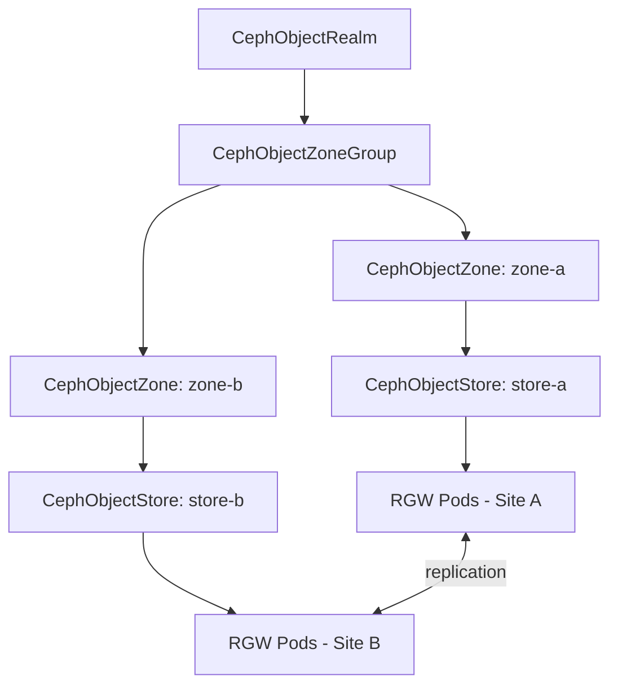

# How to Create CephObjectStore in Rook with Zone Config

Author: [nawazdhandala](https://www.github.com/nawazdhandala)

Tags: Rook, Ceph, Kubernetes, ObjectStore, RGW, Zone, Multisite

Description: Learn how to create a CephObjectStore in Rook with zone configuration for multi-site object storage deployments and geographic replication.

---

A `CephObjectStore` with zone configuration connects RGW instances to a Ceph multi-site topology (realm, zone group, zone). This is the foundation for S3-compatible object storage that replicates across clusters.

## Multi-Site Object Store Architecture



## Step 1: Create the Realm

```yaml
apiVersion: ceph.rook.io/v1
kind: CephObjectRealm
metadata:
  name: my-realm
  namespace: rook-ceph
spec: {}
```

## Step 2: Create the Zone Group

```yaml
apiVersion: ceph.rook.io/v1
kind: CephObjectZoneGroup
metadata:
  name: my-zonegroup
  namespace: rook-ceph
spec:
  realm: my-realm
```

## Step 3: Create the Zone

```yaml
apiVersion: ceph.rook.io/v1
kind: CephObjectZone
metadata:
  name: zone-a
  namespace: rook-ceph
spec:
  zoneGroup: my-zonegroup
  metadataPool:
    failureDomain: host
    replicated:
      size: 3
  dataPool:
    failureDomain: host
    replicated:
      size: 3
  preservePoolsOnDelete: true
```

## Step 4: Create the CephObjectStore with Zone Config

```yaml
apiVersion: ceph.rook.io/v1
kind: CephObjectStore
metadata:
  name: store-a
  namespace: rook-ceph
spec:
  # Link to the multi-site zone
  zone:
    name: zone-a
  # RGW gateway configuration
  gateway:
    port: 80
    instances: 2
    resources:
      requests:
        cpu: "1"
        memory: "1Gi"
      limits:
        cpu: "4"
        memory: "4Gi"
    placement:
      podAntiAffinity:
        preferredDuringSchedulingIgnoredDuringExecution:
          - weight: 100
            podAffinityTerm:
              labelSelector:
                matchLabels:
                  app: rook-ceph-rgw
              topologyKey: kubernetes.io/hostname
```

Apply all resources in order:

```bash
kubectl apply -f realm.yaml
kubectl apply -f zonegroup.yaml
kubectl apply -f zone.yaml
kubectl apply -f objectstore.yaml
```

## Verify the Object Store

```bash
# Check CephObjectStore status
kubectl get cephobjectstore store-a -n rook-ceph

# Check RGW pods
kubectl get pods -n rook-ceph -l app=rook-ceph-rgw

# Check zone configuration
kubectl exec -n rook-ceph deploy/rook-ceph-tools -- radosgw-admin zone get --rgw-zone=zone-a

# Check realm and zone group
kubectl exec -n rook-ceph deploy/rook-ceph-tools -- radosgw-admin realm list
kubectl exec -n rook-ceph deploy/rook-ceph-tools -- radosgw-admin zonegroup list
```

## Creating a StorageClass for OBC

```yaml
apiVersion: storage.k8s.io/v1
kind: StorageClass
metadata:
  name: rook-ceph-bucket
provisioner: rook-ceph.ceph.rook.io/bucket
parameters:
  objectStoreName: store-a
  objectStoreNamespace: rook-ceph
  region: us-east-1
reclaimPolicy: Delete
```

## Standalone Object Store (No Zone)

For single-site deployments without multi-site, omit the `zone` block and include pools directly:

```yaml
apiVersion: ceph.rook.io/v1
kind: CephObjectStore
metadata:
  name: my-store
  namespace: rook-ceph
spec:
  metadataPool:
    failureDomain: host
    replicated:
      size: 3
  dataPool:
    failureDomain: host
    replicated:
      size: 3
  preservePoolsOnDelete: true
  gateway:
    port: 80
    instances: 1
```

## Summary

Creating a `CephObjectStore` with zone configuration in Rook requires first setting up a realm, zone group, and zone through their respective CRDs. The `CephObjectStore` then references the zone via `spec.zone.name`, and RGW instances automatically join the multi-site topology. This pattern enables cross-cluster S3 replication with automatic data synchronization between zones.
