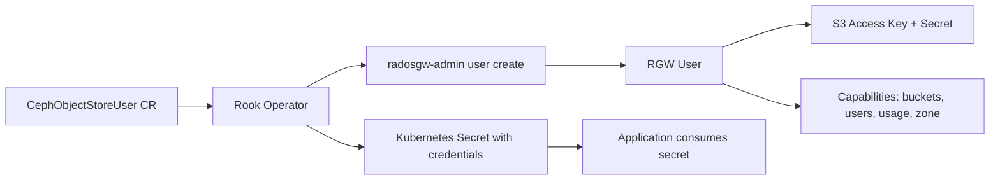

# How to Set Up CephObjectStoreUser with Capability Grants in Rook

Author: [nawazdhandala](https://www.github.com/nawazdhandala)

Tags: Rook, Ceph, Kubernetes, ObjectStore, User, Capability, RGW, S3

Description: Learn how to create CephObjectStoreUser resources in Rook with fine-grained capability grants to control access to buckets, users, and admin operations.

---

`CephObjectStoreUser` is the Rook CRD for managing RGW (RADOS Gateway) users declaratively. Beyond basic S3 access, you can grant specific capabilities like bucket listing, user management, and quota control.

## User and Capability Architecture



## Basic User Creation

```yaml
apiVersion: ceph.rook.io/v1
kind: CephObjectStoreUser
metadata:
  name: my-s3-user
  namespace: rook-ceph
spec:
  store: my-store
  displayName: "My S3 User"
```

This creates a user with no special capabilities -- only S3 bucket access via owned resources.

## User with Full Capabilities

```yaml
apiVersion: ceph.rook.io/v1
kind: CephObjectStoreUser
metadata:
  name: admin-user
  namespace: rook-ceph
spec:
  store: my-store
  displayName: "Admin User"
  capabilities:
    user: "*"
    bucket: "*"
    usage: "read, write"
    metadata: "read, write"
    zone: "read, write"
```

## Capability Definitions

| Capability | Values | Description |
|---|---|---|
| `user` | `*`, `read`, `write`, `read, write` | Manage other users |
| `bucket` | `*`, `read`, `write` | List/manage all buckets |
| `usage` | `read`, `write` | Access usage stats |
| `metadata` | `read`, `write` | Manage RGW metadata |
| `zone` | `read`, `write` | Manage zone config |

## Read-Only Reporting User

```yaml
apiVersion: ceph.rook.io/v1
kind: CephObjectStoreUser
metadata:
  name: reporting-user
  namespace: rook-ceph
spec:
  store: my-store
  displayName: "Reporting User"
  capabilities:
    usage: "read"
    bucket: "read"
```

## User with Quotas

```yaml
apiVersion: ceph.rook.io/v1
kind: CephObjectStoreUser
metadata:
  name: limited-user
  namespace: rook-ceph
spec:
  store: my-store
  displayName: "Limited User"
  quotas:
    maxBuckets: 5
    maxSize: "10Gi"
    maxObjects: 100000
```

## Accessing the Generated Secret

Rook creates a secret named `rook-ceph-object-user-<store>-<username>`:

```bash
# Get the secret name
kubectl get secret -n rook-ceph | grep object-user

# Get the access key
kubectl get secret rook-ceph-object-user-my-store-my-s3-user \
  -n rook-ceph \
  -o jsonpath='{.data.AccessKey}' | base64 -d

# Get the secret key
kubectl get secret rook-ceph-object-user-my-store-my-s3-user \
  -n rook-ceph \
  -o jsonpath='{.data.SecretKey}' | base64 -d

# Get the endpoint
kubectl get secret rook-ceph-object-user-my-store-my-s3-user \
  -n rook-ceph \
  -o jsonpath='{.data.Endpoint}' | base64 -d
```

## Using the Secret in an Application

```yaml
apiVersion: apps/v1
kind: Deployment
metadata:
  name: my-app
  namespace: default
spec:
  selector:
    matchLabels:
      app: my-app
  template:
    metadata:
      labels:
        app: my-app
    spec:
      containers:
        - name: app
          image: my-app:latest
          env:
            - name: AWS_ACCESS_KEY_ID
              valueFrom:
                secretKeyRef:
                  name: rook-ceph-object-user-my-store-my-s3-user
                  key: AccessKey
            - name: AWS_SECRET_ACCESS_KEY
              valueFrom:
                secretKeyRef:
                  name: rook-ceph-object-user-my-store-my-s3-user
                  key: SecretKey
            - name: S3_ENDPOINT
              valueFrom:
                secretKeyRef:
                  name: rook-ceph-object-user-my-store-my-s3-user
                  key: Endpoint
```

## Verifying User Capabilities

```bash
# Check user info including capabilities
kubectl exec -n rook-ceph deploy/rook-ceph-tools -- \
  radosgw-admin user info --uid=my-s3-user

# Modify capabilities after creation
kubectl exec -n rook-ceph deploy/rook-ceph-tools -- \
  radosgw-admin caps add \
    --uid=my-s3-user \
    --caps="buckets=*;users=read"
```

## Summary

`CephObjectStoreUser` CRDs in Rook create RGW users declaratively and automatically generate a Kubernetes secret containing the access key, secret key, and endpoint. The `capabilities` field controls administrative access beyond normal S3 bucket operations, and `quotas` limits storage usage. Mount the generated secret as environment variables in application pods for clean credential management.
