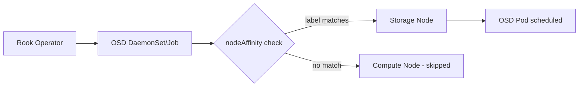

# How to Configure OSD Placement with nodeAffinity in Rook-Ceph

Author: [nawazdhandala](https://www.github.com/nawazdhandala)

Tags: Rook, Ceph, Kubernetes, OSD, Placement, Affinity

Description: Learn how to use nodeAffinity rules in Rook-Ceph to control which Kubernetes nodes receive OSD pods, ensuring storage runs only on designated hardware.

---

Controlling OSD placement is critical for production Rook-Ceph deployments. Using `nodeAffinity` you can restrict OSDs to nodes with specific labels, hardware characteristics, or roles, keeping storage isolated from compute workloads.

## Architecture



## Label Storage Nodes

Before configuring placement, label the nodes that should host OSDs:

```bash
# Label dedicated storage nodes
kubectl label node storage-node-1 role=storage-node
kubectl label node storage-node-2 role=storage-node
kubectl label node storage-node-3 role=storage-node

# Verify labels
kubectl get nodes --show-labels | grep storage-node
```

## Configure nodeAffinity in CephCluster

```yaml
apiVersion: ceph.rook.io/v1
kind: CephCluster
metadata:
  name: rook-ceph
  namespace: rook-ceph
spec:
  dataDirHostPath: /var/lib/rook
  placement:
    osd:
      nodeAffinity:
        requiredDuringSchedulingIgnoredDuringExecution:
          nodeSelectorTerms:
            - matchExpressions:
                - key: role
                  operator: In
                  values:
                    - storage-node
      tolerations:
        - key: storage-node
          operator: Exists
          effect: NoSchedule
  storage:
    useAllNodes: false
    useAllDevices: false
    nodes:
      - name: storage-node-1
        devices:
          - name: sdb
      - name: storage-node-2
        devices:
          - name: sdb
      - name: storage-node-3
        devices:
          - name: sdb
```

## Preferred vs Required Affinity

Use `preferredDuringSchedulingIgnoredDuringExecution` when you want soft placement hints rather than hard requirements:

```yaml
placement:
  osd:
    nodeAffinity:
      preferredDuringSchedulingIgnoredDuringExecution:
        - weight: 100
          preference:
            matchExpressions:
              - key: disk-type
                operator: In
                values:
                  - nvme
        - weight: 50
          preference:
            matchExpressions:
              - key: disk-type
                operator: In
                values:
                  - ssd
```

## Placement for All Components

Rook supports placement configuration for each component independently:

```yaml
spec:
  placement:
    all:
      nodeAffinity:
        requiredDuringSchedulingIgnoredDuringExecution:
          nodeSelectorTerms:
            - matchExpressions:
                - key: kubernetes.io/os
                  operator: In
                  values:
                    - linux
    mgr:
      nodeAffinity:
        requiredDuringSchedulingIgnoredDuringExecution:
          nodeSelectorTerms:
            - matchExpressions:
                - key: role
                  operator: In
                  values:
                    - ceph-mgr
    mon:
      nodeAffinity:
        requiredDuringSchedulingIgnoredDuringExecution:
          nodeSelectorTerms:
            - matchExpressions:
                - key: role
                  operator: In
                  values:
                    - ceph-mon
    osd:
      nodeAffinity:
        requiredDuringSchedulingIgnoredDuringExecution:
          nodeSelectorTerms:
            - matchExpressions:
                - key: role
                  operator: In
                  values:
                    - storage-node
```

## Combine with Taints and Tolerations

For strict isolation, taint storage nodes and add matching tolerations:

```bash
# Taint storage nodes to repel non-storage workloads
kubectl taint nodes storage-node-1 storage-node=true:NoSchedule
kubectl taint nodes storage-node-2 storage-node=true:NoSchedule
kubectl taint nodes storage-node-3 storage-node=true:NoSchedule
```

```yaml
spec:
  placement:
    osd:
      nodeAffinity:
        requiredDuringSchedulingIgnoredDuringExecution:
          nodeSelectorTerms:
            - matchExpressions:
                - key: role
                  operator: In
                  values:
                    - storage-node
      tolerations:
        - key: storage-node
          operator: Equal
          value: "true"
          effect: NoSchedule
```

## Verify OSD Placement

```bash
# Check which nodes OSD pods are running on
kubectl get pods -n rook-ceph -l app=rook-ceph-osd -o wide

# Verify no OSDs on non-storage nodes
kubectl get pods -n rook-ceph -o wide | grep osd

# Check OSD tree in Ceph toolbox
kubectl exec -n rook-ceph deploy/rook-ceph-tools -- ceph osd tree
```

## Summary

`nodeAffinity` in Rook-Ceph placement configuration gives you precise control over which Kubernetes nodes host OSD pods. Using required affinity rules combined with node labels and taints/tolerations ensures storage workloads are strictly isolated to dedicated hardware, improving both performance and operational predictability.
