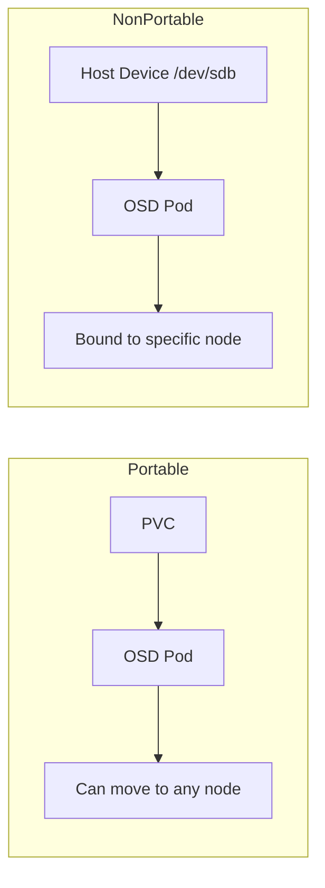

# Configure OSD Portable vs Non-Portable Storage in Rook-Ceph

Author: [nawazdhandala](https://www.github.com/nawazdhandala)

Tags: Rook, Ceph, Kubernetes, OSD, Storage, PVC

Description: Understand the difference between portable and non-portable OSDs in Rook-Ceph, and learn when to use each mode for cloud vs bare-metal deployments.

---

Rook-Ceph supports two OSD deployment models: portable OSDs backed by PVCs that can be rescheduled across nodes, and non-portable OSDs bound to specific host paths or raw devices. Choosing the right model depends on your infrastructure.

## Portable vs Non-Portable



| Feature | Portable | Non-Portable |
|---|---|---|
| Backed by | PVC | Raw disk or host path |
| Node binding | Flexible | Fixed to one node |
| Cloud-friendly | Yes | No |
| Raw performance | Lower | Higher |
| Node failure handling | Reschedule on any node | Requires same node |

## Portable OSD Configuration

Portable OSDs use `storageClassDeviceSets` with `portable: true`:

```yaml
apiVersion: ceph.rook.io/v1
kind: CephCluster
metadata:
  name: rook-ceph
  namespace: rook-ceph
spec:
  dataDirHostPath: /var/lib/rook
  storage:
    storageClassDeviceSets:
      - name: portable-set
        count: 3
        portable: true          # OSD can be rescheduled to any node
        tuneFastDeviceClass: false
        volumeClaimTemplates:
          - metadata:
              name: data
            spec:
              resources:
                requests:
                  storage: 100Gi
              storageClassName: gp3
              volumeMode: Block
              accessModes:
                - ReadWriteOnce
```

When `portable: true`, Rook does not pin the OSD pod to the node where it was first scheduled. If the node goes down, the OSD pod can be rescheduled once the PVC is re-attached on another node (assuming your storage backend supports this).

## Non-Portable OSD Configuration (Raw Devices)

Non-portable OSDs are bound to specific nodes through `storage.nodes`:

```yaml
spec:
  storage:
    useAllNodes: false
    useAllDevices: false
    nodes:
      - name: storage-node-1
        devices:
          - name: sdb
          - name: sdc
      - name: storage-node-2
        devices:
          - name: sdb
          - name: sdc
      - name: storage-node-3
        devices:
          - name: sdb
          - name: sdc
```

Non-portable OSDs cannot be migrated to a different node because the data resides on a local, non-shared disk.

## Non-Portable OSD with Device Filter

```yaml
spec:
  storage:
    useAllNodes: true
    useAllDevices: false
    deviceFilter: "^nvme[0-9]n[0-9]"   # match all NVMe devices
    config:
      storeType: bluestore
      osdsPerDevice: "1"
```

## Non-Portable with storageClassDeviceSets

You can create non-portable device sets by setting `portable: false`:

```yaml
storageClassDeviceSets:
  - name: local-set
    count: 3
    portable: false     # OSD is pinned to the node where PVC is bound
    volumeClaimTemplates:
      - metadata:
          name: data
        spec:
          resources:
            requests:
              storage: 500Gi
          storageClassName: local-storage   # uses local-path provisioner
          volumeMode: Block
          accessModes:
            - ReadWriteOnce
```

## When to Use Each Mode

**Use portable OSDs when:**
- Running on cloud providers (EBS, GCE PD, Azure Disk)
- You need node failure recovery without data loss
- Using managed Kubernetes services (EKS, GKE, AKS)

**Use non-portable OSDs when:**
- Running on bare-metal with dedicated disks
- Maximum IOPS and throughput are required
- Using NVMe local SSDs for lowest latency

## Verify OSD Mode

```bash
# Check OSD pods and their node bindings
kubectl get pods -n rook-ceph -l app=rook-ceph-osd -o wide

# For PVC-backed OSDs, check PVC binding
kubectl get pvc -n rook-ceph -l ceph.rook.io/DeviceSet=portable-set

# Check OSD details in Ceph
kubectl exec -n rook-ceph deploy/rook-ceph-tools -- ceph osd metadata 0 | grep -E "hostname|device"
```

## Handling Node Failure with Portable OSDs

```bash
# When a node is lost, check OSD status
kubectl exec -n rook-ceph deploy/rook-ceph-tools -- ceph health detail

# Force reschedule portable OSD to a healthy node
kubectl delete pod -n rook-ceph <osd-pod-name>

# The OSD pod will reschedule after the PVC re-attaches
kubectl get pods -n rook-ceph -l app=rook-ceph-osd -w
```

## Summary

Portable OSDs (`portable: true`) backed by PVCs are ideal for cloud deployments where flexibility and resilience matter. Non-portable OSDs bound to raw disks or local paths deliver peak performance for bare-metal workloads. Understanding the trade-offs helps you design a Rook-Ceph cluster that matches your infrastructure and reliability requirements.
