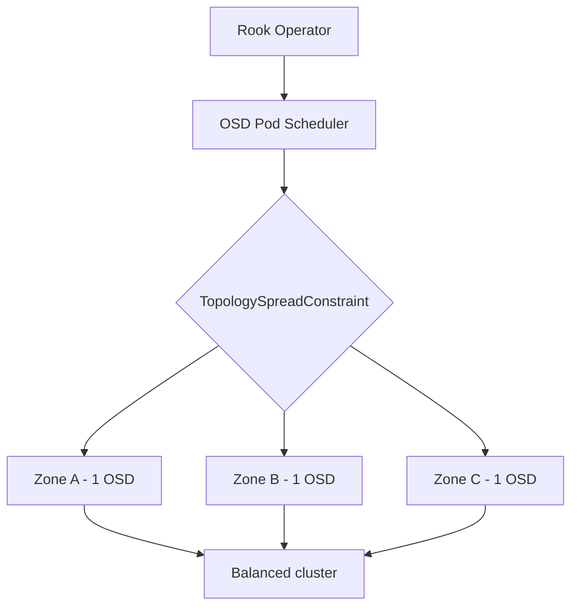

# How to Configure OSD Topology Spreading in Rook-Ceph

Author: [nawazdhandala](https://www.github.com/nawazdhandala)

Tags: Rook, Ceph, Kubernetes, OSD, Topology, Placement

Description: Configure topology spread constraints for Rook-Ceph OSDs to distribute storage pods evenly across zones, racks, or nodes for high availability.

---

Topology spreading ensures OSD pods are distributed evenly across failure domains such as availability zones, racks, or hosts. This prevents multiple OSDs from being concentrated on a single zone, which would defeat the purpose of Ceph replication.

## How Topology Spreading Works



## Prerequisites

- Nodes labeled with topology keys
- Kubernetes 1.19+ for stable `topologySpreadConstraints`

## Label Nodes with Topology Keys

```bash
# Label nodes with zone topology
kubectl label node node-1 topology.kubernetes.io/zone=us-east-1a
kubectl label node node-2 topology.kubernetes.io/zone=us-east-1b
kubectl label node node-3 topology.kubernetes.io/zone=us-east-1c

# Label with rack topology for on-premises clusters
kubectl label node node-1 topology.rook.io/rack=rack-a
kubectl label node node-2 topology.rook.io/rack=rack-b
kubectl label node node-3 topology.rook.io/rack=rack-c
```

## Configure Topology Spreading for OSDs

```yaml
apiVersion: ceph.rook.io/v1
kind: CephCluster
metadata:
  name: rook-ceph
  namespace: rook-ceph
spec:
  dataDirHostPath: /var/lib/rook
  placement:
    osd:
      topologySpreadConstraints:
        - maxSkew: 1
          topologyKey: topology.kubernetes.io/zone
          whenUnsatisfiable: DoNotSchedule
          labelSelector:
            matchExpressions:
              - key: app
                operator: In
                values:
                  - rook-ceph-osd
  storage:
    useAllNodes: true
    useAllDevices: false
    deviceFilter: "^sd[b-z]"
```

## Multi-Level Topology Spreading

Spread across both zones and hosts simultaneously for maximum resilience:

```yaml
placement:
  osd:
    topologySpreadConstraints:
      - maxSkew: 1
        topologyKey: topology.kubernetes.io/zone
        whenUnsatisfiable: DoNotSchedule
        labelSelector:
          matchExpressions:
            - key: app
              operator: In
              values:
                - rook-ceph-osd
      - maxSkew: 1
        topologyKey: kubernetes.io/hostname
        whenUnsatisfiable: ScheduleAnyway
        labelSelector:
          matchExpressions:
            - key: app
              operator: In
              values:
                - rook-ceph-osd
```

## Topology Spreading with PVC-Based Device Sets

For PVC-backed OSDs, apply topology spreading within the device set:

```yaml
spec:
  storage:
    storageClassDeviceSets:
      - name: set1
        count: 3
        portable: true
        placement:
          topologySpreadConstraints:
            - maxSkew: 1
              topologyKey: topology.kubernetes.io/zone
              whenUnsatisfiable: DoNotSchedule
              labelSelector:
                matchExpressions:
                  - key: app
                    operator: In
                    values:
                      - rook-ceph-osd
        volumeClaimTemplates:
          - metadata:
              name: data
            spec:
              resources:
                requests:
                  storage: 100Gi
              storageClassName: gp3
              volumeMode: Block
              accessModes:
                - ReadWriteOnce
```

## Configure Ceph CRUSH to Match Topology

After OSDs are placed, configure the CRUSH map to reflect topology:

```bash
# Open Ceph toolbox
kubectl exec -n rook-ceph deploy/rook-ceph-tools -- bash

# View current CRUSH map
ceph osd crush tree

# Add zone bucket type to CRUSH map if needed
ceph osd crush add-bucket zone-a zone
ceph osd crush add-bucket zone-b zone
ceph osd crush add-bucket zone-c zone

# Move hosts under zone buckets
ceph osd crush move node-1 zone=zone-a
ceph osd crush move node-2 zone=zone-b
ceph osd crush move node-3 zone=zone-c
```

## Verify Spreading

```bash
# Check OSD distribution across zones
kubectl get pods -n rook-ceph -l app=rook-ceph-osd -o custom-columns=\
NAME:.metadata.name,NODE:.spec.nodeName,ZONE:.spec.nodeSelector.'topology\.kubernetes\.io/zone'

# Check current OSD placement
kubectl exec -n rook-ceph deploy/rook-ceph-tools -- ceph osd df tree

# Verify topology in CRUSH map
kubectl exec -n rook-ceph deploy/rook-ceph-tools -- ceph osd crush tree --show-shadow
```

## whenUnsatisfiable Options

| Value | Behavior |
|---|---|
| `DoNotSchedule` | Block scheduling if constraint would be violated |
| `ScheduleAnyway` | Schedule even if constraint is violated, prefer balanced |

Use `DoNotSchedule` for zones in production, `ScheduleAnyway` as a secondary host-level constraint.

## Summary

OSD topology spreading in Rook-Ceph distributes storage pods across failure domains using Kubernetes `topologySpreadConstraints`. Combining zone-level hard constraints with host-level soft constraints ensures maximum fault tolerance. Always align the Ceph CRUSH map with the topology to get proper replication across failure domains.
