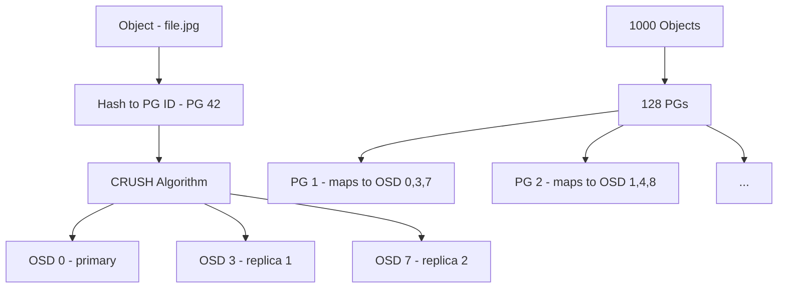

# How to Configure Rook-Ceph Placement Groups

Author: [nawazdhandala](https://www.github.com/nawazdhandala)

Tags: Rook, Ceph, Kubernetes, PlacementGroup, PG, Performance

Description: Learn how to configure and optimize Ceph Placement Groups (PGs) in Rook, including PG autoscaling, manual PG counts, and PG health monitoring.

---

## What Placement Groups Are

Placement Groups (PGs) are the internal unit of data distribution in Ceph. Every object stored in Ceph is assigned to a PG, and each PG is mapped to a set of OSDs based on the CRUSH algorithm. PGs act as an indirection layer between objects and OSDs, making it possible to rebalance data efficiently when OSDs are added or removed without moving individual objects.



## How PG Count Affects Performance

Too few PGs: OSDs are underutilized, limited parallelism, potential for data imbalance.
Too many PGs: High memory overhead on OSDs (each PG consumes ~100KB RAM), slow recovery.

The general guideline is 100-200 PGs per OSD across all pools combined. With 9 OSDs and 3-replica replication, the total PG count formula is:

```text
Target PGs per pool = (OSD count * PGs per OSD target) / replication factor
                    = (9 * 150) / 3
                    = 450 PGs per pool
```

PG counts must be powers of 2: 256, 512, 1024, etc.

## PG Autoscaling (Recommended)

The simplest approach is to let Ceph manage PG counts automatically with the pg_autoscaler module. Enable it in the CephCluster CR:

```yaml
spec:
  mgr:
    modules:
      - name: pg_autoscaler
        enabled: true
```

When creating pools, enable autoscaling per-pool:

```yaml
apiVersion: ceph.rook.io/v1
kind: CephBlockPool
metadata:
  name: replicapool
  namespace: rook-ceph
spec:
  failureDomain: host
  replicated:
    size: 3
  parameters:
    # Let the autoscaler manage PG count
    pg_autoscale_mode: "on"
    # Target size ratio: this pool gets 20% of total cluster capacity
    target_size_ratio: "0.2"
```

Check autoscaler recommendations:

```bash
kubectl -n rook-ceph exec deploy/rook-ceph-tools -- \
  ceph osd pool autoscale-status
```

```text
POOL          SIZE  TARGET SIZE  RATE  RAW CAPACITY  BIAS  PG_NUM  NEW PG_NUM  AUTOSCALE
replicapool  5.0G         -     3.0        900 GiB   1.0     128        128  on
```

## Manual PG Configuration

For precise control, disable autoscaling and set PG counts manually:

```yaml
apiVersion: ceph.rook.io/v1
kind: CephBlockPool
metadata:
  name: replicapool
  namespace: rook-ceph
spec:
  failureDomain: host
  replicated:
    size: 3
  parameters:
    pg_num: "128"
    pgp_num: "128"
    pg_autoscale_mode: "off"
```

## Changing PG Count on Existing Pools

Increase PGs on an existing pool (splitting):

```bash
kubectl -n rook-ceph exec deploy/rook-ceph-tools -- bash -c "
  ceph osd pool set replicapool pg_num 256
  # pgp_num controls actual data migration - increase after pg_num settles
  ceph osd pool set replicapool pgp_num 256
"
```

Monitor the split progress:

```bash
kubectl -n rook-ceph exec deploy/rook-ceph-tools -- ceph pg stat
```

During the split, some PGs show `splitting` state. Wait for all PGs to return to `active+clean`.

## PG Merging (Reducing PG Count)

Ceph 14+ supports PG merging (reducing PG count):

```bash
kubectl -n rook-ceph exec deploy/rook-ceph-tools -- bash -c "
  ceph osd pool set replicapool pg_num 64
  ceph osd pool set replicapool pgp_num 64
"
```

## Monitoring PG Health

Check PG summary:

```bash
kubectl -n rook-ceph exec deploy/rook-ceph-tools -- ceph pg stat
```

List degraded PGs:

```bash
kubectl -n rook-ceph exec deploy/rook-ceph-tools -- ceph pg dump_stuck degraded
```

Get PG distribution across OSDs:

```bash
kubectl -n rook-ceph exec deploy/rook-ceph-tools -- \
  ceph pg dump | grep -v "^version" | awk '{print $14}' | sort | uniq -c | sort -rn
```

## Setting Target Size for Autoscaler

Tell the autoscaler the expected size of a pool so it can calculate appropriate PG counts ahead of time:

```bash
# Set target size to 500GB for more accurate PG calculation
kubectl -n rook-ceph exec deploy/rook-ceph-tools -- \
  ceph osd pool set replicapool target_size_bytes 536870912000

# Or set as a ratio of total cluster capacity
kubectl -n rook-ceph exec deploy/rook-ceph-tools -- \
  ceph osd pool set replicapool target_size_ratio 0.3
```

## Per-Pool PG Configuration in Rook

Each CephBlockPool or CephFilesystem data pool can have independent PG settings:

```yaml
apiVersion: ceph.rook.io/v1
kind: CephBlockPool
metadata:
  name: high-capacity-pool
  namespace: rook-ceph
spec:
  failureDomain: host
  replicated:
    size: 3
  parameters:
    pg_autoscale_mode: "on"
    # This pool will hold 50% of cluster data
    target_size_ratio: "0.5"
```

## Summary

Placement Groups are Ceph's internal data distribution mechanism - the right count depends on OSD count, pool count, and replication factor. Enable the `pg_autoscaler` module and set `pg_autoscale_mode: "on"` per pool to let Ceph manage PG counts automatically, which is the recommended approach for most deployments. For precise control, set `pg_num` and `pgp_num` manually and disable autoscaling. Use `target_size_ratio` or `target_size_bytes` to give the autoscaler accurate capacity hints. Monitor PG health with `ceph pg stat` and watch for non-`active+clean` states that indicate rebalancing, recovery, or problems.
