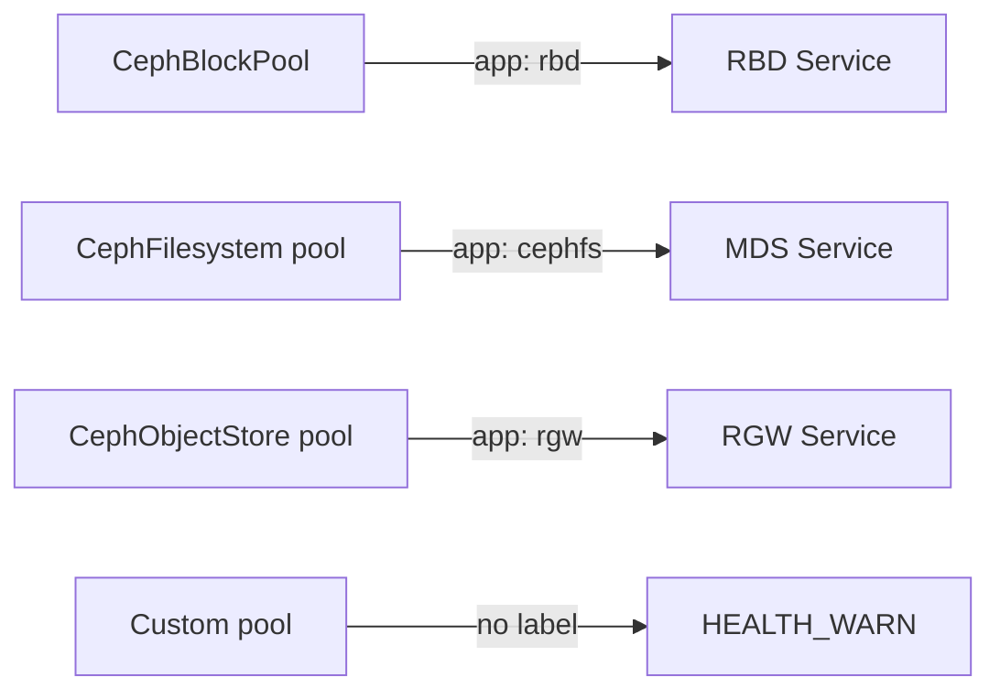

# How to Configure Pool Application Labels in Rook-Ceph

Author: [nawazdhandala](https://www.github.com/nawazdhandala)

Tags: Rook, Ceph, Kubernetes, Pool, Application, RADOS

Description: Learn how to set pool application labels in Rook-Ceph to inform Ceph which application uses each pool, enabling proper health checks and monitoring.

---

Ceph requires each pool to have an application label that identifies which Ceph service uses it. Without proper labels, `ceph health` reports `POOL_APP_NOT_ENABLED` warnings. Rook sets these automatically for most cases, but you need to understand them when creating custom pools.

## Why Application Labels Matter



Ceph uses application labels for:
- Health check validation
- Per-application statistics
- Quota tracking by application
- Crush rule enforcement

## Standard Application Labels

| Application | Label |
|---|---|
| RADOS Block Device | `rbd` |
| CephFS | `cephfs` |
| RADOS Gateway (S3/Swift) | `rgw` |
| Custom applications | any string |

## CephBlockPool with Application Label

Rook automatically sets the `rbd` label for `CephBlockPool` resources. Here is the explicit configuration:

```yaml
apiVersion: ceph.rook.io/v1
kind: CephBlockPool
metadata:
  name: replicapool
  namespace: rook-ceph
spec:
  failureDomain: host
  replicated:
    size: 3
    requireSafeReplicaSize: true
  application: rbd    # explicitly set for clarity
```

## Custom Application Label

For application-specific pools used directly via librados or custom drivers:

```yaml
apiVersion: ceph.rook.io/v1
kind: CephBlockPool
metadata:
  name: myapp-pool
  namespace: rook-ceph
spec:
  failureDomain: host
  replicated:
    size: 3
  application: myapp    # custom application identifier
```

## Set Application Label via CLI

If a pool already exists without a label, enable it via the Ceph toolbox:

```bash
kubectl exec -n rook-ceph deploy/rook-ceph-tools -- bash

# Enable rbd application for a block pool
ceph osd pool application enable replicapool rbd

# Enable cephfs application for a filesystem pool
ceph osd pool application enable myfs-metadata cephfs
ceph osd pool application enable myfs-data0 cephfs

# Enable rgw application for an object store pool
ceph osd pool application enable my-store.rgw.buckets.data rgw

# Enable a custom application label
ceph osd pool application enable myapp-pool myapp

# Verify labels
ceph osd pool application get replicapool
```

## List All Pool Applications

```bash
kubectl exec -n rook-ceph deploy/rook-ceph-tools -- \
  ceph osd pool ls detail | grep application
```

## Remove an Application Label

```bash
kubectl exec -n rook-ceph deploy/rook-ceph-tools -- \
  ceph osd pool application disable replicapool rbd --yes-i-really-mean-it
```

## Checking for POOL_APP_NOT_ENABLED Warnings

```bash
kubectl exec -n rook-ceph deploy/rook-ceph-tools -- ceph health detail

# Example warning output:
# HEALTH_WARN 1 pool(s) do not have an application enabled
# [WRN] POOL_APP_NOT_ENABLED: 1 pool(s) do not have an application enabled
#     application not enabled on pool 'custom-pool'
```

Fix by enabling the appropriate application label:

```bash
kubectl exec -n rook-ceph deploy/rook-ceph-tools -- \
  ceph osd pool application enable custom-pool rbd
```

## Application Labels in Rook CRD Status

Rook reflects pool status in the CRD:

```bash
# Check CephBlockPool status
kubectl get cephblockpool -n rook-ceph replicapool -o yaml | grep -A5 status

# Check all pools
kubectl get cephblockpool -n rook-ceph
```

## Summary

Pool application labels in Rook-Ceph identify which Ceph service uses each pool. Rook sets these automatically for managed pools, but custom pools created via the Ceph CLI must have labels set manually. Always enable the correct application label (`rbd`, `cephfs`, or `rgw`) to keep your cluster in `HEALTH_OK` and enable accurate per-application statistics.
