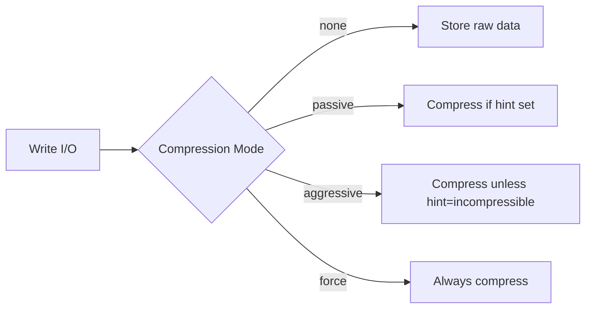

# How to Set Pool Compression Mode in Rook-Ceph

Author: [nawazdhandala](https://www.github.com/nawazdhandala)

Tags: Rook, Ceph, Kubernetes, Pool, Compression, BlueStore

Description: Enable and configure BlueStore inline compression for Rook-Ceph pools to reduce storage usage for compressible data workloads.

---

Ceph BlueStore supports inline compression at the pool level. Enabling compression can significantly reduce storage consumption for workloads with compressible data such as logs, text files, and unencrypted databases.

## Compression Modes



| Mode | Behavior |
|---|---|
| `none` | No compression (default) |
| `passive` | Compress only if the client hints compressible |
| `aggressive` | Compress unless client hints incompressible |
| `force` | Always compress regardless of hints |

## Configure Compression on a CephBlockPool

```yaml
apiVersion: ceph.rook.io/v1
kind: CephBlockPool
metadata:
  name: compressed-pool
  namespace: rook-ceph
spec:
  failureDomain: host
  replicated:
    size: 3
    requireSafeReplicaSize: true
  parameters:
    compression_mode: aggressive
    compression_algorithm: snappy    # lz4, zlib, zstd, snappy
    compression_min_blob_size: "8192"
    compression_max_blob_size: "65536"
```

## Compression Algorithm Comparison

| Algorithm | Speed | Ratio | Best For |
|---|---|---|---|
| `snappy` | Fastest | Lowest | General purpose, low latency |
| `lz4` | Fast | Medium | Good balance |
| `zlib` | Medium | High | Archive/cold data |
| `zstd` | Medium | High | Modern workloads, best ratio |

## Configure Compression on a CephFilesystem Data Pool

```yaml
apiVersion: ceph.rook.io/v1
kind: CephFilesystem
metadata:
  name: myfs
  namespace: rook-ceph
spec:
  metadataPool:
    failureDomain: host
    replicated:
      size: 3
  dataPools:
    - name: data0
      failureDomain: host
      replicated:
        size: 3
      parameters:
        compression_mode: aggressive
        compression_algorithm: zstd
  metadataServer:
    activeCount: 1
    activeStandby: true
```

## Enable Compression via Ceph CLI

You can also set compression on existing pools without recreating them:

```bash
kubectl exec -n rook-ceph deploy/rook-ceph-tools -- bash

# Enable compression on an existing pool
ceph osd pool set replicapool compression_mode aggressive
ceph osd pool set replicapool compression_algorithm snappy

# Set blob size limits
ceph osd pool set replicapool compression_min_blob_size 8192
ceph osd pool set replicapool compression_max_blob_size 65536

# Verify settings
ceph osd pool get replicapool compression_mode
ceph osd pool get replicapool compression_algorithm
```

## Monitor Compression Savings

```bash
kubectl exec -n rook-ceph deploy/rook-ceph-tools -- bash

# Check compression stats per pool
ceph df detail | grep -A5 compressed-pool

# Check OSD-level compression stats
ceph daemon osd.0 perf dump | python3 -m json.tool | grep -A10 compress

# Overall cluster compression ratio
ceph osd df | awk '{print $1, $6, $7}'
```

Example output:

```text
POOL               STORED  COMPRESS_UNDER_BYTES  COMPRESS_BYTES_USED
compressed-pool    12 GiB  16 GiB                8 GiB
```

This shows 12 GiB of logical data compressed from 16 GiB to 8 GiB (50% savings).

## Disable Compression on a Pool

```bash
kubectl exec -n rook-ceph deploy/rook-ceph-tools -- \
  ceph osd pool set replicapool compression_mode none
```

Or update the CephBlockPool manifest:

```yaml
spec:
  parameters:
    compression_mode: none
```

## When to Use Compression

**Good candidates for compression:**
- Log storage (very high compression ratio)
- Text-based application data
- Virtual machine disk images with OS data
- Backup storage pools

**Avoid compression for:**
- Already-compressed data (JPEG, video, zip files)
- Encrypted volumes
- Latency-sensitive NVMe workloads where CPU overhead matters

## Summary

Pool compression in Rook-Ceph is configured via the `parameters` field in `CephBlockPool` or `CephFilesystem`. Use `aggressive` mode with `zstd` or `snappy` for most workloads. Monitor compression ratios using `ceph df detail` to validate savings, and avoid compressing data that is already compressed or encrypted.
