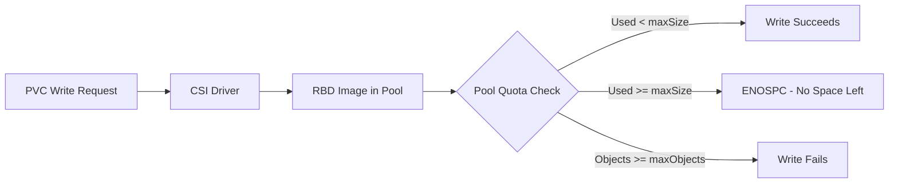

# How to Configure Pool Quotas (maxSize, maxObjects) in Rook

Author: [nawazdhandala](https://www.github.com/nawazdhandala)

Tags: Rook, Ceph, Kubernetes, Storage

Description: Set storage quotas on Ceph block pools using maxSize and maxObjects in Rook's CephBlockPool CRD to enforce capacity limits per pool.

---

## Introduction

Ceph pool quotas allow you to set limits on the total amount of data or the number of objects that can be stored in a pool. Rook exposes these limits through the CephBlockPool `quotas` spec field. Pool quotas are useful for multi-tenant deployments where different teams share a single Ceph cluster and you need to prevent any one pool from consuming all available storage.

## How Pool Quotas Work



## Prerequisites

- Running Rook-Ceph cluster with a CephBlockPool
- Sufficient cluster capacity to accommodate the quota limits you set
- Access to the Rook toolbox for verification

## Step 1: Configure maxSize Quota on a CephBlockPool

The `maxSize` quota limits the total raw data stored in the pool (before replication overhead):

```yaml
# blockpool-with-size-quota.yaml
apiVersion: ceph.rook.io/v1
kind: CephBlockPool
metadata:
  name: team-a-pool
  namespace: rook-ceph
spec:
  replicated:
    size: 3
    requireSafeReplicaSize: true
  quotas:
    # Maximum raw bytes stored in this pool (not counting replication)
    maxSize: "100Gi"
```

```bash
kubectl apply -f blockpool-with-size-quota.yaml

# Verify the quota was applied
kubectl get cephblockpool team-a-pool -n rook-ceph -o yaml | grep -A5 quotas
```

## Step 2: Configure maxObjects Quota

The `maxObjects` quota limits the number of RADOS objects in the pool:

```yaml
# blockpool-with-object-quota.yaml
apiVersion: ceph.rook.io/v1
kind: CephBlockPool
metadata:
  name: team-b-pool
  namespace: rook-ceph
spec:
  replicated:
    size: 3
    requireSafeReplicaSize: true
  quotas:
    # Maximum number of RADOS objects in this pool
    maxObjects: 1000000
```

## Step 3: Configure Both Size and Object Quotas

```yaml
# blockpool-full-quota.yaml
apiVersion: ceph.rook.io/v1
kind: CephBlockPool
metadata:
  name: shared-pool
  namespace: rook-ceph
spec:
  replicated:
    size: 3
    requireSafeReplicaSize: true
  quotas:
    maxSize: "500Gi"
    maxObjects: 5000000
```

```bash
kubectl apply -f blockpool-full-quota.yaml
```

## Step 4: Verify Quotas on the Ceph Cluster

```bash
# Access the Rook toolbox
kubectl -n rook-ceph exec -it deploy/rook-ceph-tools -- bash

# Check pool quota settings
ceph osd pool get-quota team-a-pool

# Expected output:
# quotas for pool 'team-a-pool':
#   max objects: N/A
#   max bytes  : 107374182400 (100 GiB)

# Check current pool usage vs quota
ceph df detail | grep team-a-pool
```

## Step 5: Multi-Tenant Pool Quota Configuration

Set up multiple pools with quotas for different teams:

```yaml
# multi-tenant-pools.yaml
apiVersion: ceph.rook.io/v1
kind: CephBlockPool
metadata:
  name: frontend-pool
  namespace: rook-ceph
spec:
  replicated:
    size: 3
  quotas:
    maxSize: "200Gi"
---
apiVersion: ceph.rook.io/v1
kind: CephBlockPool
metadata:
  name: backend-pool
  namespace: rook-ceph
spec:
  replicated:
    size: 3
  quotas:
    maxSize: "500Gi"
---
apiVersion: ceph.rook.io/v1
kind: CephBlockPool
metadata:
  name: analytics-pool
  namespace: rook-ceph
spec:
  replicated:
    size: 2
  quotas:
    maxSize: "1Ti"
    maxObjects: 10000000
```

```bash
kubectl apply -f multi-tenant-pools.yaml

# Verify all quotas
kubectl -n rook-ceph exec -it deploy/rook-ceph-tools -- \
  ceph osd pool ls | xargs -I{} ceph osd pool get-quota {}
```

## Step 6: Create StorageClasses for Quota-Enforced Pools

```yaml
# storageclass-team-a.yaml
apiVersion: storage.k8s.io/v1
kind: StorageClass
metadata:
  name: rook-ceph-block-team-a
provisioner: rook-ceph.rbd.csi.ceph.com
parameters:
  clusterID: <cluster-fsid>
  pool: team-a-pool
  imageFormat: "2"
  imageFeatures: layering,fast-diff,object-map,deep-flatten,exclusive-lock
  csi.storage.k8s.io/provisioner-secret-name: rook-csi-rbd-provisioner
  csi.storage.k8s.io/provisioner-secret-namespace: rook-ceph
  csi.storage.k8s.io/controller-expand-secret-name: rook-csi-rbd-provisioner
  csi.storage.k8s.io/controller-expand-secret-namespace: rook-ceph
  csi.storage.k8s.io/node-stage-secret-name: rook-csi-rbd-node
  csi.storage.k8s.io/node-stage-secret-namespace: rook-ceph
reclaimPolicy: Delete
allowVolumeExpansion: true
```

## Step 7: Set Up Alerts for Pool Quota Usage

```yaml
# pool-quota-alerts.yaml
apiVersion: monitoring.coreos.com/v1
kind: PrometheusRule
metadata:
  name: rook-pool-quota-alerts
  namespace: rook-ceph
  labels:
    release: kube-prometheus-stack
spec:
  groups:
    - name: pool-quota.rules
      rules:
        - alert: CephPoolQuotaNearFull
          expr: |
            (ceph_pool_stored_raw / ceph_pool_quota_max_bytes) > 0.80
          for: 5m
          labels:
            severity: warning
          annotations:
            summary: "Ceph pool {{ $labels.pool_id }} is above 80% of quota"
            description: "Pool {{ $labels.name }} has used more than 80% of its maxSize quota."
        - alert: CephPoolQuotaFull
          expr: |
            (ceph_pool_stored_raw / ceph_pool_quota_max_bytes) > 0.95
          for: 1m
          labels:
            severity: critical
          annotations:
            summary: "Ceph pool {{ $labels.pool_id }} is critically near quota"
```

```bash
kubectl apply -f pool-quota-alerts.yaml
```

## Step 8: Remove or Update Quotas

To remove a quota from a pool, set the value to `"0"` or omit the quota field:

```yaml
# Remove size quota by setting to 0
spec:
  quotas:
    maxSize: "0"
    maxObjects: 0
```

Or update directly via the Ceph CLI:

```bash
# Remove size quota
kubectl -n rook-ceph exec -it deploy/rook-ceph-tools -- \
  ceph osd pool set-quota team-a-pool max_bytes 0

# Update to new quota value
kubectl -n rook-ceph exec -it deploy/rook-ceph-tools -- \
  ceph osd pool set-quota team-a-pool max_bytes $((200 * 1024 * 1024 * 1024))
```

## Troubleshooting

```bash
# If PVC provisioning fails with "no space left on device"
kubectl -n rook-ceph exec -it deploy/rook-ceph-tools -- \
  ceph df | grep team-a-pool

# Check if quota is the cause
kubectl -n rook-ceph exec -it deploy/rook-ceph-tools -- \
  ceph osd pool get-quota team-a-pool

# Inspect Ceph health for quota-related warnings
kubectl -n rook-ceph exec -it deploy/rook-ceph-tools -- \
  ceph health detail | grep -i quota
```

## Summary

Pool quotas in Rook CephBlockPool are configured using the `quotas` spec field with `maxSize` (byte string like `"100Gi"`) and `maxObjects` (integer) parameters. These map directly to Ceph's `max_bytes` and `max_objects` pool quota settings. Pool quotas are ideal for multi-tenant clusters where you need to enforce per-team capacity limits and prevent storage exhaustion by a single pool. Set up Prometheus alerts to notify operators when pools approach their quota limits.
