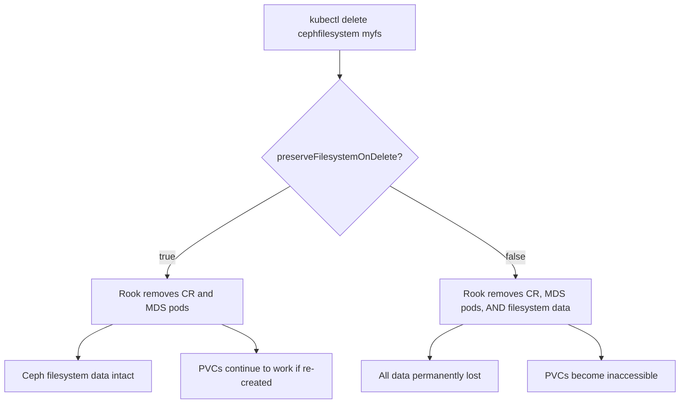

# How to Set preserveFilesystemOnDelete in Rook CephFilesystem

Author: [nawazdhandala](https://www.github.com/nawazdhandala)

Tags: Rook, Ceph, Kubernetes, CephFilesystem, Storage, Configuration

Description: Learn how to configure preserveFilesystemOnDelete in a Rook CephFilesystem CR to protect your shared filesystem from accidental deletion in Kubernetes.

---

The `preserveFilesystemOnDelete` field in the Rook `CephFilesystem` CRD controls whether the underlying Ceph filesystem is deleted when the Kubernetes custom resource is removed. Setting this to `true` is a critical safety measure in production environments.

## How It Works



## Field Location in CephFilesystem CRD

```yaml
apiVersion: ceph.rook.io/v1
kind: CephFilesystem
metadata:
  name: myfs
  namespace: rook-ceph
spec:
  metadataPool:
    failureDomain: host
    replicated:
      size: 3
  dataPools:
    - name: data0
      failureDomain: host
      replicated:
        size: 3
  preserveFilesystemOnDelete: true   # <-- key field
  metadataServer:
    activeCount: 1
    activeStandby: true
```

## Default Behavior

By default, `preserveFilesystemOnDelete` is `false`. This means deleting the CR also destroys the Ceph filesystem and all data in it.

```bash
# Without the flag set to true, this destroys data
kubectl delete cephfilesystem myfs -n rook-ceph
```

## Setting preserveFilesystemOnDelete to true

```yaml
apiVersion: ceph.rook.io/v1
kind: CephFilesystem
metadata:
  name: myfs
  namespace: rook-ceph
spec:
  metadataPool:
    failureDomain: host
    replicated:
      size: 3
  dataPools:
    - name: replicated
      failureDomain: host
      replicated:
        size: 3
  preserveFilesystemOnDelete: true
  metadataServer:
    activeCount: 1
    activeStandby: true
    resources:
      requests:
        cpu: "500m"
        memory: "1Gi"
      limits:
        cpu: "2"
        memory: "4Gi"
```

Apply the CR:

```bash
kubectl apply -f cephfilesystem.yaml
kubectl get cephfilesystem -n rook-ceph
```

## Verifying the Filesystem Survives Deletion

```bash
# Delete the CR
kubectl delete cephfilesystem myfs -n rook-ceph

# Confirm MDS pods are gone
kubectl get pods -n rook-ceph -l app=rook-ceph-mds

# Confirm filesystem still exists in Ceph
kubectl exec -n rook-ceph deploy/rook-ceph-tools -- ceph fs ls
```

The Ceph filesystem remains intact after deleting the Kubernetes CR when the flag is enabled.

## Re-Attaching After Deletion

If you deleted the CR and want to re-attach:

```bash
# Re-apply the same CephFilesystem spec
kubectl apply -f cephfilesystem.yaml

# Rook will reconnect to the existing filesystem without re-creating it
kubectl get cephfilesystem -n rook-ceph
kubectl get pods -n rook-ceph -l app=rook-ceph-mds
```

## Patching an Existing CR

```bash
kubectl patch cephfilesystem myfs -n rook-ceph \
  --type merge \
  -p '{"spec":{"preserveFilesystemOnDelete":true}}'
```

## Production Checklist

```bash
# Confirm the field is set before any delete operations
kubectl get cephfilesystem myfs -n rook-ceph -o jsonpath='{.spec.preserveFilesystemOnDelete}'

# Should output: true
```

## Summary

`preserveFilesystemOnDelete: true` is a one-line safeguard in the `CephFilesystem` spec that decouples the Kubernetes resource lifecycle from the Ceph filesystem lifecycle. Always enable it in production to prevent irreversible data loss when CRs are accidentally deleted or when performing cluster migrations.
