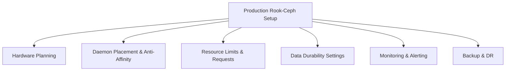

# How to Configure Rook-Ceph for Production Workloads

Author: [nawazdhandala](https://www.github.com/nawazdhandala)

Tags: Rook, Ceph, Kubernetes, Production, Storage, Performance, High Availability

Description: Configure Rook-Ceph for production Kubernetes workloads with proper resource limits, anti-affinity rules, PodDisruptionBudgets, monitoring, and storage best practices.

---

## Production Readiness Checklist

Running Rook-Ceph in production requires careful attention to resource allocation, placement, data durability, monitoring, and operational procedures. This guide covers the most important production configuration settings.



## Hardware Planning

For production clusters, follow these minimum guidelines:

- At least 3 nodes for MONs, each on separate physical hosts
- At least 3 OSD nodes, ideally 5+ for better CRUSH distribution
- Dedicated NVMe or SSD disks for OSDs (separate from OS disk)
- Dedicated network interfaces for Ceph cluster network (10 Gbps recommended)
- Separate NIC for Ceph public network (client traffic) and cluster network (OSD replication)

Label your storage nodes:

```bash
kubectl label node storage-node-1 role=storage-node
kubectl label node storage-node-2 role=storage-node
kubectl label node storage-node-3 role=storage-node
```

## Production CephCluster Configuration

A production-ready CephCluster spec:

```yaml
apiVersion: ceph.rook.io/v1
kind: CephCluster
metadata:
  name: rook-ceph
  namespace: rook-ceph
spec:
  cephVersion:
    image: quay.io/ceph/ceph:v19.2.0
    allowUnsupported: false
  dataDirHostPath: /var/lib/rook
  skipUpgradeChecks: false
  continueUpgradeAfterChecksEvenIfNotHealthy: false
  mon:
    count: 3
    allowMultiplePerNode: false
    volumeClaimTemplate:
      spec:
        storageClassName: local-nvme
        resources:
          requests:
            storage: 10Gi
  mgr:
    count: 2
    allowMultiplePerNode: false
    modules:
      - name: pg_autoscaler
        enabled: true
      - name: rook
        enabled: true
  dashboard:
    enabled: true
    ssl: true
  monitoring:
    enabled: true
  network:
    connections:
      requireMsgr2: true
  storage:
    useAllNodes: false
    useAllDevices: false
    nodes:
      - name: storage-node-1
        devices:
          - name: nvme0n1
      - name: storage-node-2
        devices:
          - name: nvme0n1
      - name: storage-node-3
        devices:
          - name: nvme0n1
  resources:
    mgr:
      requests:
        cpu: "1"
        memory: "1Gi"
      limits:
        cpu: "2"
        memory: "2Gi"
    mon:
      requests:
        cpu: "500m"
        memory: "1Gi"
      limits:
        cpu: "2"
        memory: "2Gi"
    osd:
      requests:
        cpu: "1"
        memory: "4Gi"
      limits:
        cpu: "4"
        memory: "8Gi"
    mds:
      requests:
        cpu: "500m"
        memory: "4Gi"
      limits:
        cpu: "2"
        memory: "8Gi"
  disruptionManagement:
    managePodBudgets: true
    osdMaintenanceTimeout: 30
    pgHealthCheckTimeout: 0
  placement:
    mon:
      podAntiAffinity:
        requiredDuringSchedulingIgnoredDuringExecution:
          - labelSelector:
              matchExpressions:
                - key: app
                  operator: In
                  values:
                    - rook-ceph-mon
            topologyKey: kubernetes.io/hostname
    osd:
      podAntiAffinity:
        preferredDuringSchedulingIgnoredDuringExecution:
          - weight: 100
            podAffinityTerm:
              labelSelector:
                matchExpressions:
                  - key: app
                    operator: In
                    values:
                      - rook-ceph-osd
              topologyKey: kubernetes.io/hostname
      nodeAffinity:
        requiredDuringSchedulingIgnoredDuringExecution:
          nodeSelectorTerms:
            - matchExpressions:
                - key: role
                  operator: In
                  values:
                    - storage-node
```

## Production Pool Configuration

Create pools with appropriate durability settings. Use a replication factor of 3 for most workloads:

```yaml
apiVersion: ceph.rook.io/v1
kind: CephBlockPool
metadata:
  name: replicapool
  namespace: rook-ceph
spec:
  failureDomain: host
  replicated:
    size: 3
    requireSafeReplicaSize: true
  parameters:
    compression_mode: none
  mirroring:
    enabled: false
  statusCheck:
    mirror:
      disabled: false
      interval: "60s"
```

For write-heavy workloads, configure a separate pool with SSD device class:

```yaml
apiVersion: ceph.rook.io/v1
kind: CephBlockPool
metadata:
  name: ssd-pool
  namespace: rook-ceph
spec:
  failureDomain: host
  deviceClass: ssd
  replicated:
    size: 3
    requireSafeReplicaSize: true
```

## PodDisruptionBudgets

Rook automatically creates PodDisruptionBudgets when `managePodBudgets: true` is set. Verify they exist:

```bash
kubectl -n rook-ceph get poddisruptionbudget
```

Manually create PDBs for any Rook components not covered:

```yaml
apiVersion: policy/v1
kind: PodDisruptionBudget
metadata:
  name: rook-ceph-operator-pdb
  namespace: rook-ceph
spec:
  minAvailable: 1
  selector:
    matchLabels:
      app: rook-ceph-operator
```

## Monitoring and Alerting

Enable Prometheus monitoring in the CephCluster spec:

```yaml
spec:
  monitoring:
    enabled: true
    metricsDisabled: false
```

Create a Prometheus alert for cluster health:

```yaml
apiVersion: monitoring.coreos.com/v1
kind: PrometheusRule
metadata:
  name: ceph-health-alerts
  namespace: rook-ceph
spec:
  groups:
    - name: ceph-health
      rules:
        - alert: CephClusterHealthError
          expr: ceph_health_status == 2
          for: 5m
          labels:
            severity: critical
          annotations:
            summary: "Ceph cluster is in HEALTH_ERR state"
        - alert: CephOSDDown
          expr: ceph_osd_up == 0
          for: 5m
          labels:
            severity: warning
          annotations:
            summary: "Ceph OSD {{ $labels.ceph_daemon }} is down"
```

## Storage Class Defaults

Set the production StorageClass as the default:

```bash
kubectl patch storageclass rook-ceph-block \
  -p '{"metadata":{"annotations":{"storageclass.kubernetes.io/is-default-class":"true"}}}'
```

## Summary

Production Rook-Ceph requires careful resource planning, pod anti-affinity for MONs and OSDs across separate nodes, `requireSafeReplicaSize: true` on pools to prevent data loss during expansion, PodDisruptionBudgets to protect against accidental drain operations, and Prometheus monitoring with health alerts. Setting explicit CPU and memory requests/limits prevents Ceph daemons from interfering with application workloads. Together, these settings create a resilient, observable storage platform suitable for critical production workloads.
