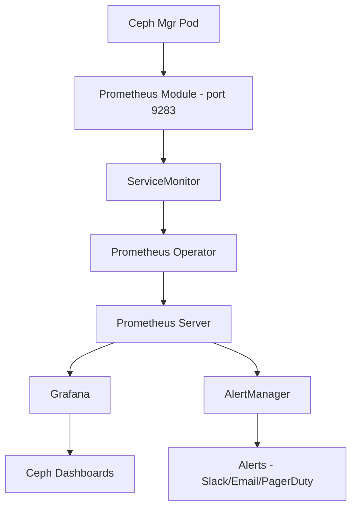

# How to Monitor Rook-Ceph with Prometheus and Grafana

Author: [nawazdhandala](https://www.github.com/nawazdhandala)

Tags: Rook, Ceph, Kubernetes, Prometheus, Grafana, Monitoring, Observability

Description: Complete guide to setting up Prometheus and Grafana monitoring for Rook-Ceph clusters, including ServiceMonitor configuration and pre-built Grafana dashboards.

---

## Rook-Ceph Monitoring Architecture

Rook-Ceph exposes Prometheus metrics through the Ceph Manager's built-in Prometheus module. The metrics endpoint runs on port 9283 inside the mgr pod. A ServiceMonitor resource tells Prometheus Operator to scrape this endpoint. Grafana then visualizes the metrics using pre-built Ceph dashboards.



## Prerequisites

- Prometheus Operator installed (via `kube-prometheus-stack` Helm chart)
- Grafana running in the cluster
- Rook-Ceph cluster with monitoring enabled

Install the kube-prometheus-stack if not already present:

```bash
helm repo add prometheus-community https://prometheus-community.github.io/helm-charts
helm repo update

helm install kube-prometheus-stack \
  prometheus-community/kube-prometheus-stack \
  --namespace monitoring \
  --create-namespace \
  --set prometheus.prometheusSpec.podMonitorSelectorNilUsesHelmValues=false \
  --set prometheus.prometheusSpec.serviceMonitorSelectorNilUsesHelmValues=false
```

## Step 1 - Enable Monitoring in Rook

Enable the monitoring flag in the CephCluster CR:

```yaml
apiVersion: ceph.rook.io/v1
kind: CephCluster
metadata:
  name: rook-ceph
  namespace: rook-ceph
spec:
  monitoring:
    enabled: true
    # Interval for health check metrics
    interval: 10s
```

```bash
kubectl -n rook-ceph patch cephcluster rook-ceph \
  --type=merge \
  -p '{"spec":{"monitoring":{"enabled":true}}}'
```

## Step 2 - Verify the Metrics Endpoint

Check that the mgr pod is exposing metrics:

```bash
# Get the mgr pod name
kubectl -n rook-ceph get pods -l app=rook-ceph-mgr

# Check the metrics endpoint
kubectl -n rook-ceph port-forward svc/rook-ceph-mgr 9283:9283 &
curl http://localhost:9283/metrics | head -50
```

You should see metrics like:

```text
# HELP ceph_cluster_total_bytes Total storage capacity of the cluster
# TYPE ceph_cluster_total_bytes gauge
ceph_cluster_total_bytes{} 9.66367299584e+11
# HELP ceph_cluster_total_used_bytes Cluster space currently in use
# TYPE ceph_cluster_total_used_bytes gauge
ceph_cluster_total_used_bytes{} 2.63118848e+08
```

## Step 3 - Create the ServiceMonitor

If the rook-ceph-cluster Helm chart is installed, it creates the ServiceMonitor automatically. For manual deployments, create it explicitly:

```yaml
apiVersion: monitoring.coreos.com/v1
kind: ServiceMonitor
metadata:
  name: rook-ceph-mgr
  namespace: rook-ceph
  labels:
    # Match the label that your Prometheus uses to select ServiceMonitors
    release: kube-prometheus-stack
spec:
  namespaceSelector:
    matchNames:
      - rook-ceph
  selector:
    matchLabels:
      app: rook-ceph-mgr
      rook_cluster: rook-ceph
  endpoints:
    - port: http-metrics
      path: /metrics
      interval: 15s
      scheme: http
```

```bash
kubectl apply -f servicemonitor.yaml
```

Verify Prometheus is scraping the endpoint:

```bash
kubectl -n monitoring port-forward svc/kube-prometheus-stack-prometheus 9090:9090 &
```

Open `http://localhost:9090/targets` and find `rook-ceph/rook-ceph-mgr` in the list.

## Step 4 - Import Ceph Grafana Dashboards

The Rook project provides pre-built Grafana dashboards. Import them from the Rook GitHub repository.

Download the dashboards:

```bash
# Ceph Cluster Overview
curl -s https://raw.githubusercontent.com/rook/rook/master/deploy/examples/monitoring/grafana/ceph-cluster.json -o ceph-cluster.json

# OSD Performance
curl -s https://raw.githubusercontent.com/rook/rook/master/deploy/examples/monitoring/grafana/ceph-osd.json -o ceph-osd.json

# Pool Details
curl -s https://raw.githubusercontent.com/rook/rook/master/deploy/examples/monitoring/grafana/ceph-pools.json -o ceph-pools.json
```

Import them as ConfigMaps so Grafana auto-loads them (with Grafana sidecar enabled):

```yaml
apiVersion: v1
kind: ConfigMap
metadata:
  name: grafana-dashboard-ceph-cluster
  namespace: monitoring
  labels:
    grafana_dashboard: "1"
data:
  ceph-cluster.json: |
    <paste the JSON content here>
```

Or import directly through the Grafana UI:
1. Go to Dashboards > Import
2. Upload the JSON file or paste the content
3. Set the Prometheus data source
4. Click Import

## Step 5 - Key Metrics to Monitor

### Cluster Health

```text
ceph_health_status
  0 = HEALTH_OK
  1 = HEALTH_WARN
  2 = HEALTH_ERR
```

### OSD Status

```text
ceph_osd_up
ceph_osd_in
ceph_osd_weight
ceph_osd_apply_latency_ms
ceph_osd_commit_latency_ms
```

### Capacity

```text
ceph_cluster_total_bytes
ceph_cluster_total_used_bytes
ceph_cluster_total_used_raw_bytes
```

### Pool Throughput

```text
ceph_pool_rd_bytes
ceph_pool_wr_bytes
ceph_pool_rd
ceph_pool_wr
```

### PG Health

```text
ceph_pg_active
ceph_pg_clean
ceph_pg_degraded
ceph_pg_undersized
```

## Useful PromQL Queries

Cluster capacity usage percentage:

```text
100 * ceph_cluster_total_used_raw_bytes / ceph_cluster_total_bytes
```

Number of OSDs currently down:

```text
count(ceph_osd_up == 0)
```

Total cluster read throughput in MB/s:

```text
sum(rate(ceph_pool_rd_bytes[5m])) / 1024 / 1024
```

Average OSD apply latency in ms:

```text
avg(ceph_osd_apply_latency_ms)
```

## Summary

Monitoring Rook-Ceph with Prometheus and Grafana requires enabling the `monitoring` flag in the CephCluster CR, creating a ServiceMonitor to tell Prometheus where to scrape metrics, and importing the Ceph Grafana dashboards. The Ceph mgr exposes comprehensive metrics on port 9283 including cluster health, OSD status, pool throughput, and PG states. Use the provided PromQL queries as starting points for dashboards and alerts that give you visibility into cluster health before problems affect workloads.
