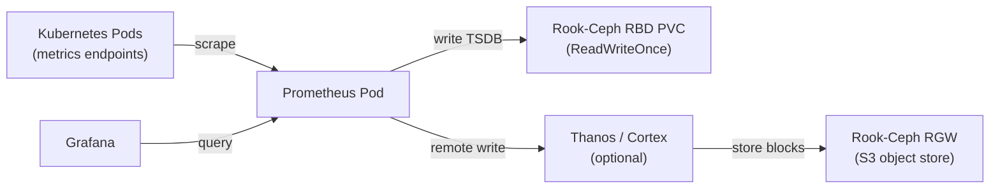

# How to Use Rook-Ceph for Prometheus TSDB Storage

Author: [nawazdhandala](https://www.github.com/nawazdhandala)

Tags: Rook, Ceph, Kubernetes, Prometheus, TSDB, Monitoring, Storage

Description: Configure Rook-Ceph block storage for Prometheus TSDB, Thanos, and VictoriaMetrics to provide durable, scalable time-series database storage in Kubernetes.

---

## How Prometheus Uses Storage

Prometheus stores its time-series data in a local TSDB (Time-Series Database) on disk. For Kubernetes deployments, this TSDB must be backed by persistent storage that survives pod restarts. Rook-Ceph RBD provides the low-latency, high-IOPS block storage that Prometheus TSDB requires for both writes (constant metric ingestion) and reads (query evaluation).



## Prerequisites

- Rook-Ceph cluster with RBD and optionally RGW operational
- Prometheus Operator or kube-prometheus-stack installed (or manual Prometheus deployment)

## Step 1 - Create a Dedicated Pool for Prometheus

Create a Ceph pool optimized for time-series write patterns (write-heavy, sequential-ish):

```yaml
apiVersion: ceph.rook.io/v1
kind: CephBlockPool
metadata:
  name: prometheus-pool
  namespace: rook-ceph
spec:
  failureDomain: host
  replicated:
    size: 3
    requireSafeReplicaSize: true
  parameters:
    compression_mode: aggressive
```

The `compression_mode: aggressive` enables Ceph BlueStore compression, which is highly effective for Prometheus TSDB data (time-series data compresses very well).

Apply it:

```bash
kubectl apply -f prometheus-pool.yaml
```

Create a StorageClass for Prometheus:

```yaml
apiVersion: storage.k8s.io/v1
kind: StorageClass
metadata:
  name: rook-ceph-prometheus
provisioner: rook-ceph.rbd.csi.ceph.com
parameters:
  clusterID: rook-ceph
  pool: prometheus-pool
  imageFormat: "2"
  imageFeatures: layering
  csi.storage.k8s.io/fstype: xfs
  csi.storage.k8s.io/provisioner-secret-name: rook-csi-rbd-provisioner
  csi.storage.k8s.io/provisioner-secret-namespace: rook-ceph
  csi.storage.k8s.io/controller-expand-secret-name: rook-csi-rbd-provisioner
  csi.storage.k8s.io/controller-expand-secret-namespace: rook-ceph
  csi.storage.k8s.io/node-stage-secret-name: rook-csi-rbd-node
  csi.storage.k8s.io/node-stage-secret-namespace: rook-ceph
reclaimPolicy: Retain
allowVolumeExpansion: true
```

## Step 2 - Deploy Prometheus with kube-prometheus-stack

Add the kube-prometheus-stack Helm repository:

```bash
helm repo add prometheus-community https://prometheus-community.github.io/helm-charts
helm repo update
```

Create a values file specifying Rook-Ceph storage:

```yaml
prometheus:
  prometheusSpec:
    retention: 30d
    retentionSize: 90GB
    storageSpec:
      volumeClaimTemplate:
        spec:
          storageClassName: rook-ceph-prometheus
          accessModes:
            - ReadWriteOnce
          resources:
            requests:
              storage: 100Gi
    resources:
      requests:
        cpu: "500m"
        memory: "2Gi"
      limits:
        cpu: "2"
        memory: "8Gi"

alertmanager:
  alertmanagerSpec:
    storage:
      volumeClaimTemplate:
        spec:
          storageClassName: rook-ceph-prometheus
          accessModes:
            - ReadWriteOnce
          resources:
            requests:
              storage: 5Gi

grafana:
  persistence:
    enabled: true
    storageClassName: rook-ceph-prometheus
    size: 10Gi
```

Install it:

```bash
helm install kube-prometheus-stack prometheus-community/kube-prometheus-stack \
  --namespace monitoring \
  --create-namespace \
  --values prometheus-values.yaml
```

## Step 3 - Verify Prometheus TSDB Storage

Check the Prometheus PVC is bound:

```bash
kubectl -n monitoring get pvc | grep prometheus
```

Verify Prometheus can write to the PVC by checking the TSDB status endpoint:

```bash
kubectl -n monitoring port-forward svc/kube-prometheus-stack-prometheus 9090:9090 &
curl http://localhost:9090/api/v1/status/tsdb
```

The output shows block counts and the current head block size.

## Step 4 - Configure Thanos with Rook-Ceph RGW for Long-Term Storage

For long-term metrics retention beyond 30 days, use Thanos with Rook-Ceph RGW as the object store.

Create a Thanos S3 configuration secret pointing to RGW:

```yaml
apiVersion: v1
kind: Secret
metadata:
  name: thanos-objstore-config
  namespace: monitoring
stringData:
  objstore.yml: |
    type: S3
    config:
      bucket: thanos-metrics
      endpoint: rook-ceph-rgw-my-store.rook-ceph.svc:80
      access_key: thanos-access-key
      secret_key: thanos-secret-key
      insecure: true
```

Enable Thanos sidecar in the kube-prometheus-stack values:

```yaml
prometheus:
  prometheusSpec:
    thanos:
      baseImage: quay.io/thanos/thanos
      version: v0.36.0
      objectStorageConfig:
        name: thanos-objstore-config
        key: objstore.yml
```

Upgrade the Helm release:

```bash
helm upgrade kube-prometheus-stack prometheus-community/kube-prometheus-stack \
  --namespace monitoring \
  --values prometheus-values.yaml
```

## Step 5 - VictoriaMetrics with Rook-Ceph

VictoriaMetrics is a high-performance alternative to Prometheus. Configure it with Rook-Ceph:

```yaml
apiVersion: apps/v1
kind: StatefulSet
metadata:
  name: victoria-metrics
  namespace: monitoring
spec:
  serviceName: victoria-metrics
  replicas: 1
  selector:
    matchLabels:
      app: victoria-metrics
  template:
    metadata:
      labels:
        app: victoria-metrics
    spec:
      containers:
        - name: victoria-metrics
          image: victoriametrics/victoria-metrics:v1.101.0
          args:
            - --storageDataPath=/storage
            - --retentionPeriod=90d
            - --httpListenAddr=:8428
          ports:
            - containerPort: 8428
          volumeMounts:
            - name: storage
              mountPath: /storage
          resources:
            requests:
              cpu: "500m"
              memory: "1Gi"
            limits:
              cpu: "4"
              memory: "16Gi"
  volumeClaimTemplates:
    - metadata:
        name: storage
      spec:
        accessModes:
          - ReadWriteOnce
        storageClassName: rook-ceph-prometheus
        resources:
          requests:
            storage: 200Gi
```

## Monitoring TSDB Health

Check Prometheus TSDB stats from the Rook-Ceph perspective by monitoring the PVC utilization:

```bash
kubectl -n monitoring exec -it prometheus-kube-prometheus-stack-prometheus-0 -- \
  du -sh /prometheus/
```

Watch for TSDB compaction activity in Prometheus logs:

```bash
kubectl -n monitoring logs -l app.kubernetes.io/name=prometheus --tail=50 | grep compaction
```

## Summary

Rook-Ceph provides ideal storage for Prometheus TSDB through dedicated RBD block storage with BlueStore compression enabled (time-series data compresses well). Deploy via kube-prometheus-stack with `storageClassName: rook-ceph-prometheus` in the `storageSpec.volumeClaimTemplate`. For long-term storage, add Thanos with Rook-Ceph RGW as the S3 backend to store compacted metric blocks beyond the local TSDB retention period. Use `reclaimPolicy: Retain` to protect metrics data from accidental deletion.
