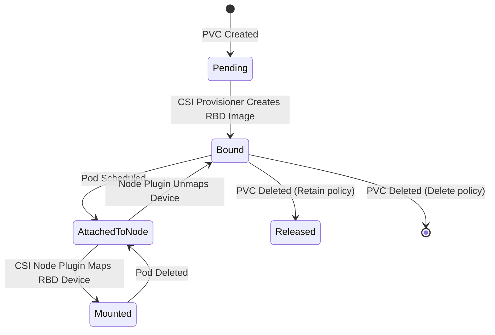

# How to Provision a Persistent Volume with Rook-Ceph RBD

Author: [nawazdhandala](https://www.github.com/nawazdhandala)

Tags: Rook, Ceph, Kubernetes, PVC, RBD, PersistentVolume

Description: Learn how to create and use Kubernetes PersistentVolumeClaims backed by Rook-Ceph RBD, from dynamic provisioning through mounting in application pods.

---

## How RBD PVC Provisioning Works

When you create a PVC referencing a Rook-Ceph StorageClass, the CSI provisioner creates a thin-provisioned RBD image in the configured pool. The image is only mapped to a block device on a Kubernetes node when a pod actually mounts the PVC. This lazy attachment reduces resource usage - an unattached RBD image consumes only metadata until it is written to.



## Creating a PVC with Dynamic Provisioning

The simplest way to get storage with Rook-Ceph is to create a PVC that references the RBD StorageClass. The CSI driver handles all provisioning automatically:

```yaml
apiVersion: v1
kind: PersistentVolumeClaim
metadata:
  name: my-app-data
  namespace: default
spec:
  accessModes:
    - ReadWriteOnce
  resources:
    requests:
      storage: 20Gi
  storageClassName: rook-ceph-block
```

```bash
kubectl apply -f pvc.yaml
kubectl get pvc my-app-data -w
```

## Mounting the PVC in a Deployment

Reference the PVC in a Deployment's pod spec:

```yaml
apiVersion: apps/v1
kind: Deployment
metadata:
  name: my-app
  namespace: default
spec:
  replicas: 1
  selector:
    matchLabels:
      app: my-app
  template:
    metadata:
      labels:
        app: my-app
    spec:
      containers:
        - name: app
          image: nginx:latest
          ports:
            - containerPort: 80
          volumeMounts:
            - name: data
              mountPath: /usr/share/nginx/html
      volumes:
        - name: data
          persistentVolumeClaim:
            claimName: my-app-data
```

```bash
kubectl apply -f deployment.yaml
```

## Using PVCs with StatefulSets

StatefulSets should use `volumeClaimTemplates` rather than referencing a shared PVC directly. This creates one PVC per pod replica, ensuring each pod gets its own isolated storage:

```yaml
apiVersion: apps/v1
kind: StatefulSet
metadata:
  name: postgres
  namespace: default
spec:
  serviceName: postgres
  replicas: 1
  selector:
    matchLabels:
      app: postgres
  template:
    metadata:
      labels:
        app: postgres
    spec:
      containers:
        - name: postgres
          image: postgres:15
          env:
            - name: POSTGRES_PASSWORD
              value: mysecretpassword
            - name: PGDATA
              value: /var/lib/postgresql/data/pgdata
          volumeMounts:
            - name: postgres-data
              mountPath: /var/lib/postgresql/data
  volumeClaimTemplates:
    - metadata:
        name: postgres-data
      spec:
        accessModes:
          - ReadWriteOnce
        resources:
          requests:
            storage: 50Gi
        storageClassName: rook-ceph-block
```

## Expanding an Existing PVC

Rook-Ceph RBD StorageClasses support online volume expansion. Increase the PVC size by editing the `spec.resources.requests.storage` field:

```yaml
apiVersion: v1
kind: PersistentVolumeClaim
metadata:
  name: my-app-data
spec:
  accessModes:
    - ReadWriteOnce
  resources:
    requests:
      # Increased from 20Gi to 50Gi
      storage: 50Gi
  storageClassName: rook-ceph-block
```

```bash
kubectl apply -f pvc-expanded.yaml

# Monitor the expansion progress
kubectl describe pvc my-app-data | grep -A 5 Conditions
```

The expansion happens in two stages: Ceph resizes the RBD image, then the filesystem on the node is expanded. The pod does not need to be restarted for the expansion to take effect on a running ext4 or XFS volume.

## Checking PVC and PV Details

Inspect the PVC to find the underlying PV and verify storage:

```bash
kubectl describe pvc my-app-data
```

Find the RBD image name from the PV:

```bash
kubectl get pv $(kubectl get pvc my-app-data -o jsonpath='{.spec.volumeName}') -o yaml | grep -A 10 csi
```

Look up the RBD image in the Ceph pool:

```bash
kubectl -n rook-ceph exec deploy/rook-ceph-tools -- \
  rbd info replicapool/csi-vol-$(kubectl get pvc my-app-data -o jsonpath='{.spec.volumeName}' | cut -d- -f2-)
```

## Pre-Provisioned (Static) PV

For migrating existing RBD images into Kubernetes, create a static PV:

```yaml
apiVersion: v1
kind: PersistentVolume
metadata:
  name: existing-rbd-pv
spec:
  capacity:
    storage: 20Gi
  accessModes:
    - ReadWriteOnce
  persistentVolumeReclaimPolicy: Retain
  storageClassName: rook-ceph-block
  csi:
    driver: rook-ceph.rbd.csi.ceph.com
    nodeStageSecretRef:
      name: rook-csi-rbd-node
      namespace: rook-ceph
    volumeAttributes:
      clusterID: rook-ceph
      pool: replicapool
      staticVolume: "true"
      imageFormat: "2"
      imageFeatures: layering
    volumeHandle: existing-image-name
```

## Summary

Provisioning a Rook-Ceph RBD PVC is straightforward: create a PVC referencing the `rook-ceph-block` StorageClass, and the CSI driver automatically creates and binds an RBD image. For Deployments, reference the PVC in the `volumes` section; for StatefulSets, use `volumeClaimTemplates` for per-replica storage isolation. Online volume expansion works without pod restarts when the StorageClass has `allowVolumeExpansion: true`. Use `kubectl describe pvc` and the toolbox's `rbd info` command to inspect the underlying image when troubleshooting.
