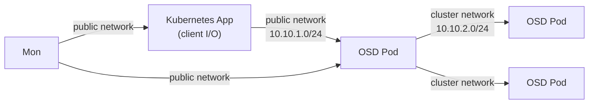

# How to Set Up Public and Cluster Network Separation in Rook-Ceph

Author: [nawazdhandala](https://www.github.com/nawazdhandala)

Tags: Rook, Ceph, Kubernetes, Network, Storage, Performance

Description: Configure separate public and cluster networks in Rook-Ceph to isolate client storage traffic from OSD replication traffic, improving performance and security.

---

## Why Separate Public and Cluster Networks

Ceph supports two distinct network planes:

- **Public network** - Used by Mon, MGR, and for client-to-OSD communication
- **Cluster network** - Used exclusively for OSD-to-OSD replication and recovery

Separating these networks means replication and recovery traffic does not compete with client I/O on the same NIC, improving client throughput during recovery events.



## Hardware Setup

Each storage node needs two dedicated network interfaces:

- `eth1` (or `bond0`) - Public storage network: `10.10.1.0/24`
- `eth2` (or `bond1`) - Cluster replication network: `10.10.2.0/24`

Configure these interfaces with static IPs on each node before deploying Rook.

## Configuration with Host Networking

When using `provider: host`, specify CIDR ranges for each plane:

```yaml
apiVersion: ceph.rook.io/v1
kind: CephCluster
metadata:
  name: rook-ceph
  namespace: rook-ceph
spec:
  cephVersion:
    image: quay.io/ceph/ceph:v19.2.0
  dataDirHostPath: /var/lib/rook
  network:
    provider: host
    addressRanges:
      public:
        - 10.10.1.0/24
      cluster:
        - 10.10.2.0/24
  mon:
    count: 3
    allowMultiplePerNode: false
  storage:
    useAllNodes: false
    useAllDevices: false
    nodes:
      - name: storage-node-1
        devices:
          - name: nvme0n1
      - name: storage-node-2
        devices:
          - name: nvme0n1
      - name: storage-node-3
        devices:
          - name: nvme0n1
```

Ceph resolves which NIC to bind by matching the configured CIDR against the node's available IP addresses. The NIC with an IP in `10.10.1.0/24` becomes the public interface for that OSD; the NIC with an IP in `10.10.2.0/24` becomes the cluster interface.

## Configuration with Multus (Overlay Network)

If you prefer overlay networking with dedicated virtual interfaces via Multus:

```yaml
spec:
  network:
    provider: multus
    selectors:
      public: rook-ceph/public-net
      cluster: rook-ceph/cluster-net
```

Create corresponding NetworkAttachmentDefinitions:

```yaml
apiVersion: k8s.cni.cncf.io/v1
kind: NetworkAttachmentDefinition
metadata:
  name: public-net
  namespace: rook-ceph
spec:
  config: |
    {
      "cniVersion": "0.3.1",
      "type": "macvlan",
      "master": "eth1",
      "mode": "bridge",
      "ipam": {"type": "dhcp"}
    }
---
apiVersion: k8s.cni.cncf.io/v1
kind: NetworkAttachmentDefinition
metadata:
  name: cluster-net
  namespace: rook-ceph
spec:
  config: |
    {
      "cniVersion": "0.3.1",
      "type": "macvlan",
      "master": "eth2",
      "mode": "bridge",
      "ipam": {"type": "dhcp"}
    }
```

## Verifying Network Separation

After deploying, check OSD addresses from the toolbox:

```bash
kubectl -n rook-ceph exec -it deploy/rook-ceph-tools -- \
  ceph osd dump | grep -E "public_addr|cluster_addr" | head -10
```

Expected output shows separate IPs for public and cluster addresses:

```
public_addr 10.10.1.11:6800/...
cluster_addr 10.10.2.11:6801/...
```

Also verify Mon addresses are on the public network:

```bash
kubectl -n rook-ceph exec -it deploy/rook-ceph-tools -- ceph mon dump
```

## Benefits of Network Separation in Practice

During a recovery event (e.g., one OSD fails and 100 GB needs to be backfilled), the cluster network carries the backfill traffic at potentially 10 Gbps. Without separation, this would saturate client-facing NICs. With separation, client I/O continues normally on the public network while recovery proceeds independently on the cluster network.

## Summary

Separate public and cluster networks in Rook-Ceph by configuring `network.addressRanges.public` and `network.addressRanges.cluster` with their respective CIDRs when using host networking. Each storage node needs two dedicated NICs or VLAN interfaces, one in each network range. Ceph binds Mon and client-facing OSD traffic to the public network CIDR and OSD-to-OSD replication traffic to the cluster network CIDR. Verify the separation with `ceph osd dump | grep addr` to confirm distinct public and cluster IP addresses per OSD.
