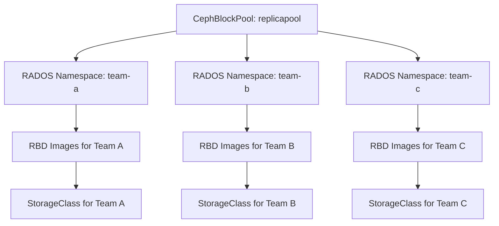

# How to Use CephBlockPoolRadosNamespace in Rook

Author: [nawazdhandala](https://www.github.com/nawazdhandala)

Tags: Rook, Ceph, Kubernetes, RBD, RadosNamespace, Isolation

Description: Learn how to use CephBlockPoolRadosNamespace CRD in Rook to create logical namespaces within a CephBlockPool for multi-tenant RBD isolation.

---

`CephBlockPoolRadosNamespace` lets you create isolated RADOS namespaces within a single CephBlockPool. Each namespace acts as a logical partition, enabling multi-tenant RBD storage where different teams share pool capacity but have isolated image namespaces and access credentials.

## Architecture



## Prerequisites

- Rook v1.10+
- An existing `CephBlockPool`
- Rook CSI driver installed

## Create a CephBlockPool

```yaml
apiVersion: ceph.rook.io/v1
kind: CephBlockPool
metadata:
  name: replicapool
  namespace: rook-ceph
spec:
  failureDomain: host
  replicated:
    size: 3
    requireSafeReplicaSize: true
```

## Create a CephBlockPoolRadosNamespace

```yaml
apiVersion: ceph.rook.io/v1
kind: CephBlockPoolRadosNamespace
metadata:
  name: team-a-namespace
  namespace: rook-ceph
spec:
  blockPoolName: replicapool    # reference to the parent pool
```

Apply for each tenant:

```yaml
---
apiVersion: ceph.rook.io/v1
kind: CephBlockPoolRadosNamespace
metadata:
  name: team-a-namespace
  namespace: rook-ceph
spec:
  blockPoolName: replicapool
---
apiVersion: ceph.rook.io/v1
kind: CephBlockPoolRadosNamespace
metadata:
  name: team-b-namespace
  namespace: rook-ceph
spec:
  blockPoolName: replicapool
---
apiVersion: ceph.rook.io/v1
kind: CephBlockPoolRadosNamespace
metadata:
  name: team-c-namespace
  namespace: rook-ceph
spec:
  blockPoolName: replicapool
```

```bash
kubectl apply -f rados-namespaces.yaml
kubectl get cephblockpoolradosnamespace -n rook-ceph
```

## Create StorageClass per Namespace

Each namespace gets its own StorageClass with the `radosNamespaceName` parameter:

```yaml
apiVersion: storage.k8s.io/v1
kind: StorageClass
metadata:
  name: ceph-rbd-team-a
provisioner: rook-ceph.rbd.csi.ceph.com
parameters:
  clusterID: rook-ceph
  pool: replicapool
  radosNamespaceName: team-a-namespace    # isolate to this namespace
  imageFormat: "2"
  imageFeatures: layering
  csi.storage.k8s.io/provisioner-secret-name: rook-csi-rbd-provisioner
  csi.storage.k8s.io/provisioner-secret-namespace: rook-ceph
  csi.storage.k8s.io/controller-expand-secret-name: rook-csi-rbd-provisioner
  csi.storage.k8s.io/controller-expand-secret-namespace: rook-ceph
  csi.storage.k8s.io/node-stage-secret-name: rook-csi-rbd-node
  csi.storage.k8s.io/node-stage-secret-namespace: rook-ceph
reclaimPolicy: Delete
allowVolumeExpansion: true
---
apiVersion: storage.k8s.io/v1
kind: StorageClass
metadata:
  name: ceph-rbd-team-b
provisioner: rook-ceph.rbd.csi.ceph.com
parameters:
  clusterID: rook-ceph
  pool: replicapool
  radosNamespaceName: team-b-namespace
  imageFormat: "2"
  imageFeatures: layering
  csi.storage.k8s.io/provisioner-secret-name: rook-csi-rbd-provisioner
  csi.storage.k8s.io/provisioner-secret-namespace: rook-ceph
  csi.storage.k8s.io/controller-expand-secret-name: rook-csi-rbd-provisioner
  csi.storage.k8s.io/controller-expand-secret-namespace: rook-ceph
  csi.storage.k8s.io/node-stage-secret-name: rook-csi-rbd-node
  csi.storage.k8s.io/node-stage-secret-namespace: rook-ceph
reclaimPolicy: Delete
allowVolumeExpansion: true
```

## Create a PVC Using a Namespaced StorageClass

```yaml
apiVersion: v1
kind: PersistentVolumeClaim
metadata:
  name: team-a-data
  namespace: team-a
spec:
  accessModes:
    - ReadWriteOnce
  resources:
    requests:
      storage: 10Gi
  storageClassName: ceph-rbd-team-a
```

## Verify Namespace Isolation

```bash
kubectl exec -n rook-ceph deploy/rook-ceph-tools -- bash

# List images in team-a namespace
rbd ls replicapool --namespace team-a-namespace

# List images in team-b namespace
rbd ls replicapool --namespace team-b-namespace

# Confirm images are isolated
rbd info replicapool/csi-vol-xxxx --namespace team-a-namespace
```

## Check RadosNamespace Status

```bash
kubectl get cephblockpoolradosnamespace -n rook-ceph -o wide
kubectl describe cephblockpoolradosnamespace team-a-namespace -n rook-ceph
```

## Summary

`CephBlockPoolRadosNamespace` provides logical multi-tenancy within a single Rook-Ceph block pool. Each namespace isolates RBD images under a unique prefix, and pairing each namespace with a dedicated StorageClass lets Kubernetes teams provision storage independently while sharing underlying pool capacity and hardware.
