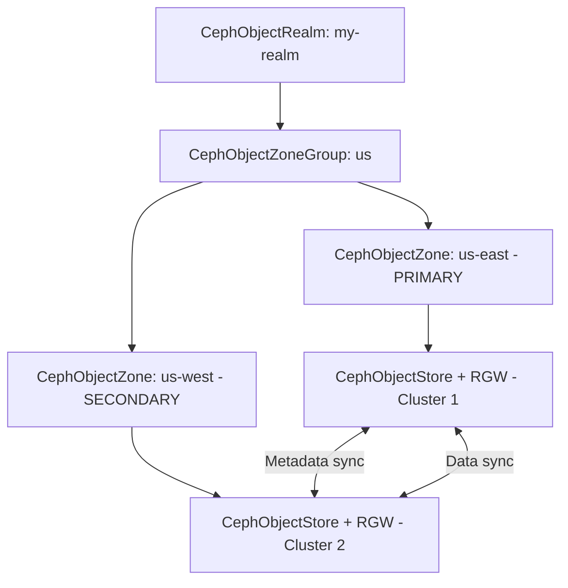

# How to Set Up Ceph RADOSGW Multisite with Rook

Author: [nawazdhandala](https://www.github.com/nawazdhandala)

Tags: Rook, Ceph, Kubernetes, RADOSGW, RGW, Multisite, Replication, ObjectStore

Description: Step-by-step guide to configuring Ceph RADOSGW multisite object storage with Rook, enabling automatic S3 data replication between two clusters.

---

Ceph RADOSGW multisite replicates objects and bucket metadata between clusters. With Rook, you configure this through the `CephObjectRealm`, `CephObjectZoneGroup`, `CephObjectZone`, and `CephObjectStore` CRDs across two clusters.

## Multisite Topology



## Cluster 1 (Primary) Setup

### 1. Create Realm

```yaml
apiVersion: ceph.rook.io/v1
kind: CephObjectRealm
metadata:
  name: my-realm
  namespace: rook-ceph
spec: {}
```

### 2. Create Zone Group

```yaml
apiVersion: ceph.rook.io/v1
kind: CephObjectZoneGroup
metadata:
  name: us
  namespace: rook-ceph
spec:
  realm: my-realm
```

### 3. Create Primary Zone

```yaml
apiVersion: ceph.rook.io/v1
kind: CephObjectZone
metadata:
  name: us-east
  namespace: rook-ceph
spec:
  zoneGroup: us
  metadataPool:
    failureDomain: host
    replicated:
      size: 3
  dataPool:
    failureDomain: host
    replicated:
      size: 3
  preservePoolsOnDelete: true
```

### 4. Create Primary Object Store

```yaml
apiVersion: ceph.rook.io/v1
kind: CephObjectStore
metadata:
  name: store-east
  namespace: rook-ceph
spec:
  zone:
    name: us-east
  gateway:
    port: 80
    instances: 2
```

### 5. Set Master Zone Group and Zone

```bash
kubectl exec -n rook-ceph deploy/rook-ceph-tools -- \
  radosgw-admin zonegroup modify --rgw-zonegroup=us --master

kubectl exec -n rook-ceph deploy/rook-ceph-tools -- \
  radosgw-admin zone modify --rgw-zone=us-east --master

kubectl exec -n rook-ceph deploy/rook-ceph-tools -- \
  radosgw-admin period update --commit
```

### 6. Export Realm Pull Token

```bash
kubectl exec -n rook-ceph deploy/rook-ceph-tools -- \
  radosgw-admin realm pull-token \
    --url=http://store-east-endpoint \
    --access-key=<admin-access> \
    --secret-key=<admin-secret>
```

Get the realm endpoint and credentials from the object store user:

```bash
# Create a system user for realm operations
kubectl exec -n rook-ceph deploy/rook-ceph-tools -- \
  radosgw-admin user create \
    --uid=realm-sync \
    --display-name="Realm Sync User" \
    --system

kubectl exec -n rook-ceph deploy/rook-ceph-tools -- \
  radosgw-admin user info --uid=realm-sync
```

## Cluster 2 (Secondary) Setup

### 1. Create Realm Secret (from primary's pull token)

```bash
kubectl create secret generic realm-my-realm \
  --from-literal=endpoint="http://store-east.cluster1.example.com:80" \
  --from-literal=token="<access-key>:<secret-key>" \
  -n rook-ceph
```

### 2. Pull the Realm

```yaml
apiVersion: ceph.rook.io/v1
kind: CephObjectRealm
metadata:
  name: my-realm
  namespace: rook-ceph
spec:
  pull:
    endpoint: http://store-east.cluster1.example.com:80
    secretNames:
      - realm-my-realm
```

### 3. Create Secondary Zone

```yaml
apiVersion: ceph.rook.io/v1
kind: CephObjectZone
metadata:
  name: us-west
  namespace: rook-ceph
spec:
  zoneGroup: us
  metadataPool:
    failureDomain: host
    replicated:
      size: 3
  dataPool:
    failureDomain: host
    replicated:
      size: 3
  preservePoolsOnDelete: true
```

### 4. Create Secondary Object Store

```yaml
apiVersion: ceph.rook.io/v1
kind: CephObjectStore
metadata:
  name: store-west
  namespace: rook-ceph
spec:
  zone:
    name: us-west
  gateway:
    port: 80
    instances: 2
```

## Verify Sync Status

```bash
# On secondary cluster
kubectl exec -n rook-ceph deploy/rook-ceph-tools -- \
  radosgw-admin sync status

# Check data sync
kubectl exec -n rook-ceph deploy/rook-ceph-tools -- \
  radosgw-admin sync status --rgw-zone=us-west

# Check metadata sync
kubectl exec -n rook-ceph deploy/rook-ceph-tools -- \
  radosgw-admin metadata sync status
```

Expected sync status (when caught up):

```yaml
realm: my-realm
zonegroup: us
zone: us-west
metadata sync: syncing
  incremental sync: ...
data sync source: us-east
  ...behind shards: 0
```

## Test Replication

```bash
# Upload to primary
aws s3 cp /tmp/test.txt s3://my-bucket/test.txt \
  --endpoint-url http://store-east.cluster1.example.com:80

# Verify on secondary (after sync)
aws s3 ls s3://my-bucket/ \
  --endpoint-url http://store-west.cluster2.example.com:80
```

## Summary

Rook RADOSGW multisite requires CRDs applied in sequence: realm, zone group, zone, and object store. The primary site creates the realm and master zone; secondary sites pull the realm configuration and create a non-master zone pointing to the same zone group. Sync status is verified via `radosgw-admin sync status`. Once configured, all object writes to any zone replicate automatically to peer zones.
