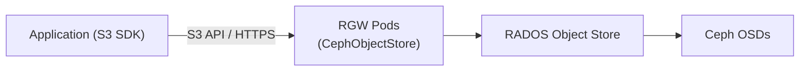

# How to Configure Ceph RadosGW for S3 API in Rook

Author: [nawazdhandala](https://www.github.com/nawazdhandala)

Tags: Rook, Ceph, Kubernetes, S3, Object Storage, RGW, RADOSGW

Description: Configure Ceph RadosGW (RGW) in Rook-Ceph to expose an S3-compatible object storage API, including StorageClass bucket provisioning and user management.

---

## How RadosGW S3 Works in Rook-Ceph

Ceph RadosGW (RGW) provides an S3-compatible REST API on top of the Ceph RADOS object store. In Rook, you deploy RGW through the `CephObjectStore` CRD, which provisions RGW pods and a Kubernetes Service. Applications can then use standard S3 SDKs or tools (AWS CLI, s3cmd, boto3) to interact with the object store.



## Prerequisites

- A running Rook-Ceph cluster with OSDs
- Sufficient pool capacity for object data
- The `rook-ceph-tools` pod for CLI access

## Step 1 - Create the Object Store

The `CephObjectStore` resource deploys RGW pods and creates the required Ceph pools:

```yaml
apiVersion: ceph.rook.io/v1
kind: CephObjectStore
metadata:
  name: my-store
  namespace: rook-ceph
spec:
  metadataPool:
    failureDomain: host
    replicated:
      size: 3
  dataPool:
    failureDomain: host
    replicated:
      size: 3
  preservePoolsOnDelete: true
  gateway:
    sslCertificateRef:
    port: 80
    securePort:
    instances: 2
    priorityClassName: system-cluster-critical
```

Apply it:

```bash
kubectl apply -f cephobjectstore.yaml
```

Verify the object store is ready:

```bash
kubectl -n rook-ceph get cephobjectstore my-store
```

The `phase` should be `Ready`.

## Step 2 - Create the StorageClass for Bucket Provisioning

The COSI (Container Object Storage Interface) or the Rook-specific `ObjectBucketClaim` approach uses a StorageClass to provision buckets dynamically:

```yaml
apiVersion: storage.k8s.io/v1
kind: StorageClass
metadata:
  name: rook-ceph-bucket
provisioner: rook-ceph.ceph.rook.io/bucket
reclaimPolicy: Delete
parameters:
  objectStoreName: my-store
  objectStoreNamespace: rook-ceph
```

Apply it:

```bash
kubectl apply -f storageclass-bucket.yaml
```

## Step 3 - Create a Bucket via ObjectBucketClaim

Create an ObjectBucketClaim (OBC) to provision a new S3 bucket:

```yaml
apiVersion: objectbucket.io/v1alpha1
kind: ObjectBucketClaim
metadata:
  name: my-bucket
  namespace: default
spec:
  generateBucketName: my-bucket
  storageClassName: rook-ceph-bucket
```

Apply it:

```bash
kubectl apply -f objectbucketclaim.yaml
```

Rook automatically creates a ConfigMap and Secret with connection details:

```bash
kubectl get configmap my-bucket -o yaml
kubectl get secret my-bucket -o yaml
```

The ConfigMap contains `BUCKET_HOST`, `BUCKET_PORT`, `BUCKET_NAME`. The Secret contains `AWS_ACCESS_KEY_ID` and `AWS_SECRET_ACCESS_KEY`.

## Step 4 - Create an S3 User Manually

You can also create RGW users directly:

```bash
kubectl -n rook-ceph exec -it deploy/rook-ceph-tools -- \
  radosgw-admin user create \
  --uid=myuser \
  --display-name="My User" \
  --email=myuser@example.com
```

Note the `access_key` and `secret_key` from the output.

Set a quota on the user:

```bash
kubectl -n rook-ceph exec -it deploy/rook-ceph-tools -- \
  radosgw-admin quota set --quota-scope=user --uid=myuser \
  --max-size=10G --max-objects=100000
```

Enable the quota:

```bash
kubectl -n rook-ceph exec -it deploy/rook-ceph-tools -- \
  radosgw-admin quota enable --quota-scope=user --uid=myuser
```

## Step 5 - Access the S3 API

Get the RGW service endpoint:

```bash
kubectl -n rook-ceph get svc rook-ceph-rgw-my-store
```

Test with the AWS CLI using credentials from the OBC Secret:

```bash
export AWS_ACCESS_KEY_ID=$(kubectl get secret my-bucket -o jsonpath='{.data.AWS_ACCESS_KEY_ID}' | base64 -d)
export AWS_SECRET_ACCESS_KEY=$(kubectl get secret my-bucket -o jsonpath='{.data.AWS_SECRET_ACCESS_KEY}' | base64 -d)
export BUCKET_HOST=$(kubectl get configmap my-bucket -o jsonpath='{.data.BUCKET_HOST}')
export BUCKET_NAME=$(kubectl get configmap my-bucket -o jsonpath='{.data.BUCKET_NAME}')

aws s3 ls --endpoint-url http://${BUCKET_HOST} s3://${BUCKET_NAME}
```

Upload a test file:

```bash
echo "hello rook" > test.txt
aws s3 cp test.txt --endpoint-url http://${BUCKET_HOST} s3://${BUCKET_NAME}/test.txt
```

## Exposing RGW Externally

To expose RGW outside the cluster, change the Service type to LoadBalancer:

```yaml
apiVersion: ceph.rook.io/v1
kind: CephObjectStore
metadata:
  name: my-store
  namespace: rook-ceph
spec:
  gateway:
    port: 80
    instances: 2
    externalRgwEndpoints:
      - ip: 192.168.1.100
```

Or patch the existing service:

```bash
kubectl -n rook-ceph patch svc rook-ceph-rgw-my-store \
  -p '{"spec":{"type":"LoadBalancer"}}'
```

## Monitoring the Object Store

Check RGW stats:

```bash
kubectl -n rook-ceph exec -it deploy/rook-ceph-tools -- \
  radosgw-admin usage show --show-log-entries=false
```

List all buckets across all users:

```bash
kubectl -n rook-ceph exec -it deploy/rook-ceph-tools -- \
  radosgw-admin bucket list
```

## Summary

Configuring Ceph RadosGW for S3 API in Rook involves deploying a `CephObjectStore` resource, creating a StorageClass for dynamic bucket provisioning, and using `ObjectBucketClaim` to provision buckets. Applications receive S3 credentials through a Kubernetes Secret and ConfigMap. For manual user management, `radosgw-admin` provides full control over users, quotas, and bucket policies.
