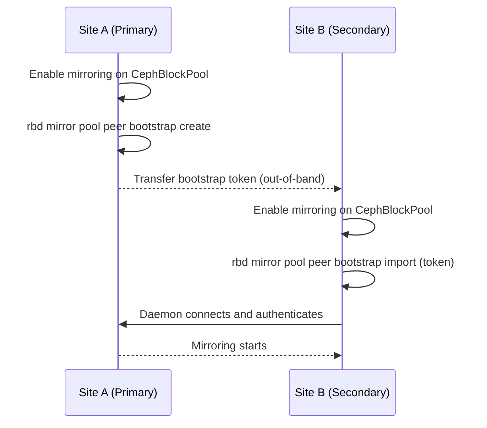

# How to Set Up Bootstrap Peers and Peer Tokens for RBD Mirroring in Rook

Author: [nawazdhandala](https://www.github.com/nawazdhandala)

Tags: Rook, Ceph, Kubernetes, Storage

Description: Generate and exchange bootstrap peer tokens between two Rook-managed Ceph clusters to enable RBD mirroring for disaster recovery.

---

## Introduction

RBD mirroring between two Ceph clusters requires bootstrapping a trust relationship using peer tokens. Each cluster generates a bootstrap token that the peer cluster uses to authenticate and set up the mirroring daemon. Rook automates most of this process through the `CephBlockPoolRadosNamespace` and mirror peer bootstrap commands, but the token exchange must still be performed as an operational step.

## Mirroring Peer Bootstrap Flow



## Prerequisites

- Two independent Rook-Ceph clusters (Site A and Site B)
- Network connectivity between the two clusters' Ceph monitor endpoints
- Both clusters running Ceph Quincy or newer
- Rook operator v1.10+ on both clusters

## Step 1: Enable Mirroring on Site A CephBlockPool

On the Site A Kubernetes cluster:

```yaml
# site-a-pool-mirroring.yaml
apiVersion: ceph.rook.io/v1
kind: CephBlockPool
metadata:
  name: replicapool
  namespace: rook-ceph
spec:
  replicated:
    size: 3
    requireSafeReplicaSize: true
  mirroring:
    enabled: true
    # journal mode mirrors at the journal level
    mode: journal
    # Optional: snapshot-based mirroring schedule
    # mode: snapshot
    snapshotSchedules:
      - interval: 24h
        startTime: "00:00:00-05:00"
```

```bash
kubectl apply -f site-a-pool-mirroring.yaml

# Check mirroring status
kubectl -n rook-ceph exec -it deploy/rook-ceph-tools -- \
  rbd mirror pool status replicapool
```

## Step 2: Generate a Bootstrap Token on Site A

```bash
# Access the Site A toolbox
kubectl -n rook-ceph exec -it deploy/rook-ceph-tools -- bash

# Generate a bootstrap token for the peer
rbd mirror pool peer bootstrap create \
  --site-name site-a \
  replicapool

# The output is a base64-encoded JSON token, save it:
# eyJmc2lkIjoiYWFhMTExMTEtYWFhYS1hYWFhLWFhYWEtYWFhYWFhYWFhYWFhIi...
```

Save this token securely - it is a credential that grants mirroring access to your cluster.

## Step 3: Create a Kubernetes Secret with the Bootstrap Token on Site B

Transfer the token from Site A to Site B (via a secure out-of-band channel), then create a secret:

```bash
# On the Site B Kubernetes cluster
# Replace TOKEN_VALUE with the actual token from Site A
BOOTSTRAP_TOKEN="eyJmc2lkIjoiYWFhMTExMTEtYWFhYS1hYWFhLWFhYWEtYWFhYWFhYWFhYWFhIi..."

kubectl create secret generic site-a-peer-token \
  -n rook-ceph \
  --from-literal=token="$BOOTSTRAP_TOKEN"
```

Or as a YAML manifest:

```yaml
# site-a-peer-secret.yaml
apiVersion: v1
kind: Secret
metadata:
  name: site-a-peer-token
  namespace: rook-ceph
type: Opaque
stringData:
  token: "eyJmc2lkIjoiYWFhMTExMTEtYWFhYS1hYWFhLWFhYWEtYWFhYWFhYWFhYWFhIi..."
```

## Step 4: Enable Mirroring on Site B and Import the Token

```yaml
# site-b-pool-mirroring.yaml
apiVersion: ceph.rook.io/v1
kind: CephBlockPool
metadata:
  name: replicapool
  namespace: rook-ceph
spec:
  replicated:
    size: 3
    requireSafeReplicaSize: true
  mirroring:
    enabled: true
    mode: journal
    # Reference the bootstrap token secret from Site A
    peers:
      secretNames:
        - site-a-peer-token
```

```bash
kubectl apply -f site-b-pool-mirroring.yaml

# Check that the peer was added
kubectl -n rook-ceph exec -it deploy/rook-ceph-tools -- \
  rbd mirror pool peer list replicapool
```

## Step 5: Perform Bidirectional Peer Setup

For bidirectional failover capability, also set up the reverse direction:

```bash
# On Site B toolbox, generate Site B's bootstrap token
kubectl -n rook-ceph exec -it deploy/rook-ceph-tools -- \
  rbd mirror pool peer bootstrap create \
    --site-name site-b \
    replicapool
# Save this token as SITE_B_TOKEN
```

On Site A:

```bash
# Create secret with Site B's token
kubectl create secret generic site-b-peer-token \
  -n rook-ceph \
  --from-literal=token="$SITE_B_TOKEN"
```

Update Site A's CephBlockPool to include Site B as a peer:

```yaml
# Update site-a-pool-mirroring.yaml
spec:
  mirroring:
    enabled: true
    mode: journal
    peers:
      secretNames:
        - site-b-peer-token
```

```bash
kubectl apply -f site-a-pool-mirroring.yaml
```

## Step 6: Verify Peer Connection

```bash
# On Site A toolbox
kubectl -n rook-ceph exec -it deploy/rook-ceph-tools -- bash

# Check peer list
rbd mirror pool peer list replicapool

# Check mirroring daemon status
rbd mirror pool status replicapool --verbose

# Expected output showing healthy connection:
# health: OK
# daemon health: OK
# image health: OK
# images: 5 total
#     5 replaying
```

## Step 7: Check CephBlockPool Status for Mirroring Info

```bash
kubectl describe cephblockpool replicapool -n rook-ceph | grep -A20 "Mirroring"

# Check the mirroring status via kubectl
kubectl get cephblockpool replicapool -n rook-ceph -o yaml | grep -A10 "mirroring"
```

## Troubleshooting

```bash
# If peer bootstrap import fails
kubectl -n rook-ceph exec -it deploy/rook-ceph-tools -- \
  ceph log last 50 | grep -i mirror

# Check mirror daemon connectivity
kubectl -n rook-ceph exec -it deploy/rook-ceph-tools -- \
  ceph mirror daemon status

# Verify the bootstrap token is valid JSON when decoded
echo "$BOOTSTRAP_TOKEN" | base64 -d | python3 -m json.tool

# Check if mirroring is actually enabled on the pool
kubectl -n rook-ceph exec -it deploy/rook-ceph-tools -- \
  ceph osd pool ls detail | grep -A5 replicapool
```

## Security Considerations

- Bootstrap tokens grant significant access to your Ceph cluster - treat them as credentials
- Rotate peer tokens periodically using `rbd mirror pool peer remove` and re-bootstrapping
- Transmit tokens over encrypted channels (SSH, sealed secrets, Vault) only
- Audit peer access with `rbd mirror pool peer list` regularly

## Summary

Setting up bootstrap peers for RBD mirroring involves generating a token on each site using `rbd mirror pool peer bootstrap create`, storing the remote site's token in a Kubernetes secret, and referencing that secret in the `mirroring.peers.secretNames` field of the CephBlockPool spec. Rook handles the underlying peer configuration automatically once the token is provided. For bidirectional failover, both sites must import each other's tokens.
