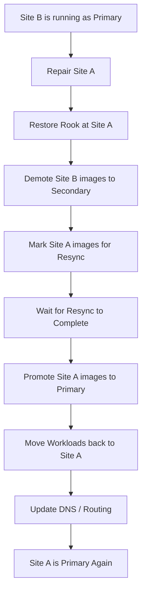

# How to Perform RBD Asynchronous DR Failback with Rook

Author: [OneUptime](https://www.github.com/oneuptime)

Tags: Rook, Ceph, Kubernetes, Storage

Description: Restore RBD mirroring and fail back workloads from the secondary Ceph site to the repaired primary site after a disaster recovery event in Rook.

---

## Introduction

After a disaster recovery failover, you will eventually want to return workloads to the primary site once it has been repaired. Failback is more complex than failover because it requires resyncing data from the secondary (now primary) back to the original primary site, which must be demoted and then promoted again. This process involves a controlled resync that can take significant time depending on data volume and network bandwidth.

## Failback Process Overview



## Prerequisites

- Site A has been repaired and the Rook-Ceph cluster is healthy
- Site B is currently running as primary after a previous failover
- Both sites have network connectivity for mirroring
- VolumeReplication CRs exist on both sites

## Step 1: Verify Site A is Healthy and Ready

```bash
# On Site A cluster
kubectl get cephcluster -n rook-ceph

# Check that all components are ready
kubectl -n rook-ceph exec -it deploy/rook-ceph-tools -- ceph status

# Verify mirroring daemon is running
kubectl -n rook-ceph exec -it deploy/rook-ceph-tools -- \
  ceph mirror daemon status

# Check that pool mirroring is enabled
kubectl -n rook-ceph exec -it deploy/rook-ceph-tools -- \
  rbd mirror pool status replicapool
```

## Step 2: Demote Site B Images to Secondary

On the Site B cluster, change the VolumeReplication state to trigger demotion:

```bash
# Gracefully stop workloads on Site B first to ensure a clean snapshot
kubectl scale deployment my-database --replicas=0 -n production
kubectl scale deployment my-app --replicas=0 -n production

# Wait for pods to terminate
kubectl wait --for=delete pod -l app=my-database -n production --timeout=120s
```

Now demote the volumes:

```yaml
# demote-site-b.yaml
apiVersion: replication.storage.openshift.io/v1alpha1
kind: VolumeReplication
metadata:
  name: db-volume-replication
  namespace: production
spec:
  volumeReplicationClass: rook-vrc-15min
  dataSource:
    apiGroup: ""
    kind: PersistentVolumeClaim
    name: database-pvc
  # Demote: change from primary to secondary
  replicationState: secondary
```

```bash
kubectl apply -f demote-site-b.yaml

# Or patch directly
kubectl patch volumereplication db-volume-replication \
  -n production \
  --type='merge' \
  -p='{"spec":{"replicationState":"secondary"}}'
```

## Step 3: Verify Demotion and Resync Started

```bash
# Check that Site B images are now secondary
kubectl -n rook-ceph exec -it deploy/rook-ceph-tools -- \
  rbd mirror pool status replicapool --verbose

# Check VolumeReplication status
kubectl describe volumereplication db-volume-replication -n production | \
  grep -A10 "Status:"

# The image should show:
# state: up+replaying (meaning it is now secondary and receiving data)
```

## Step 4: Mark Site A Images for Resync

On Site A, trigger a resync to pull the latest data from Site B (now primary):

```yaml
# resync-site-a.yaml
apiVersion: replication.storage.openshift.io/v1alpha1
kind: VolumeReplication
metadata:
  name: db-volume-replication
  namespace: production
spec:
  volumeReplicationClass: rook-vrc-15min
  dataSource:
    apiGroup: ""
    kind: PersistentVolumeClaim
    name: database-pvc
  # Trigger resync to pull data from Site B
  replicationState: resync
```

```bash
kubectl apply -f resync-site-a.yaml

# Monitor resync progress
kubectl get volumereplication db-volume-replication -n production -w
```

Or via Ceph CLI on Site A:

```bash
kubectl -n rook-ceph exec -it deploy/rook-ceph-tools -- bash

# Check if image is replaying (resyncing) from Site B
rbd mirror image status replicapool/csi-vol-<image-id>
# Should show: state: up+replaying
#              description: replaying, <bytes> remaining
```

## Step 5: Monitor Resync Progress

```bash
# On Site A toolbox - watch resync progress
watch -n 10 kubectl -n rook-ceph exec deploy/rook-ceph-tools -- \
  rbd mirror image status replicapool/csi-vol-<image-id>

# Check Prometheus metric for replication lag
# rbd_mirror_image_replaying_lag_seconds should decrease over time

# Check bytes remaining in resync
kubectl -n rook-ceph exec -it deploy/rook-ceph-tools -- \
  rbd mirror pool status replicapool --verbose | grep -E "replaying|syncing"
```

## Step 6: Promote Site A Images Once Resync is Complete

After resync completes, promote Site A back to primary:

```yaml
# promote-site-a.yaml
apiVersion: replication.storage.openshift.io/v1alpha1
kind: VolumeReplication
metadata:
  name: db-volume-replication
  namespace: production
spec:
  volumeReplicationClass: rook-vrc-15min
  dataSource:
    apiGroup: ""
    kind: PersistentVolumeClaim
    name: database-pvc
  # Promote Site A back to primary
  replicationState: primary
```

```bash
kubectl apply -f promote-site-a.yaml

# Verify promotion
kubectl -n rook-ceph exec -it deploy/rook-ceph-tools -- \
  rbd mirror image status replicapool/csi-vol-<image-id>
# State should show: up+stopped (primary, not replicating outbound)
```

## Step 7: Start Workloads on Site A

```bash
# Scale up workloads at Site A
kubectl scale deployment my-database --replicas=1 -n production
kubectl scale deployment my-app --replicas=3 -n production

# Verify application health
kubectl get pods -n production
kubectl exec -n production deploy/my-database -- \
  psql -U postgres -c "SELECT now(), count(*) FROM critical_table;"
```

## Step 8: Update DNS to Point Back to Site A

```bash
# Update DNS to route traffic back to Site A
# Example with kubectl annotate to track routing state
kubectl annotate namespace production \
  "dr-routing/active-site=site-a" \
  --overwrite

# Update external DNS or ingress controllers
# The specific commands depend on your DNS provider
```

## Step 9: Re-Enable Mirroring from Site A to Site B

Ensure Site A is set up to mirror forward to Site B for future DR:

```bash
# On Site A toolbox, verify mirroring is configured
kubectl -n rook-ceph exec -it deploy/rook-ceph-tools -- \
  rbd mirror pool peer list replicapool

# Verify Site B is receiving mirror data
# On Site B toolbox:
kubectl --kubeconfig=/path/to/site-b-kubeconfig \
  -n rook-ceph exec -it deploy/rook-ceph-tools -- \
  rbd mirror pool status replicapool
# Should show: state: up+replaying (Site B back to secondary)
```

## Troubleshooting

```bash
# Resync not starting
kubectl -n rook-ceph exec -it deploy/rook-ceph-tools -- \
  ceph log last 50 | grep -i mirror

# Image stuck in unknown state
kubectl -n rook-ceph exec -it deploy/rook-ceph-tools -- \
  rbd mirror image resync replicapool/csi-vol-<image-id>

# Data inconsistency after failback - run scrub
kubectl -n rook-ceph exec -it deploy/rook-ceph-tools -- \
  ceph osd pool scrub replicapool
```

## Summary

RBD asynchronous DR failback with Rook follows a sequence of: stopping workloads at Site B, demoting Site B images to secondary, triggering a resync on Site A to pull the latest data, waiting for resync to complete, promoting Site A back to primary, restarting workloads, and updating DNS. The resync phase is the most time-consuming part and its duration depends on how much data changed during the failover period. Always verify application data integrity after promotion completes.
