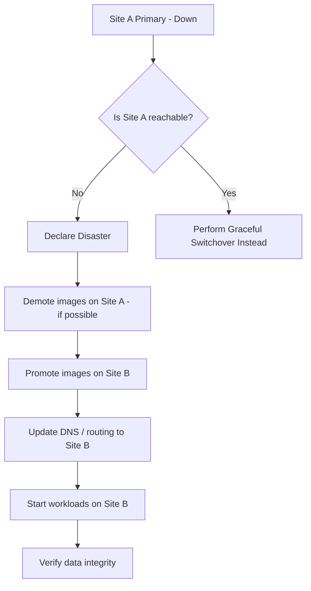

# How to Perform RBD Asynchronous DR Failover with Rook

Author: [nawazdhandala](https://www.github.com/nawazdhandala)

Tags: Rook, Ceph, Kubernetes, Storage

Description: Execute a disaster recovery failover for RBD-mirrored volumes in Rook by promoting secondary images to primary at the secondary site.

---

## Introduction

When a primary Ceph site becomes unavailable, you need to promote the mirrored RBD images at the secondary site to primary so that workloads can resume. This process - called failover - involves changing the replication state from secondary to primary, updating Kubernetes workloads to use the promoted volumes, and verifying data integrity.

Failover is a disruptive operation on the primary site and should only be performed after confirming the primary is unreachable.

## Failover Decision Flow



## Prerequisites

- Two Rook-Ceph clusters with RBD mirroring configured in snapshot or journal mode
- VolumeReplication CRs deployed on both sites for the volumes to be failed over
- Secondary site (Site B) with VolumeReplication objects in `secondary` state
- Network access to the Site B Kubernetes cluster

## Step 1: Confirm Primary Site is Unreachable

Before initiating failover, confirm the primary is down to avoid split-brain:

```bash
# Attempt to reach Site A Kubernetes API
kubectl --kubeconfig=/path/to/site-a-kubeconfig get nodes

# Check Ceph cluster health at Site A (if partial access available)
kubectl --kubeconfig=/path/to/site-a-kubeconfig \
  -n rook-ceph exec -it deploy/rook-ceph-tools -- \
  ceph status
```

If Site A is completely unreachable, proceed with the forced failover.

## Step 2: Check Current Replication State on Site B

```bash
# On Site B cluster
kubectl get volumereplication -A

# Check the state of each replication
kubectl describe volumereplication db-volume-replication -n production | grep -E "State:|Health:|Last Sync"
```

## Step 3: Force Promote RBD Images on Site B

Use the VolumeReplication CR to promote volumes to primary state on Site B:

```yaml
# promote-site-b.yaml - patch for each VolumeReplication object
apiVersion: replication.storage.openshift.io/v1alpha1
kind: VolumeReplication
metadata:
  name: db-volume-replication
  namespace: production
spec:
  volumeReplicationClass: rook-vrc-15min
  dataSource:
    apiGroup: ""
    kind: PersistentVolumeClaim
    name: database-pvc
  # Change from secondary to primary - this triggers forced promotion
  replicationState: primary
  # Force promotion even if primary site may still be active
  # (use with caution - only when primary is confirmed down)
  autoResync: false
```

```bash
kubectl apply -f promote-site-b.yaml

# Or patch existing VolumeReplication
kubectl patch volumereplication db-volume-replication \
  -n production \
  --type='merge' \
  -p='{"spec":{"replicationState":"primary"}}'
```

## Step 4: Force Promote via Ceph CLI (If VRO Not Available)

If the Volume Replication Operator is unavailable, use direct Ceph commands:

```bash
# On Site B toolbox
kubectl -n rook-ceph exec -it deploy/rook-ceph-tools -- bash

# List all mirrored images in the pool
rbd mirror image ls replicapool

# Force promote a specific image to primary
# WARNING: only use --force if primary site is confirmed down
rbd mirror image promote --force replicapool/csi-vol-<image-id>

# Verify the promotion
rbd mirror image status replicapool/csi-vol-<image-id>
# State should show: up+stopped -> up+replaying is for secondary
# After promotion: state will show "up+stopped" (now primary, not replicating)
```

## Step 5: Verify Image Status After Promotion

```bash
kubectl -n rook-ceph exec -it deploy/rook-ceph-tools -- bash

# Check all images in the pool
rbd mirror pool status replicapool --verbose

# For each image, confirm it is now primary
rbd mirror image status replicapool/csi-vol-<image-id>
# Expected:
# state: up+stopped
# description: local image is primary

# Check VolumeReplication status
kubectl get volumereplication -n production -o wide
```

## Step 6: Update Workloads to Use the Promoted PVCs

The PVCs should already be bound to the promoted volumes. Start or scale up your workloads:

```bash
# Scale up the deployments that were stopped or not running at Site B
kubectl scale deployment my-database --replicas=1 -n production
kubectl scale deployment my-app --replicas=3 -n production

# Watch pods start up
kubectl get pods -n production -w

# Verify application is healthy
kubectl exec -n production deploy/my-database -- \
  psql -U postgres -c "SELECT count(*) FROM critical_table;"
```

## Step 7: Update DNS and Ingress to Route to Site B

```bash
# Update external DNS to point to Site B ingress
# This step depends on your DNS provider

# Example: update a Route53 record
aws route53 change-resource-record-sets \
  --hosted-zone-id <zone-id> \
  --change-batch '{
    "Changes": [{
      "Action": "UPSERT",
      "ResourceRecordSet": {
        "Name": "app.example.com",
        "Type": "A",
        "TTL": 60,
        "ResourceRecords": [{"Value": "<site-b-ingress-ip>"}]
      }
    }]
  }'

# Update Kubernetes Ingress if needed
kubectl patch ingress my-app-ingress -n production \
  -p '{"spec":{"rules":[{"host":"app.example.com","http":{"paths":[{"path":"/","pathType":"Prefix","backend":{"service":{"name":"my-app","port":{"number":80}}}}]}}]}}'
```

## Step 8: Document the Failover Event

```bash
# Create a Kubernetes event annotation for audit purposes
kubectl annotate namespace production \
  "dr-failover/timestamp=$(date -u +%Y-%m-%dT%H:%M:%SZ)" \
  "dr-failover/reason=site-a-unavailable" \
  "dr-failover/operator=<your-name>"

# Check the last sync time to understand potential data loss
kubectl get volumereplication -n production \
  -o jsonpath='{range .items[*]}{.metadata.name}{"\t"}{.status.lastSyncTime}{"\n"}{end}'
```

## Troubleshooting

```bash
# Promotion fails because primary is still alive (split-brain risk)
# Do not use --force unless absolutely certain primary is down
rbd mirror image status replicapool/csi-vol-<image-id>
# Check if peer site description shows "remote image is primary"

# PVC stuck in ReadOnly or not mounting after promotion
kubectl describe pod <pod-name> -n production | grep -A10 Events

# Manually verify RBD image is writable
kubectl -n rook-ceph exec -it deploy/rook-ceph-tools -- \
  rbd bench --io-type write --io-size 4096 --io-total 1M \
  replicapool/csi-vol-<image-id>
```

## Summary

RBD asynchronous DR failover with Rook involves patching VolumeReplication CRs from `secondary` to `primary` state, or using `rbd mirror image promote --force` directly when the primary site is confirmed down. After promotion, scale up workloads at the secondary site and update DNS routing. Always verify data integrity after failover using application-level checks, and document the last sync time to understand the actual data loss window (RPO).
