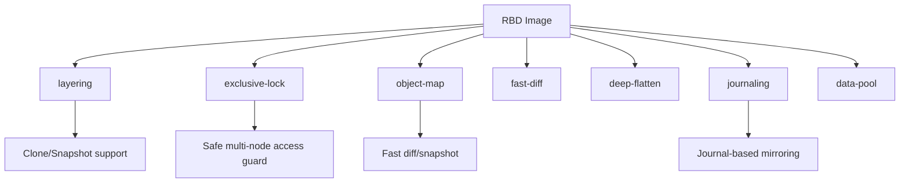

# How to Enable Image Features for RBD Volumes in Rook

Author: [nawazdhandala](https://www.github.com/nawazdhandala)

Tags: Rook, Ceph, Kubernetes, RBD, ImageFeature, CSI

Description: Learn which RBD image features to enable in Rook for snapshots, cloning, mirroring, and encryption, and how to configure them in StorageClass definitions.

---

Ceph RBD images support optional features that enable capabilities like copy-on-write cloning, snapshots, live migration, journaling, and encryption. Understanding which features to enable ensures compatibility with CSI operations and unlocks advanced functionality.

## RBD Image Feature Overview



## Common Image Features

| Feature | Purpose | Required For |
|---|---|---|
| `layering` | COW cloning from snapshots | Snapshots, clones |
| `exclusive-lock` | Prevent concurrent writes | Multi-node safety |
| `object-map` | Track allocated objects | Fast `diff`, `export` |
| `fast-diff` | Efficient diff computation | Snapshot efficiency |
| `deep-flatten` | Flatten child images recursively | Full clone independence |
| `journaling` | Write journal for mirroring | RBD mirroring |
| `data-pool` | Store data in a separate pool | Erasure-coded data |

## Default Features in Rook CSI

Rook's default StorageClass uses:
```
imageFeatures: layering
```

This is the minimum recommended set for safe CSI operation.

## Configure Image Features in StorageClass

```yaml
apiVersion: storage.k8s.io/v1
kind: StorageClass
metadata:
  name: ceph-rbd-standard
provisioner: rook-ceph.rbd.csi.ceph.com
parameters:
  clusterID: rook-ceph
  pool: replicapool
  imageFormat: "2"
  # Comma-separated list of features
  imageFeatures: layering,exclusive-lock,object-map,fast-diff,deep-flatten
  csi.storage.k8s.io/provisioner-secret-name: rook-csi-rbd-provisioner
  csi.storage.k8s.io/provisioner-secret-namespace: rook-ceph
  csi.storage.k8s.io/controller-expand-secret-name: rook-csi-rbd-provisioner
  csi.storage.k8s.io/controller-expand-secret-namespace: rook-ceph
  csi.storage.k8s.io/node-stage-secret-name: rook-csi-rbd-node
  csi.storage.k8s.io/node-stage-secret-namespace: rook-ceph
reclaimPolicy: Delete
allowVolumeExpansion: true
```

## StorageClass for Mirroring (Journal Mode)

```yaml
apiVersion: storage.k8s.io/v1
kind: StorageClass
metadata:
  name: ceph-rbd-mirrored
provisioner: rook-ceph.rbd.csi.ceph.com
parameters:
  clusterID: rook-ceph
  pool: replicapool
  imageFormat: "2"
  imageFeatures: layering,journaling,exclusive-lock
  csi.storage.k8s.io/provisioner-secret-name: rook-csi-rbd-provisioner
  csi.storage.k8s.io/provisioner-secret-namespace: rook-ceph
  csi.storage.k8s.io/controller-expand-secret-name: rook-csi-rbd-provisioner
  csi.storage.k8s.io/controller-expand-secret-namespace: rook-ceph
  csi.storage.k8s.io/node-stage-secret-name: rook-csi-rbd-node
  csi.storage.k8s.io/node-stage-secret-namespace: rook-ceph
reclaimPolicy: Retain
allowVolumeExpansion: true
```

Note: `journaling` requires `exclusive-lock` to be enabled as well.

## Enable/Disable Features on Existing Images

```bash
kubectl exec -n rook-ceph deploy/rook-ceph-tools -- bash

# List current features on an image
rbd info replicapool/csi-vol-xxxxxxxx | grep features

# Enable object-map and fast-diff
rbd feature enable replicapool/csi-vol-xxxxxxxx object-map fast-diff

# Enable journaling for mirroring
rbd feature enable replicapool/csi-vol-xxxxxxxx exclusive-lock journaling

# Disable deep-flatten if not needed
rbd feature disable replicapool/csi-vol-xxxxxxxx deep-flatten

# Verify updated features
rbd info replicapool/csi-vol-xxxxxxxx
```

## Kernel Client Compatibility

Some features require specific kernel versions. If you use the in-kernel RBD driver (instead of the CSI/librbd path), check compatibility:

| Feature | Min Kernel |
|---|---|
| `layering` | 3.10 |
| `exclusive-lock` | 4.9 |
| `object-map` | Not supported in kernel client |
| `fast-diff` | Not supported in kernel client |
| `journaling` | Not supported in kernel client |

When targeting kernel clients, limit features to `layering` only:

```yaml
parameters:
  imageFeatures: layering
```

## Check Feature Flags on a PVC

```bash
# Find the RBD image name for a PVC
kubectl get pv $(kubectl get pvc my-pvc -o jsonpath='{.spec.volumeName}') \
  -o jsonpath='{.spec.csi.volumeAttributes}'

# Check features using the image name
kubectl exec -n rook-ceph deploy/rook-ceph-tools -- \
  rbd info replicapool/<image-name> | grep features
```

## Summary

RBD image features in Rook are configured via the `imageFeatures` parameter in StorageClass definitions. Use `layering` as the minimum for snapshot support. Add `exclusive-lock`, `object-map`, and `fast-diff` for better performance and safety. Enable `journaling` when configuring RBD mirroring, and avoid kernel-incompatible features if nodes mount volumes via the kernel RBD driver.
