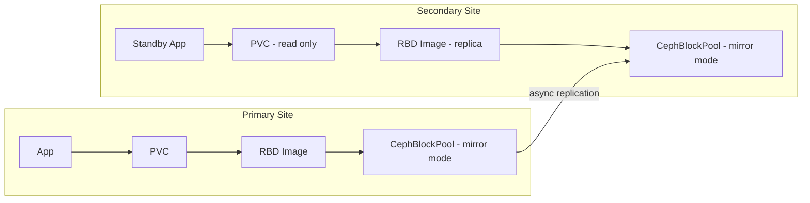

# How to Configure RBD Mirroring for Disaster Recovery in Rook

Author: [nawazdhandala](https://www.github.com/nawazdhandala)

Tags: Rook, Ceph, Kubernetes, RBD, Mirroring, DisasterRecovery

Description: Set up RBD mirroring between two Rook-Ceph clusters for asynchronous disaster recovery, including peer configuration and failover procedures.

---

RBD mirroring replicates block device images asynchronously between two Ceph clusters. It enables disaster recovery scenarios where you can fail over workloads to a secondary site with minimal data loss (RPO) and recovery time (RTO).

## Architecture



## Prerequisites

- Two separate Rook-Ceph clusters (primary and secondary)
- Network connectivity between the two clusters
- Rook v1.7+ for CephRBDMirror CRD support

## Step 1: Enable Mirroring on the Block Pool (Primary)

```yaml
apiVersion: ceph.rook.io/v1
kind: CephBlockPool
metadata:
  name: replicapool
  namespace: rook-ceph
spec:
  failureDomain: host
  replicated:
    size: 3
    requireSafeReplicaSize: true
  mirroring:
    enabled: true
    mode: image          # image mode mirrors per-image; pool mode mirrors all
    snapshotSchedules:
      - interval: 1h     # create a snapshot every hour for snapshot-based mirroring
        startTime: 00:00:00-05:00
```

Apply the same config on the secondary cluster.

## Step 2: Deploy CephRBDMirror Daemon

```yaml
apiVersion: ceph.rook.io/v1
kind: CephRBDMirror
metadata:
  name: my-rbd-mirror
  namespace: rook-ceph
spec:
  count: 1     # number of mirror daemon replicas
  resources:
    requests:
      cpu: "100m"
      memory: "512Mi"
    limits:
      cpu: "1"
      memory: "1Gi"
  placement:
    podAntiAffinity:
      preferredDuringSchedulingIgnoredDuringExecution:
        - weight: 100
          podAffinityTerm:
            labelSelector:
              matchExpressions:
                - key: app
                  operator: In
                  values:
                    - rook-ceph-rbd-mirror
            topologyKey: kubernetes.io/hostname
```

Deploy on both primary and secondary clusters.

## Step 3: Exchange Cluster Peer Secrets

On the **primary** cluster, get the bootstrap secret:

```bash
kubectl exec -n rook-ceph deploy/rook-ceph-tools -- \
  rbd mirror pool peer bootstrap create --site-name primary replicapool
```

This outputs a base64-encoded bootstrap token. Store it as a secret on the **secondary** cluster:

```bash
# On secondary cluster
kubectl create secret generic primary-bootstrap-peer \
  --from-literal=token=<base64-bootstrap-token> \
  --from-literal=pool=replicapool \
  -n rook-ceph
```

Then import the peer on the secondary cluster:

```yaml
apiVersion: ceph.rook.io/v1
kind: CephBlockPool
metadata:
  name: replicapool
  namespace: rook-ceph
spec:
  failureDomain: host
  replicated:
    size: 3
  mirroring:
    enabled: true
    mode: image
    peers:
      secretNames:
        - primary-bootstrap-peer
```

## Step 4: Enable Mirroring on Individual Images

For `image` mode, you must explicitly enable mirroring on each RBD image:

```bash
kubectl exec -n rook-ceph deploy/rook-ceph-tools -- bash

# Enable journaling feature (required for journal-based mirroring)
rbd feature enable replicapool/csi-vol-xxxxxx journaling

# Enable mirroring on the image
rbd mirror image enable replicapool/csi-vol-xxxxxx journal

# Check mirroring status
rbd mirror image status replicapool/csi-vol-xxxxxx
```

## Step 5: Enable via StorageClass (Snapshot Mode)

For snapshot-based mirroring (no journaling required), configure the StorageClass:

```yaml
apiVersion: storage.k8s.io/v1
kind: StorageClass
metadata:
  name: ceph-rbd-mirrored
provisioner: rook-ceph.rbd.csi.ceph.com
parameters:
  clusterID: rook-ceph
  pool: replicapool
  imageFormat: "2"
  imageFeatures: layering
  # Enable snapshot-based mirroring for all new PVCs
  mirroringMode: snapshot
  schedulingInterval: 1h
  schedulingStartTime: "00:00:00-05:00"
  csi.storage.k8s.io/provisioner-secret-name: rook-csi-rbd-provisioner
  csi.storage.k8s.io/provisioner-secret-namespace: rook-ceph
  csi.storage.k8s.io/controller-expand-secret-name: rook-csi-rbd-provisioner
  csi.storage.k8s.io/controller-expand-secret-namespace: rook-ceph
  csi.storage.k8s.io/node-stage-secret-name: rook-csi-rbd-node
  csi.storage.k8s.io/node-stage-secret-namespace: rook-ceph
reclaimPolicy: Retain
allowVolumeExpansion: true
```

## Monitor Mirroring Status

```bash
kubectl exec -n rook-ceph deploy/rook-ceph-tools -- bash

# Check pool-level mirroring status
rbd mirror pool status replicapool

# Check image-level mirroring status
rbd mirror image status replicapool/csi-vol-xxxxxx

# Detailed peer info
rbd mirror pool peer list replicapool
```

## Failover Procedure

```bash
# On secondary cluster - promote the image to primary
rbd mirror image promote --force replicapool/csi-vol-xxxxxx

# Verify the image is now primary on secondary
rbd info replicapool/csi-vol-xxxxxx | grep -i primary

# Scale up your application on the secondary cluster
kubectl scale deployment myapp --replicas=1 -n myapp-ns
```

## Summary

RBD mirroring in Rook uses the `CephBlockPool` mirroring settings and `CephRBDMirror` daemon to replicate block images between clusters. Use snapshot mode for simplicity or journal mode for near-zero RPO. Exchanging bootstrap peer tokens connects the two clusters, and the failover procedure promotes the secondary image to writable in an emergency.
