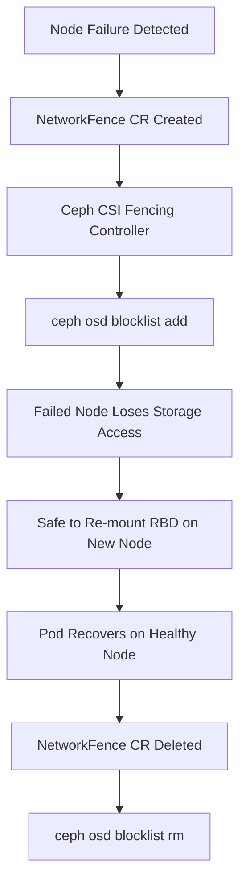

# How to Configure Network Fencing for RBD in Rook

Author: [nawazdhandala](https://www.github.com/nawazdhandala)

Tags: Rook, Ceph, Kubernetes, Storage

Description: Set up network fencing for RBD volumes in Rook using the NetworkFence CRD to automatically prevent failed nodes from accessing Ceph storage.

---

## Introduction

Network fencing is a mechanism that prevents a failed or misbehaving node from accessing storage, protecting data integrity by ensuring split-brain scenarios cannot occur. In Rook, the `NetworkFence` CRD (provided by the Ceph CSI operator) blocks a node's Ceph client access using Ceph's OSD blocklist, which prevents the failed node from writing to any RBD images even if it unexpectedly recovers partially.

## How Network Fencing Works



## Prerequisites

- Rook v1.12+ with CSI addons support
- CSI Addons Operator installed in the cluster
- `CephClientInfo` available for each node (maintained by Rook CSI)
- Kubernetes nodes running `ceph-common` or equivalent (for client IDs)

## Step 1: Install the CSI Addons Operator

```bash
# Install CSI Addons CRDs
kubectl apply -f https://raw.githubusercontent.com/csi-addons/kubernetes-csi-addons/main/deploy/controller/crds.yaml

# Install the controller
kubectl apply -f https://raw.githubusercontent.com/csi-addons/kubernetes-csi-addons/main/deploy/controller/rbac.yaml
kubectl apply -f https://raw.githubusercontent.com/csi-addons/kubernetes-csi-addons/main/deploy/controller/setup-controller.yaml

# Verify the controller is running
kubectl get pods -n csi-addons-system
```

## Step 2: Enable Network Fencing in Rook CSI Configuration

```yaml
# rook-ceph-operator-config-fencing.yaml
apiVersion: v1
kind: ConfigMap
metadata:
  name: rook-ceph-operator-config
  namespace: rook-ceph
data:
  # Enable network fencing support
  CSI_ENABLE_NETWORKFENCE: "true"
  # Enable CSI addons
  CSI_ADDONS_ENABLE: "true"
```

```bash
kubectl apply -f rook-ceph-operator-config-fencing.yaml
kubectl rollout restart deployment/rook-ceph-operator -n rook-ceph
```

## Step 3: Verify CSI AddonsNode Resources

After enabling CSI addons, each node should have a `CSIAddonsNode` resource:

```bash
# Check for CSIAddonsNode resources
kubectl get csiaddonsnode -A

# Example output:
# NAMESPACE   NAME            AGE   NETWORKFENCE
# rook-ceph   k8s-node-01     10m   Supported
# rook-ceph   k8s-node-02     10m   Supported
```

## Step 4: Create a NetworkFence to Block a Failed Node

When a node fails, create a `NetworkFence` CR to block its Ceph access:

```yaml
# network-fence-node01.yaml
apiVersion: csiaddons.openshift.io/v1alpha1
kind: NetworkFence
metadata:
  name: fence-k8s-node-01
  namespace: rook-ceph
spec:
  driver: rook-ceph.rbd.csi.ceph.com
  # Blocklist scope: node CIDR to fence
  cidrs:
    - "192.168.1.101/32"
  # Secret with Ceph admin credentials to execute the blocklist command
  secret:
    name: rook-csi-rbd-provisioner
    namespace: rook-ceph
  # Fence action: Fence = block, Unfence = unblock
  fenceState: Fenced
```

```bash
kubectl apply -f network-fence-node01.yaml

# Check the fencing status
kubectl describe networkfence fence-k8s-node-01 -n rook-ceph | grep -A10 "Status:"
```

## Step 5: Verify the Blocklist Was Applied on Ceph

```bash
kubectl -n rook-ceph exec -it deploy/rook-ceph-tools -- bash

# Check the OSD blocklist
ceph osd blocklist ls

# Expected output with the fenced node's client address:
# listed 1 entries.
# 192.168.1.101:0/0 2026-03-31T15:00:00.000000+0000
```

## Step 6: Automate Fencing with a NetworkFencePolicy

For automated fencing based on node conditions, use the NetworkFencePolicy:

```yaml
# network-fence-policy.yaml
apiVersion: csiaddons.openshift.io/v1alpha1
kind: NetworkFenceClass
metadata:
  name: rbd-network-fence
spec:
  driver: rook-ceph.rbd.csi.ceph.com
  parameters:
    secret-name: rook-csi-rbd-provisioner
    secret-namespace: rook-ceph
```

## Step 7: Integrate with External Health Monitor for Auto-Fencing

A typical auto-fencing workflow using a health monitor:

```yaml
# auto-fence-job.yaml - triggered by monitoring when node is NotReady
apiVersion: batch/v1
kind: Job
metadata:
  name: fence-failed-node
  namespace: rook-ceph
spec:
  template:
    spec:
      serviceAccountName: rook-ceph-fencing-sa
      restartPolicy: OnFailure
      containers:
        - name: fencer
          image: bitnami/kubectl
          command:
            - sh
            - -c
            - |
              NODE_IP=$(kubectl get node ${FAILED_NODE} \
                -o jsonpath='{.status.addresses[?(@.type=="InternalIP")].address}')
              kubectl apply -f - <<EOF
              apiVersion: csiaddons.openshift.io/v1alpha1
              kind: NetworkFence
              metadata:
                name: auto-fence-${FAILED_NODE}
                namespace: rook-ceph
              spec:
                driver: rook-ceph.rbd.csi.ceph.com
                cidrs:
                  - "${NODE_IP}/32"
                secret:
                  name: rook-csi-rbd-provisioner
                  namespace: rook-ceph
                fenceState: Fenced
              EOF
          env:
            - name: FAILED_NODE
              value: "k8s-node-01"
```

## Step 8: Unfence a Node After Recovery

When the node is repaired and rejoins the cluster, remove the fence:

```yaml
# unfence-node01.yaml
apiVersion: csiaddons.openshift.io/v1alpha1
kind: NetworkFence
metadata:
  name: fence-k8s-node-01
  namespace: rook-ceph
spec:
  driver: rook-ceph.rbd.csi.ceph.com
  cidrs:
    - "192.168.1.101/32"
  secret:
    name: rook-csi-rbd-provisioner
    namespace: rook-ceph
  # Change to Unfenced to remove from blocklist
  fenceState: Unfenced
```

```bash
kubectl apply -f unfence-node01.yaml

# Or delete the NetworkFence CR entirely
kubectl delete networkfence fence-k8s-node-01 -n rook-ceph

# Verify the blocklist entry was removed
kubectl -n rook-ceph exec -it deploy/rook-ceph-tools -- \
  ceph osd blocklist ls
```

## Step 9: Verify Recovery After Fencing

```bash
# After fencing the failed node, force delete stuck pods
kubectl delete pod <stuck-pod> -n <namespace> --force --grace-period=0

# Delete the stale VolumeAttachment
kubectl delete volumeattachment <attachment-name>

# New pod should start successfully on a healthy node
kubectl get pods -n <namespace> -w
```

## Troubleshooting

```bash
# NetworkFence CR in error state
kubectl describe networkfence fence-k8s-node-01 -n rook-ceph

# Check CSI addons controller logs
kubectl logs -n csi-addons-system deploy/csi-addons-controller-manager | \
  grep -E "fence|blocklist|error" | tail -20

# Manual blocklist management
kubectl -n rook-ceph exec -it deploy/rook-ceph-tools -- \
  ceph osd blocklist add <client-addr>

# Check if blocklist is working
kubectl -n rook-ceph exec -it deploy/rook-ceph-tools -- \
  ceph osd blocklist ls
```

## Summary

Network fencing for RBD in Rook uses the `NetworkFence` CRD from the CSI Addons Operator to add failed nodes' client addresses to the Ceph OSD blocklist. This prevents split-brain scenarios where a failed node continues writing to RBD images even after Kubernetes has evicted its pods. The fencing flow involves creating a NetworkFence CR with `fenceState: Fenced`, which triggers the blocklist command against the target CIDR. Once the node is repaired, set `fenceState: Unfenced` or delete the NetworkFence CR to restore normal access.
