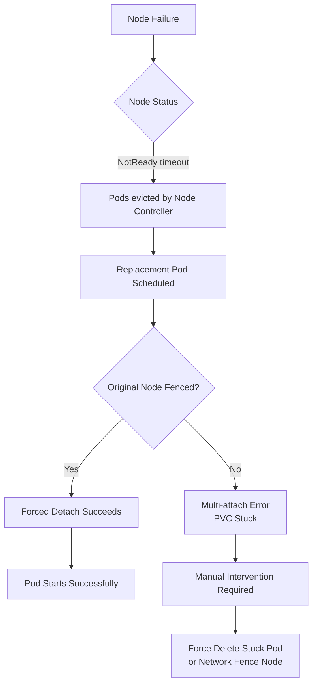

# How to Handle Node Loss for RBD Volumes in Rook

Author: [OneUptime](https://www.github.com/oneuptime)

Tags: Rook, Ceph, Kubernetes, Storage

Description: Recover RBD volumes stuck in multi-attach or ReadOnly state after a Kubernetes node failure, including forced detach and node fencing procedures.

---

## Introduction

When a Kubernetes node hosting an RBD-backed PVC unexpectedly goes down, the PVC may be stuck in a `Terminating` state or the replacement pod may fail to start with a "multi-attach error" because RBD `ReadWriteOnce` volumes can only be attached to one node at a time. This guide covers the recovery procedures for RBD volumes after node failures in Rook.

## Node Loss Scenarios



## Prerequisites

- Rook-Ceph cluster with RBD volumes in use
- `kubectl` access with delete permissions on pods and volumeattachments
- Access to the Rook toolbox pod

## Step 1: Identify Stuck Pods and PVCs

```bash
# Find pods that are Terminating or have multi-attach errors
kubectl get pods -A | grep -E "Terminating|ContainerCreating|Error"

# Describe a problematic pod to see the multi-attach error
kubectl describe pod <stuck-pod-name> -n <namespace>
# Look for: "Multi-Attach error for volume..."

# Find VolumeAttachments for the stuck PVC
kubectl get volumeattachment | grep <pvc-name-or-pv-name>

# Get the PV name for a PVC
kubectl get pvc <pvc-name> -n <namespace> \
  -o jsonpath='{.spec.volumeName}'
```

## Step 2: Check Node Status

```bash
# Get node conditions
kubectl get nodes
kubectl describe node <failed-node-name> | grep -A10 "Conditions:"

# Check if the node is truly unreachable or just has network issues
kubectl get node <failed-node-name> -o jsonpath='{.status.conditions[-1].type}'

# Check node taint (Kubernetes adds this when NodeNotReady)
kubectl describe node <failed-node-name> | grep Taint
```

## Step 3: Force Delete Stuck Pods

If the node is confirmed down and you need to release the PVC:

```bash
# Force delete the terminating pod on the failed node
kubectl delete pod <stuck-pod-name> -n <namespace> --force --grace-period=0

# Wait for the new pod to be scheduled
kubectl get pods -n <namespace> -w

# If still failing with multi-attach error, proceed to volumeattachment cleanup
```

## Step 4: Remove the Stale VolumeAttachment

```bash
# List all VolumeAttachments to find the stale one
kubectl get volumeattachment

# Get the attachment name for your PV
PV_NAME=$(kubectl get pvc <pvc-name> -n <namespace> -o jsonpath='{.spec.volumeName}')
VA_NAME=$(kubectl get volumeattachment \
  -o jsonpath="{.items[?(@.spec.source.persistentVolumeName==\"$PV_NAME\")].metadata.name}")
echo "VolumeAttachment: $VA_NAME"

# Check the attachment details
kubectl describe volumeattachment "$VA_NAME"

# Delete the stale VolumeAttachment to allow re-attachment on a healthy node
kubectl delete volumeattachment "$VA_NAME"
```

## Step 5: Verify RBD Image Lockout is Released

RBD images use exclusive locking to prevent concurrent access. After a node crash, the lock may not be properly released:

```bash
kubectl -n rook-ceph exec -it deploy/rook-ceph-tools -- bash

# List RBD images in the pool
rbd ls replicapool

# Check if the image has a lock held by the failed node
rbd lock list replicapool/csi-vol-<image-id>
# If there is a lock from the failed node:
# ID                                    Locker
# exclusive                             client.xxxx ip-192-168-1.100:xxxx/xxxx

# Break the lock (only when certain the node is down)
rbd lock remove replicapool/csi-vol-<image-id> \
  "exclusive" \
  "client.xxxx ip-192-168-1.100:xxxx/xxxx"
```

## Step 6: Unmap the RBD Device if Mounted on Another Node

```bash
# Check if the image is still mapped on the failed node (via toolbox proxy)
kubectl -n rook-ceph exec -it deploy/rook-ceph-tools -- \
  rbd status replicapool/csi-vol-<image-id>

# If the node is completely gone, the watcher will expire eventually
# To force expiry, use the following (wait for Ceph to handle it)
kubectl -n rook-ceph exec -it deploy/rook-ceph-tools -- \
  ceph osd blocklist ls

# Add the failed client to the blocklist to break the lock
kubectl -n rook-ceph exec -it deploy/rook-ceph-tools -- \
  ceph osd blocklist add <failed-client-address>
```

## Step 7: Configure Automatic Recovery with Node Problem Detector

Install Node Problem Detector to automatically detect and respond to node failures:

```yaml
# node-problem-detector.yaml
apiVersion: apps/v1
kind: DaemonSet
metadata:
  name: node-problem-detector
  namespace: kube-system
spec:
  selector:
    matchLabels:
      app: node-problem-detector
  template:
    metadata:
      labels:
        app: node-problem-detector
    spec:
      containers:
        - name: node-problem-detector
          image: registry.k8s.io/node-problem-detector/node-problem-detector:v0.8.14
          securityContext:
            privileged: true
```

## Step 8: Set Pod Tolerations to Reduce Recovery Time

Configure pods to tolerate node failures with a shorter eviction timeout:

```yaml
# deployment-with-tolerations.yaml
apiVersion: apps/v1
kind: Deployment
metadata:
  name: my-app
spec:
  template:
    spec:
      # Evict the pod after 30s of node NotReady (default is 5 minutes)
      tolerations:
        - key: node.kubernetes.io/not-ready
          operator: Exists
          effect: NoExecute
          tolerationSeconds: 30
        - key: node.kubernetes.io/unreachable
          operator: Exists
          effect: NoExecute
          tolerationSeconds: 30
      containers:
        - name: app
          image: nginx
          volumeMounts:
            - name: data
              mountPath: /data
      volumes:
        - name: data
          persistentVolumeClaim:
            claimName: my-pvc
```

## Step 9: Drain and Remove the Failed Node

Once volumes have been recovered:

```bash
# Drain the failed node (remove all pods)
kubectl drain <failed-node> \
  --ignore-daemonsets \
  --delete-emptydir-data \
  --force

# Delete the node from the cluster
kubectl delete node <failed-node>

# If the node had Rook OSDs, remove them from Ceph
kubectl -n rook-ceph exec -it deploy/rook-ceph-tools -- \
  ceph osd out osd.<id>
kubectl -n rook-ceph exec -it deploy/rook-ceph-tools -- \
  ceph osd purge osd.<id> --yes-i-really-mean-it
```

## Troubleshooting

```bash
# Pod still stuck after VolumeAttachment deletion
kubectl describe pod <pod-name> | grep -A15 "Events:"

# Check CSI node plugin logs for detach errors
kubectl logs -n rook-ceph daemonset/csi-rbdplugin -c csi-rbdplugin | \
  grep -E "error|detach|unmap" | tail -20

# Check if PV has a finalizer preventing deletion
kubectl get pv <pv-name> -o jsonpath='{.metadata.finalizers}'

# Remove finalizer if stuck
kubectl patch pv <pv-name> \
  --type='json' \
  -p='[{"op":"remove","path":"/metadata/finalizers/0"}]'
```

## Summary

Handling node loss for RBD volumes in Rook involves three main steps: force deleting the stuck pod on the failed node, deleting the stale VolumeAttachment to allow re-attachment, and breaking any stale RBD exclusive locks on the Ceph cluster. Configure shorter toleration seconds on pods that use RBD PVCs to reduce automatic recovery time. For environments that need zero-manual-intervention recovery, combine this with network fencing to guarantee the failed node cannot write to RBD images.
