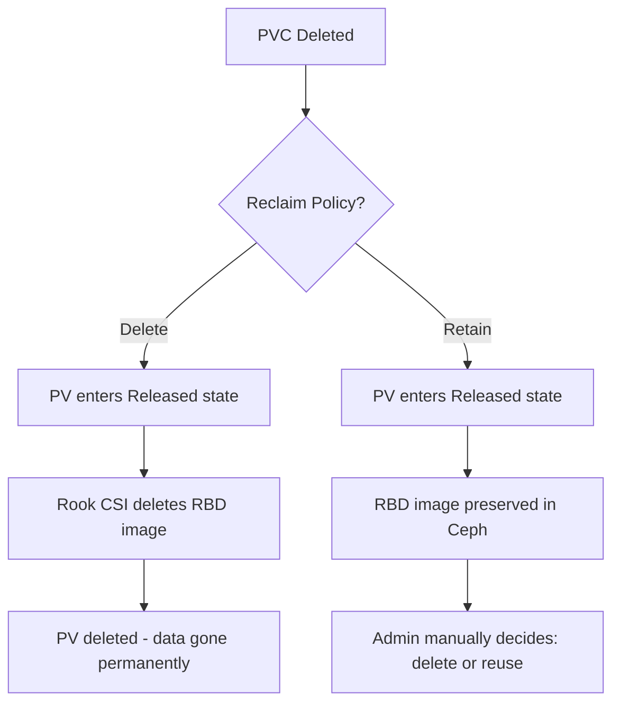

# How to Configure Reclaim Policies for Rook RBD Volumes

Author: [nawazdhandala](https://www.github.com/nawazdhandala)

Tags: Rook, Ceph, Kubernetes, Storage

Description: Configure Delete and Retain reclaim policies for Rook RBD PersistentVolumes to control what happens to Ceph RBD images when PVCs are deleted.

---

## Introduction

The reclaim policy on a Kubernetes StorageClass determines what happens to the underlying PersistentVolume (and the Ceph RBD image) when a PersistentVolumeClaim is deleted. Rook supports both the `Delete` and `Retain` reclaim policies. Choosing the right policy prevents accidental data loss in production and enables data recovery workflows.

## Reclaim Policy Behavior



## Step 1: Create a StorageClass with Delete Policy

The `Delete` policy is the default and appropriate for ephemeral workloads:

```yaml
# storageclass-delete.yaml
apiVersion: storage.k8s.io/v1
kind: StorageClass
metadata:
  name: rook-ceph-block-delete
provisioner: rook-ceph.rbd.csi.ceph.com
parameters:
  clusterID: <ceph-cluster-fsid>
  pool: replicapool
  imageFormat: "2"
  imageFeatures: layering,fast-diff,object-map,deep-flatten,exclusive-lock
  csi.storage.k8s.io/provisioner-secret-name: rook-csi-rbd-provisioner
  csi.storage.k8s.io/provisioner-secret-namespace: rook-ceph
  csi.storage.k8s.io/controller-expand-secret-name: rook-csi-rbd-provisioner
  csi.storage.k8s.io/controller-expand-secret-namespace: rook-ceph
  csi.storage.k8s.io/node-stage-secret-name: rook-csi-rbd-node
  csi.storage.k8s.io/node-stage-secret-namespace: rook-ceph
# PV and RBD image are deleted when PVC is deleted
reclaimPolicy: Delete
allowVolumeExpansion: true
```

## Step 2: Create a StorageClass with Retain Policy

The `Retain` policy is required for any stateful production workload:

```yaml
# storageclass-retain.yaml
apiVersion: storage.k8s.io/v1
kind: StorageClass
metadata:
  name: rook-ceph-block-retain
  annotations:
    description: "Production RBD volumes - data preserved after PVC deletion"
provisioner: rook-ceph.rbd.csi.ceph.com
parameters:
  clusterID: <ceph-cluster-fsid>
  pool: replicapool
  imageFormat: "2"
  imageFeatures: layering,fast-diff,object-map,deep-flatten,exclusive-lock
  csi.storage.k8s.io/provisioner-secret-name: rook-csi-rbd-provisioner
  csi.storage.k8s.io/provisioner-secret-namespace: rook-ceph
  csi.storage.k8s.io/controller-expand-secret-name: rook-csi-rbd-provisioner
  csi.storage.k8s.io/controller-expand-secret-namespace: rook-ceph
  csi.storage.k8s.io/node-stage-secret-name: rook-csi-rbd-node
  csi.storage.k8s.io/node-stage-secret-namespace: rook-ceph
# PV moves to Released state; RBD image is preserved
reclaimPolicy: Retain
allowVolumeExpansion: true
```

```bash
kubectl apply -f storageclass-retain.yaml
```

## Step 3: Change the Reclaim Policy on an Existing PV

If a PV was created with `Delete` but you need to change it to `Retain`:

```bash
# Patch the PV's reclaim policy
kubectl patch pv <pv-name> \
  -p '{"spec":{"persistentVolumeReclaimPolicy":"Retain"}}'

# Verify the change
kubectl get pv <pv-name> -o jsonpath='{.spec.persistentVolumeReclaimPolicy}'
```

## Step 4: Reclaim a Retained PV After PVC Deletion

After a PVC is deleted, a PV with `Retain` policy moves to the `Released` state. To reuse it:

```bash
# 1. Find retained PVs
kubectl get pv | grep Released

# 2. Remove the old claim reference to make the PV available
kubectl patch pv <pv-name> \
  --type='json' \
  -p='[{"op":"remove","path":"/spec/claimRef"}]'

# 3. The PV is now Available - create a new PVC that statically binds to it
# The PVC must reference the PV's volumeName
```

```yaml
# rebind-pvc.yaml
apiVersion: v1
kind: PersistentVolumeClaim
metadata:
  name: recovered-pvc
spec:
  accessModes:
    - ReadWriteOnce
  storageClassName: rook-ceph-block-retain
  resources:
    requests:
      storage: 20Gi
  # Explicitly bind to the retained PV
  volumeName: <pv-name>
```

```bash
kubectl apply -f rebind-pvc.yaml
```

## Step 5: Manually Delete a Retained RBD Image

If you no longer need the data after a PVC deletion:

```bash
# Get the RBD image name from the PV
kubectl get pv <pv-name> -o jsonpath='{.spec.csi.volumeHandle}'
# Output: 0001-0009-<cluster-id>-0000000000000001-<image-id>

# Extract the image name (last part of the volume handle)
RBD_IMAGE=$(kubectl get pv <pv-name> -o jsonpath='{.spec.csi.volumeHandle}' | awk -F'-' '{print $NF}')

# List the image in the pool
kubectl -n rook-ceph exec -it deploy/rook-ceph-tools -- \
  rbd ls replicapool | grep $RBD_IMAGE

# Delete the image
kubectl -n rook-ceph exec -it deploy/rook-ceph-tools -- \
  rbd rm replicapool/csi-vol-${RBD_IMAGE}

# Delete the Kubernetes PV resource
kubectl delete pv <pv-name>
```

## Step 6: Prevent Accidental Deletion with Finalizers

Add a finalizer to critical PVCs to prevent accidental deletion:

```yaml
# protect-pvc.yaml
apiVersion: v1
kind: PersistentVolumeClaim
metadata:
  name: critical-database-pvc
  finalizers:
    # This finalizer prevents the PVC from being deleted until explicitly removed
    - kubernetes.io/pvc-protection
spec:
  accessModes:
    - ReadWriteOnce
  storageClassName: rook-ceph-block-retain
  resources:
    requests:
      storage: 100Gi
```

To delete a finalized PVC:

```bash
# First remove the finalizer
kubectl patch pvc critical-database-pvc \
  -p '{"metadata":{"finalizers":[]}}'

# Then delete the PVC
kubectl delete pvc critical-database-pvc
```

## Step 7: Audit Retained PVs and Their Storage Cost

```bash
# List all retained PVs with their sizes
kubectl get pv -o json | python3 -c "
import json, sys
pvs = json.load(sys.stdin)['items']
retained = [pv for pv in pvs if pv['spec'].get('persistentVolumeReclaimPolicy') == 'Retain']
for pv in retained:
    name = pv['metadata']['name']
    status = pv.get('status', {}).get('phase', 'Unknown')
    capacity = pv['spec']['capacity']['storage']
    print(f'{name:50} {status:15} {capacity}')
"
```

## Summary

Rook RBD StorageClasses support `Delete` and `Retain` reclaim policies. `Delete` automatically removes the Ceph RBD image when the PVC is deleted, which is appropriate for ephemeral workloads. `Retain` preserves the RBD image and moves the PV to a `Released` state, giving administrators control over data lifecycle. For production stateful workloads, always use `Retain` and implement an operational process for periodically auditing and cleaning up released PVs.
