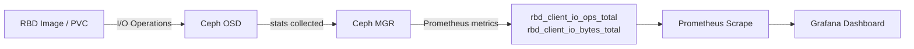

# How to Enable RBD Statistics in Rook Block Pools

Author: [nawazdhandala](https://www.github.com/nawazdhandala)

Tags: Rook, Ceph, Kubernetes, Storage

Description: Enable and access per-image RBD statistics in Rook-managed Ceph block pools for detailed I/O performance monitoring and capacity insights.

---

## Introduction

RBD statistics provide per-image I/O metrics including read/write operations, bytes transferred, and latency data. When enabled on a Ceph pool, these statistics are exposed through the Ceph MGR Prometheus endpoint and can be visualized in Grafana dashboards. This is especially useful for identifying hot volumes, tracking storage consumption per PVC, and capacity planning.

## How RBD Statistics Work



## Prerequisites

- Rook-Ceph cluster with a running CephBlockPool
- Ceph MGR Prometheus module enabled
- Prometheus Operator deployed in the Kubernetes cluster

## Step 1: Enable RBD Statistics on a CephBlockPool

Add the `enableRBDStats` flag to the CephBlockPool spec:

```yaml
# blockpool-with-stats.yaml
apiVersion: ceph.rook.io/v1
kind: CephBlockPool
metadata:
  name: replicapool
  namespace: rook-ceph
spec:
  replicated:
    size: 3
    requireSafeReplicaSize: true
  # Enable per-image statistics collection
  enableRBDStats: true
```

```bash
kubectl apply -f blockpool-with-stats.yaml

# Verify the CephBlockPool spec was applied
kubectl get cephblockpool replicapool -n rook-ceph -o yaml | grep enableRBDStats
```

## Step 2: Verify Statistics Are Enabled on the Ceph Cluster

```bash
# Access the Rook toolbox
kubectl -n rook-ceph exec -it deploy/rook-ceph-tools -- bash

# Check if RBD statistics are enabled for the pool
ceph osd pool get replicapool rbd_stats_pools

# Enable manually if needed (Rook should handle this automatically)
ceph osd pool set replicapool rbd_stats_pools "replicapool"

# Verify the mgr module is collecting RBD stats
ceph mgr module ls | grep -E "rbd_support|prometheus"
```

## Step 3: Enable the RBD Support Module

The `rbd_support` MGR module is required for per-image statistics:

```bash
# Inside the toolbox pod
ceph mgr module enable rbd_support

# Check the module is active
ceph mgr module ls | grep rbd_support

# Configure statistics polling interval (default 5 seconds)
ceph config set mgr mgr/rbd_support/stats_polling_interval 5
```

## Step 4: Check Available RBD Metrics

```bash
# Query the Prometheus metrics endpoint for RBD stats
# From within the cluster or via port-forward
curl http://<mgr-host>:9283/metrics | grep "^rbd_" | head -30

# Key metrics available:
# rbd_client_io_ops_total - total read/write operations
# rbd_client_io_bytes_total - total bytes read/written
# rbd_client_io_errors_total - total I/O errors
# rbd_client_io_latency_sum - sum of I/O latency values
# rbd_client_io_latency_count - count of I/O latency samples
```

## Step 5: Create Grafana Dashboard for RBD Statistics

Import or create a Grafana dashboard using the RBD metrics:

```yaml
# grafana-rbd-dashboard-configmap.yaml
apiVersion: v1
kind: ConfigMap
metadata:
  name: grafana-dashboard-rbd-stats
  namespace: monitoring
  labels:
    grafana_dashboard: "1"
data:
  rbd-stats.json: |
    {
      "title": "Rook Ceph RBD Statistics",
      "panels": [
        {
          "title": "RBD I/O Operations per Second",
          "type": "graph",
          "targets": [
            {
              "expr": "rate(rbd_client_io_ops_total[5m])",
              "legendFormat": "{{image}} - {{pool}}"
            }
          ]
        },
        {
          "title": "RBD I/O Throughput",
          "type": "graph",
          "targets": [
            {
              "expr": "rate(rbd_client_io_bytes_total[5m])",
              "legendFormat": "{{image}} - {{direction}}"
            }
          ]
        },
        {
          "title": "RBD Average I/O Latency (ms)",
          "type": "graph",
          "targets": [
            {
              "expr": "rate(rbd_client_io_latency_sum[5m]) / rate(rbd_client_io_latency_count[5m]) * 1000",
              "legendFormat": "{{image}}"
            }
          ]
        }
      ]
    }
```

## Step 6: Set Up Prometheus Alerts for RBD Performance

```yaml
# rbd-stats-alerts.yaml
apiVersion: monitoring.coreos.com/v1
kind: PrometheusRule
metadata:
  name: rook-rbd-stats-alerts
  namespace: rook-ceph
  labels:
    release: kube-prometheus-stack
spec:
  groups:
    - name: rbd-stats.rules
      rules:
        - alert: RBDHighLatency
          expr: |
            (rate(rbd_client_io_latency_sum[5m]) / rate(rbd_client_io_latency_count[5m])) > 0.1
          for: 5m
          labels:
            severity: warning
          annotations:
            summary: "RBD image {{ $labels.image }} has high latency"
            description: "Average I/O latency for RBD image {{ $labels.image }} in pool {{ $labels.pool }} exceeds 100ms."
        - alert: RBDHighErrorRate
          expr: rate(rbd_client_io_errors_total[5m]) > 0
          for: 2m
          labels:
            severity: critical
          annotations:
            summary: "RBD image {{ $labels.image }} has I/O errors"
```

```bash
kubectl apply -f rbd-stats-alerts.yaml
```

## Step 7: Map RBD Images to Kubernetes PVCs

```bash
# List all RBD images in the pool with their PVC mapping
kubectl -n rook-ceph exec -it deploy/rook-ceph-tools -- \
  rbd ls replicapool --format json | python3 -m json.tool

# Get detailed info about a specific image
kubectl -n rook-ceph exec -it deploy/rook-ceph-tools -- \
  rbd info replicapool/<image-name>

# Map to Kubernetes PV
kubectl get pv -o custom-columns='NAME:.metadata.name,IMAGE:.spec.csi.volumeHandle' | grep <image-id>
```

## Step 8: Verify Statistics Are Being Collected

```bash
# Query Prometheus for RBD metrics
kubectl port-forward -n monitoring svc/prometheus-operated 9090:9090 &
curl -s 'http://localhost:9090/api/v1/query?query=rbd_client_io_ops_total' \
  | python3 -m json.tool | grep value

# Check MGR logs for stats collection
kubectl -n rook-ceph exec -it deploy/rook-ceph-tools -- \
  ceph log last 50 | grep -i rbd
```

## Troubleshooting

```bash
# If stats are not appearing, check the pool setting
kubectl -n rook-ceph exec -it deploy/rook-ceph-tools -- \
  ceph osd pool get replicapool all | grep rbd_stats

# Ensure there is active I/O on the images
kubectl -n rook-ceph exec -it deploy/rook-ceph-tools -- \
  rbd perf image iotop replicapool

# Check the CephBlockPool status
kubectl describe cephblockpool replicapool -n rook-ceph | grep -A5 "Status:"
```

## Summary

Enabling RBD statistics in Rook requires setting `enableRBDStats: true` in the CephBlockPool spec and ensuring the `rbd_support` MGR module is active. Once enabled, per-image I/O metrics are exposed through the Ceph MGR Prometheus endpoint and can be scraped by Prometheus for use in Grafana dashboards and alerting rules. This gives operators detailed visibility into which PVCs are generating the most I/O load.
