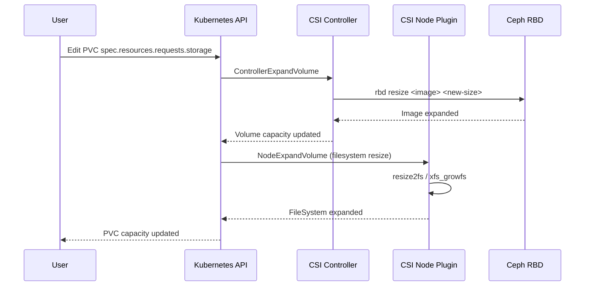

# How to Enable Volume Expansion for Rook RBD StorageClass

Author: [nawazdhandala](https://www.github.com/nawazdhandala)

Tags: Rook, Ceph, Kubernetes, Storage

Description: Enable online volume expansion for Rook RBD PersistentVolumes by configuring the StorageClass and using kubectl to resize PVCs without downtime.

---

## Introduction

Kubernetes supports online volume expansion for RBD-backed PersistentVolumes. When `allowVolumeExpansion: true` is set in the StorageClass, users can increase the size of a PVC by editing its spec. The Rook CSI driver handles expanding the underlying RBD image and optionally resizing the filesystem automatically, all without pod restarts.

## Volume Expansion Workflow



## Prerequisites

- Kubernetes v1.16+ (stable volume expansion)
- Rook CSI driver with `allowVolumeExpansion: true` in the StorageClass
- The `VolumeExpansion` feature gate enabled (enabled by default in Kubernetes 1.11+)

## Step 1: Create a StorageClass with Volume Expansion Enabled

```yaml
# storageclass-rbd-expandable.yaml
apiVersion: storage.k8s.io/v1
kind: StorageClass
metadata:
  name: rook-ceph-block
provisioner: rook-ceph.rbd.csi.ceph.com
parameters:
  clusterID: <ceph-cluster-fsid>
  pool: replicapool
  imageFormat: "2"
  # These features are required for online expansion
  imageFeatures: layering,fast-diff,object-map,deep-flatten,exclusive-lock
  csi.storage.k8s.io/provisioner-secret-name: rook-csi-rbd-provisioner
  csi.storage.k8s.io/provisioner-secret-namespace: rook-ceph
  # Controller expand secret must be set for expansion to work
  csi.storage.k8s.io/controller-expand-secret-name: rook-csi-rbd-provisioner
  csi.storage.k8s.io/controller-expand-secret-namespace: rook-ceph
  csi.storage.k8s.io/node-stage-secret-name: rook-csi-rbd-node
  csi.storage.k8s.io/node-stage-secret-namespace: rook-ceph
reclaimPolicy: Delete
# Critical: must be true for PVC resizing
allowVolumeExpansion: true
volumeBindingMode: Immediate
```

```bash
kubectl apply -f storageclass-rbd-expandable.yaml

# Verify allowVolumeExpansion is true
kubectl get storageclass rook-ceph-block -o jsonpath='{.allowVolumeExpansion}'
```

## Step 2: Create an Initial PVC

```yaml
# initial-pvc.yaml
apiVersion: v1
kind: PersistentVolumeClaim
metadata:
  name: expandable-pvc
spec:
  accessModes:
    - ReadWriteOnce
  storageClassName: rook-ceph-block
  resources:
    requests:
      storage: 10Gi
```

```bash
kubectl apply -f initial-pvc.yaml
kubectl get pvc expandable-pvc
# Expected: STATUS=Bound, CAPACITY=10Gi
```

## Step 3: Deploy a Pod Using the PVC

```yaml
# test-pod.yaml
apiVersion: v1
kind: Pod
metadata:
  name: expansion-test
spec:
  containers:
    - name: app
      image: nginx
      volumeMounts:
        - name: data
          mountPath: /data
  volumes:
    - name: data
      persistentVolumeClaim:
        claimName: expandable-pvc
```

```bash
kubectl apply -f test-pod.yaml
kubectl wait --for=condition=Ready pod/expansion-test --timeout=60s

# Check initial filesystem size inside pod
kubectl exec expansion-test -- df -h /data
```

## Step 4: Expand the PVC

```bash
# Method 1: Using kubectl patch
kubectl patch pvc expandable-pvc -p '{"spec":{"resources":{"requests":{"storage":"20Gi"}}}}'

# Method 2: Edit directly
kubectl edit pvc expandable-pvc
# Change: storage: 10Gi  ->  storage: 20Gi

# Method 3: Apply updated manifest
kubectl apply -f - <<EOF
apiVersion: v1
kind: PersistentVolumeClaim
metadata:
  name: expandable-pvc
spec:
  accessModes:
    - ReadWriteOnce
  storageClassName: rook-ceph-block
  resources:
    requests:
      storage: 20Gi
EOF
```

## Step 5: Monitor the Expansion

```bash
# Watch PVC status during expansion
kubectl get pvc expandable-pvc -w

# Expected progression:
# NAME             STATUS   VOLUME     CAPACITY   ACCESS MODES   STORAGECLASS      AGE
# expandable-pvc   Bound    pvc-xxx    10Gi       RWO            rook-ceph-block   2m
# expandable-pvc   Bound    pvc-xxx    10Gi       RWO            rook-ceph-block   2m  <- Resizing
# expandable-pvc   Bound    pvc-xxx    20Gi       RWO            rook-ceph-block   3m  <- Done

# Check conditions on the PVC
kubectl describe pvc expandable-pvc | grep -A10 Conditions

# Verify filesystem was also expanded
kubectl exec expansion-test -- df -h /data
```

## Step 6: Expand a PVC for a StatefulSet

StatefulSet PVCs require a different approach since you cannot edit the StatefulSet volumeClaimTemplate directly:

```bash
# Expand each PVC in the StatefulSet individually
for i in 0 1 2; do
  kubectl patch pvc data-mystatefulset-${i} \
    -p '{"spec":{"resources":{"requests":{"storage":"50Gi"}}}}'
done

# Verify all PVCs expanded
kubectl get pvc -l app=mystatefulset
```

## Step 7: Offline Expansion (When Online Expansion Fails)

If the pod is not running or online expansion fails, perform an offline expansion:

```bash
# Scale down the workload
kubectl scale deployment my-app --replicas=0

# Expand the PVC
kubectl patch pvc expandable-pvc \
  -p '{"spec":{"resources":{"requests":{"storage":"30Gi"}}}}'

# Wait for expansion to complete
kubectl wait --for=condition=FileSystemResizePending=False pvc/expandable-pvc

# Scale the workload back up - filesystem resize happens on NodeStageVolume
kubectl scale deployment my-app --replicas=1
```

## Troubleshooting

```bash
# Check CSI controller expand logs
kubectl logs -n rook-ceph deploy/csi-rbdplugin-provisioner -c csi-resizer | tail -20

# Check if expansion failed due to missing controller-expand-secret
kubectl describe pvc expandable-pvc | grep -A5 "Events"

# Verify the RBD image was resized on the Ceph cluster
kubectl -n rook-ceph exec -it deploy/rook-ceph-tools -- \
  rbd info replicapool/<image-name> | grep size

# Force filesystem check/resize if df shows old size
kubectl exec expansion-test -- resize2fs /dev/rbd0
```

## Important Notes

- You can only increase PVC size, not decrease it
- The `controller-expand-secret` parameters are required in the StorageClass for expansion to work
- Online filesystem resize happens automatically when the pod mounts the expanded volume
- XFS filesystems also support online expansion through `xfs_growfs`

## Summary

Enabling volume expansion for Rook RBD requires setting `allowVolumeExpansion: true` and configuring the `csi.storage.k8s.io/controller-expand-secret-name` parameter in the StorageClass. Once configured, PVCs can be expanded by increasing `spec.resources.requests.storage`. The Rook CSI driver handles RBD image resizing and filesystem expansion automatically, allowing storage to grow online without pod restarts in most cases.
