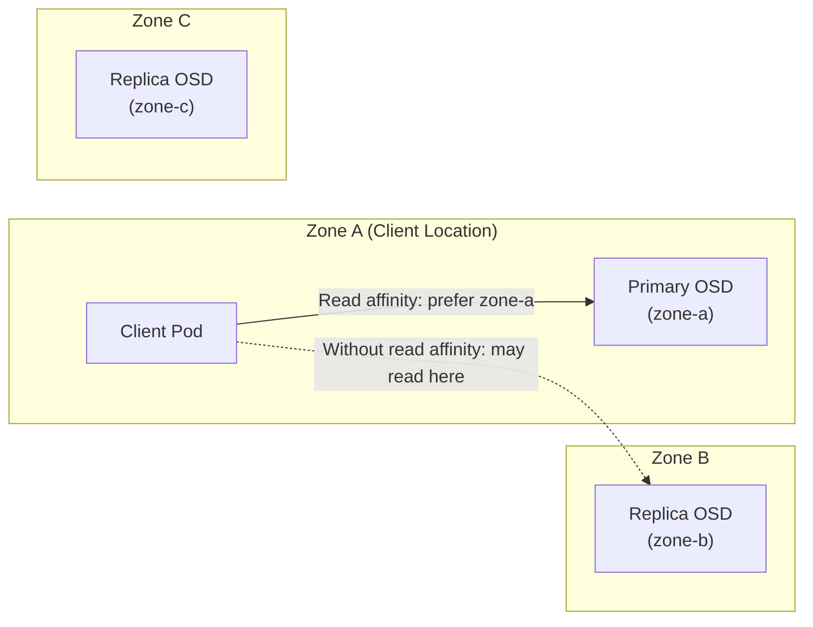

# How to Configure Read Affinity in Rook-Ceph for Performance

Author: [nawazdhandala](https://www.github.com/nawazdhandala)

Tags: Rook, Ceph, Kubernetes, Performance, Read Affinity, Storage, Locality

Description: Configure Rook-Ceph read affinity to serve reads from the nearest OSD replica, reducing cross-zone latency and network bandwidth for read-heavy workloads.

---

## How Read Affinity Works in Ceph

By default, Ceph always reads from the primary OSD for a placement group, regardless of where the client pod is running. When using zone-spread deployments, this can mean reads from zone-a pods are served by OSDs in zone-b or zone-c, adding network latency. Read affinity (also called balanced reads or crush location reads) lets clients prefer reading from the nearest OSD replica based on CRUSH topology.



## Types of Read Affinity in Rook-Ceph

Rook-Ceph supports two read affinity mechanisms:

1. **Primary affinity**: Adjusts the primary OSD election to prefer OSDs on certain nodes. This changes where writes also go.
2. **Crush location reads** (balance reads): The client reads from the nearest replica without changing primary OSD assignment. This is the recommended approach.

## Configuring Crush Location Reads via CSI

The Rook-Ceph CSI driver passes topology labels to the Ceph client, which uses them for read locality decisions.

First, ensure nodes have topology labels:

```bash
kubectl label node worker-zone-a topology.kubernetes.io/zone=zone-a
kubectl label node worker-zone-b topology.kubernetes.io/zone=zone-b
kubectl label node worker-zone-c topology.kubernetes.io/zone=zone-c
```

Enable topology awareness in the CSI driver via the operator ConfigMap:

```bash
kubectl -n rook-ceph edit configmap rook-ceph-operator-config
```

Add these settings:

```yaml
data:
  CSI_ENABLE_TOPOLOGY: "true"
  CSI_TOPOLOGY_DOMAIN_LABELS: "topology.kubernetes.io/zone"
```

## Configuring the StorageClass for Topology Awareness

Update the StorageClass to enable topology-aware provisioning:

```yaml
apiVersion: storage.k8s.io/v1
kind: StorageClass
metadata:
  name: rook-ceph-block-topology
provisioner: rook-ceph.rbd.csi.ceph.com
parameters:
  clusterID: rook-ceph
  pool: replicapool
  imageFormat: "2"
  imageFeatures: layering
  csi.storage.k8s.io/provisioner-secret-name: rook-csi-rbd-provisioner
  csi.storage.k8s.io/provisioner-secret-namespace: rook-ceph
  csi.storage.k8s.io/controller-expand-secret-name: rook-csi-rbd-provisioner
  csi.storage.k8s.io/controller-expand-secret-namespace: rook-ceph
  csi.storage.k8s.io/node-stage-secret-name: rook-csi-rbd-node
  csi.storage.k8s.io/node-stage-secret-namespace: rook-ceph
volumeBindingMode: WaitForFirstConsumer
allowedTopologies:
  - matchLabelExpressions:
      - key: topology.kubernetes.io/zone
        values:
          - zone-a
          - zone-b
          - zone-c
```

The `volumeBindingMode: WaitForFirstConsumer` ensures the volume is provisioned in the same zone as the consuming pod.

## Configuring RBD Balance Reads

Enable balance reads at the Ceph configuration level so the client prefers reading from the nearest OSD:

```bash
kubectl -n rook-ceph exec -it deploy/rook-ceph-tools -- \
  ceph config set client rbd_balance_snap_reads true
kubectl -n rook-ceph exec -it deploy/rook-ceph-tools -- \
  ceph config set client rbd_localize_snap_reads true
```

Enable balanced reads for regular (non-snapshot) reads:

```bash
kubectl -n rook-ceph exec -it deploy/rook-ceph-tools -- \
  ceph config set client rbd_balance_parent_reads true
kubectl -n rook-ceph exec -it deploy/rook-ceph-tools -- \
  ceph config set client rbd_localize_parent_reads true
```

## Configuring Primary Affinity

Primary affinity adjusts the weight of OSDs being elected as primary for placement groups. Higher primary affinity makes an OSD more likely to be the primary.

To prefer fast SSDs as primaries:

```bash
kubectl -n rook-ceph exec -it deploy/rook-ceph-tools -- \
  ceph osd primary-affinity osd.0 1.0
kubectl -n rook-ceph exec -it deploy/rook-ceph-tools -- \
  ceph osd primary-affinity osd.1 1.0
# Set lower affinity for slow HDDs
kubectl -n rook-ceph exec -it deploy/rook-ceph-tools -- \
  ceph osd primary-affinity osd.4 0.5
```

Verify primary affinity settings:

```bash
kubectl -n rook-ceph exec -it deploy/rook-ceph-tools -- \
  ceph osd dump | grep primary_affinity
```

## CephFS Read Affinity

For CephFS, configure MDS read directives to serve reads from the nearest MDS. Set the CephFS client option in the CSI driver config via the StorageClass:

```yaml
apiVersion: storage.k8s.io/v1
kind: StorageClass
metadata:
  name: rook-cephfs-topology
provisioner: rook-ceph.cephfs.csi.ceph.com
parameters:
  clusterID: rook-ceph
  fsName: myfs
  pool: myfs-replicated
  csi.storage.k8s.io/provisioner-secret-name: rook-csi-cephfs-provisioner
  csi.storage.k8s.io/provisioner-secret-namespace: rook-ceph
  csi.storage.k8s.io/controller-expand-secret-name: rook-csi-cephfs-provisioner
  csi.storage.k8s.io/controller-expand-secret-namespace: rook-ceph
  csi.storage.k8s.io/node-stage-secret-name: rook-csi-cephfs-node
  csi.storage.k8s.io/node-stage-secret-namespace: rook-ceph
  fuseMountOptions: "allow_other"
```

## Verifying Read Locality

Check which OSD is serving reads for a specific PG:

```bash
kubectl -n rook-ceph exec -it deploy/rook-ceph-tools -- \
  ceph pg map <pgid>
```

Monitor read latency by zone using Prometheus metrics. The metric `ceph_osd_op_r_latency_sum` per OSD shows where reads are actually being served.

Check OSD read statistics:

```bash
kubectl -n rook-ceph exec -it deploy/rook-ceph-tools -- \
  ceph osd perf
```

## Benchmarking Read Affinity Impact

Run a read benchmark before and after enabling read affinity to measure the improvement:

```bash
kubectl run fio-test --rm -it --image=nixery.dev/shell/fio \
  --overrides='...' \
  -- fio --name=randread --ioengine=libaio --direct=1 \
     --rw=randread --bs=4k --numjobs=4 --iodepth=32 \
     --runtime=60 --time_based --filename=/data/test --size=4G \
     --output-format=json | python3 -c "
import json,sys
d=json.load(sys.stdin)
print('Read IOPS:', d['jobs'][0]['read']['iops'])
print('Read latency avg (us):', d['jobs'][0]['read']['lat_ns']['mean']/1000)
"
```

## Summary

Read affinity in Rook-Ceph can be configured at multiple levels: CSI topology awareness (volumes provisioned near consuming pods), RBD balance reads (`rbd_balance_parent_reads`), and OSD primary affinity. For multi-zone deployments, enabling topology awareness and balance reads reduces cross-zone read latency significantly for read-heavy workloads. Primary affinity is useful to prefer faster SSDs as primary OSDs. Always benchmark before and after to quantify the improvement in your specific environment.
