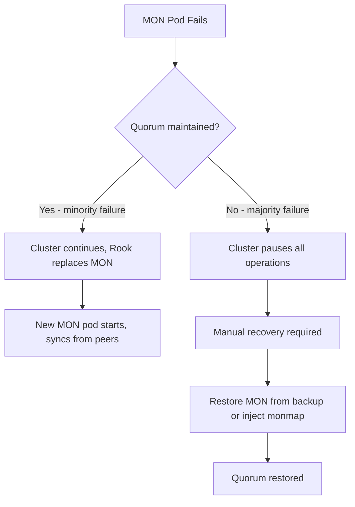

# How to Recover a Failed Rook-Ceph Monitor (MON)

Author: [nawazdhandala](https://www.github.com/nawazdhandala)

Tags: Rook, Ceph, Kubernetes, Monitor, MON, Recovery, Troubleshooting

Description: Recover a failed Ceph MON in Rook-Ceph by diagnosing quorum loss, replacing failed MON pods, and restoring cluster health step by step.

---

## How MON Failures Affect the Ceph Cluster

Ceph MONs (Monitors) maintain the cluster map and require a quorum (majority) to operate. With 3 MONs, the cluster tolerates 1 failure. With 5 MONs, it tolerates 2. If quorum is lost, all Ceph operations stop - no reads, writes, or new PVC provisioning until quorum is restored.



## Step 1 - Identify the Problem

Check the MON pod status:

```bash
kubectl -n rook-ceph get pods -l app=rook-ceph-mon
```

Describe a failing MON pod for events:

```bash
kubectl -n rook-ceph describe pod rook-ceph-mon-a-<hash>
```

Check MON pod logs:

```bash
kubectl -n rook-ceph logs rook-ceph-mon-a-<hash> --previous
```

Try to run a Ceph command. If MONs are in quorum, it will succeed:

```bash
kubectl -n rook-ceph exec -it deploy/rook-ceph-tools -- ceph status
```

If you see `connection refused` or the command hangs, quorum may be lost.

## Step 2 - Check Current Quorum Status

If at least one MON is reachable, check quorum:

```bash
kubectl -n rook-ceph exec -it deploy/rook-ceph-tools -- ceph mon stat
```

View the current quorum members:

```bash
kubectl -n rook-ceph exec -it deploy/rook-ceph-tools -- ceph quorum_status | python3 -m json.tool
```

Identify which MON is missing from the quorum.

## Step 3 - Recover a Single Failed MON (Quorum Intact)

If quorum is still maintained (2 of 3 MONs up), Rook should automatically replace the failed MON. Check the operator logs:

```bash
kubectl -n rook-ceph logs deployment/rook-ceph-operator --tail=50 | grep -i mon
```

If Rook is not replacing the MON automatically, force it by deleting the failed MON pod:

```bash
kubectl -n rook-ceph delete pod rook-ceph-mon-a-<hash>
```

Rook will create a new MON pod. If the MON is stuck because its PVC is on an unavailable node, force-delete the pod:

```bash
kubectl -n rook-ceph delete pod rook-ceph-mon-a-<hash> --force --grace-period=0
```

Then delete the MON's PVC to force reprovisioning on another node:

```bash
kubectl -n rook-ceph delete pvc rook-ceph-mon-a
```

Rook will provision a new MON on an available node and sync it from the other MONs.

## Step 4 - Recover from Quorum Loss (Majority of MONs Unavailable)

If you have lost quorum, follow these steps carefully. This is a data-affecting procedure.

First, identify one healthy MON that has the most up-to-date data. If all MON pods are down, pick the MON whose data directory was most recently written to:

```bash
# On the node where MON data is stored
ls -la /var/lib/rook/mon-a/data/
```

Scale the Rook operator to 0 to prevent interference:

```bash
kubectl -n rook-ceph scale deployment rook-ceph-operator --replicas=0
```

Start a temporary MON pod from the healthy MON's data with a modified monmap. Use the `ceph-mon --extract-monmap` and `monmaptool` approach:

```bash
kubectl -n rook-ceph exec -it rook-ceph-mon-a-<hash> -- bash
```

Inside the MON container, extract and modify the monmap:

```bash
ceph-mon --extract-monmap /tmp/monmap --mon-data /var/lib/ceph/mon/ceph-a
monmaptool --print /tmp/monmap
monmaptool --rm b /tmp/monmap
monmaptool --rm c /tmp/monmap
monmaptool --print /tmp/monmap
ceph-mon --inject-monmap /tmp/monmap --mon-data /var/lib/ceph/mon/ceph-a
```

Start just this one MON:

```bash
kubectl -n rook-ceph delete pod rook-ceph-mon-b-<hash> rook-ceph-mon-c-<hash>
```

After the single MON starts and forms quorum with itself, verify:

```bash
kubectl -n rook-ceph exec -it deploy/rook-ceph-tools -- ceph status
```

## Step 5 - Restore Full MON Count

After single-MON quorum is restored, scale the Rook operator back up:

```bash
kubectl -n rook-ceph scale deployment rook-ceph-operator --replicas=1
```

Rook will detect that only one MON is present and add new MONs to restore the configured count (usually 3).

Watch the MON recovery:

```bash
kubectl -n rook-ceph get pods -l app=rook-ceph-mon -w
```

## Step 6 - Verify Full Recovery

Confirm all MONs are in quorum:

```bash
kubectl -n rook-ceph exec -it deploy/rook-ceph-tools -- ceph mon stat
```

Confirm cluster health is restored:

```bash
kubectl -n rook-ceph exec -it deploy/rook-ceph-tools -- ceph status
```

Check that the Rook operator reports the cluster as ready:

```bash
kubectl -n rook-ceph get cephcluster rook-ceph
```

## Summary

Recovering a failed Rook-Ceph MON depends on whether quorum is intact. With quorum intact, simply delete the failed MON pod or its PVC and let Rook replace it. When quorum is lost, the recovery requires extracting the monmap from a surviving MON, removing the failed MON entries, injecting the modified monmap, and starting a single-MON quorum before restoring the full MON count. Always scale the Rook operator to 0 during manual recovery to prevent conflicting changes.
