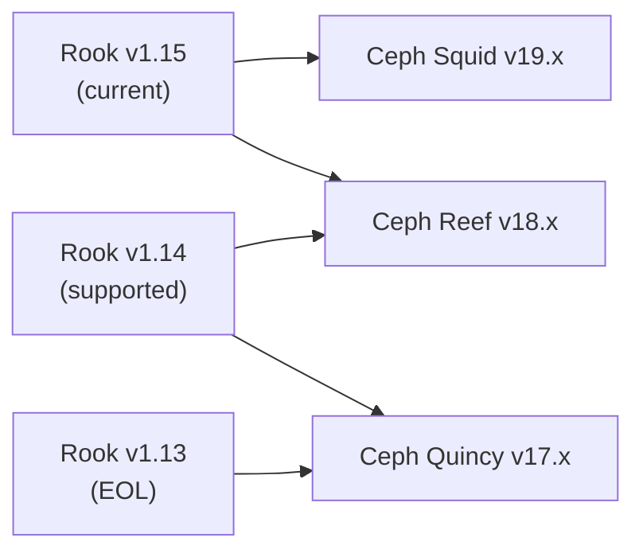
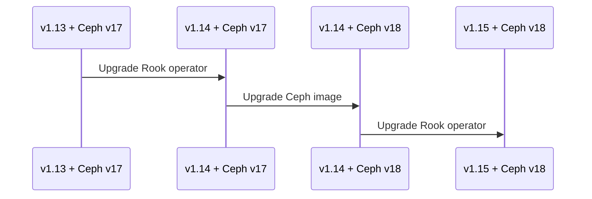

# How to Understand Rook-Ceph Release Cycle and Version Compatibility

Author: [nawazdhandala](https://www.github.com/nawazdhandala)

Tags: Rook, Ceph, Kubernetes, Storage, Release, Upgrade

Description: Understand the Rook-Ceph release cycle, supported Ceph versions per Rook release, Kubernetes version compatibility matrix, and how to plan upgrades safely.

---

## Rook Release Model

Rook follows a release train model with major releases tied to feature milestones and patch releases for bug fixes. Each major Rook release supports a specific set of Ceph versions and a range of Kubernetes versions.



## Rook to Kubernetes Compatibility

Rook releases support a rolling window of Kubernetes versions:

| Rook Version | Min Kubernetes | Max Kubernetes |
|---|---|---|
| v1.15 | 1.26 | 1.32 |
| v1.14 | 1.25 | 1.31 |
| v1.13 | 1.24 | 1.30 |
| v1.12 | 1.23 | 1.29 |

Always check the official compatibility matrix on the Rook documentation site before upgrading.

## Ceph Version Support per Rook Release

| Rook Version | Ceph Versions Supported |
|---|---|
| v1.15 | v18 (Reef), v19 (Squid) |
| v1.14 | v17 (Quincy), v18 (Reef) |
| v1.13 | v17 (Quincy), v18 (Reef) |

A new Ceph major release (e.g., Squid v19) is added to Rook support typically 1-2 releases after Ceph's upstream GA.

## Supported Kubernetes CRD API Versions

Rook CRDs follow Kubernetes API evolution:

```bash
kubectl api-versions | grep ceph.rook.io
# ceph.rook.io/v1
```

The `v1` API group has been stable since Rook 1.3. Earlier `v1alpha1` and `v1beta1` APIs are removed.

## Checking Your Current Versions

```bash
# Rook operator version
kubectl -n rook-ceph get deploy rook-ceph-operator \
  -o jsonpath='{.spec.template.spec.containers[0].image}'

# Ceph version
kubectl -n rook-ceph exec -it deploy/rook-ceph-tools -- \
  ceph version

# Kubernetes version
kubectl version --short
```

## Upgrade Path Rules

Rook enforces these upgrade path constraints:

1. Never skip Rook major versions (v1.13 -> v1.14 -> v1.15, not v1.13 -> v1.15)
2. Never skip Ceph major versions (Quincy -> Reef -> Squid, not Quincy -> Squid)
3. Upgrade Rook before upgrading Ceph
4. The Ceph version must be supported by the target Rook version

Upgrade sequence example:



## Checking the Upgrade Compatibility Before Upgrading

Before upgrading Ceph, verify the new version is in the allowlist:

```bash
# Check if new Ceph version is allowed
kubectl -n rook-ceph get cephcluster rook-ceph \
  -o jsonpath='{.spec.cephVersion.allowUnsupported}'
```

To block unsupported upgrades, ensure `allowUnsupported: false`:

```yaml
spec:
  cephVersion:
    image: quay.io/ceph/ceph:v18.2.0
    allowUnsupported: false
```

## Release Branch Lifecycle

Rook maintains approximately the last two major versions:

- **Current** - Active development and bug fixes
- **N-1** - Security and critical bug fixes only
- **N-2 and older** - End of life, no updates

Check the current EOL status at `https://rook.io/docs/rook/latest/Getting-Started/release-cycle/`.

## Helm Chart Versioning

If using Helm, Rook chart versions match operator versions:

```bash
# Check current chart version
helm list -n rook-ceph

# Check available versions
helm repo update
helm search repo rook-release/rook-ceph --versions | head -10
```

## Summary

The Rook release cycle follows a rolling compatibility window where each major version supports the last 2-3 Ceph releases and a corresponding range of Kubernetes versions. Always upgrade Rook before upgrading Ceph, never skip major versions in either component, and use the official compatibility matrix to verify support before planning an upgrade. Set `allowUnsupported: false` in the CephCluster spec to prevent accidental deployment of an unsupported Ceph version.
