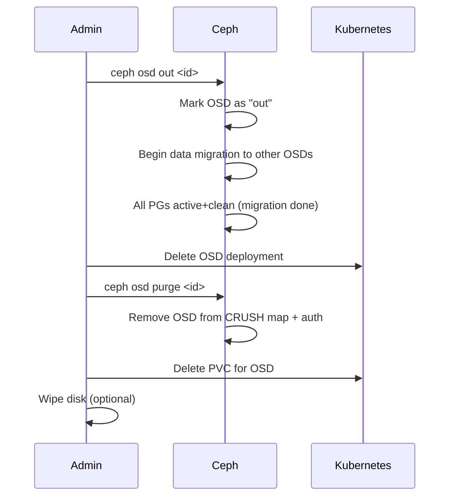

# How to Remove an OSD from a Rook-Ceph Cluster

Author: [nawazdhandala](https://www.github.com/nawazdhandala)

Tags: Rook, Ceph, Kubernetes, OSD, Removal, Operations

Description: Step-by-step procedure for safely removing an OSD from a Rook-Ceph cluster, including data drain, OSD decommission, and disk cleanup.

---

## When to Remove an OSD

You remove an OSD when a disk is failing, you are decommissioning a node, or you are replacing smaller disks with larger ones. The removal process must be done carefully: Ceph must redistribute all the data stored on the OSD before it is permanently removed, or data loss may occur if multiple OSDs in the same failure domain are removed simultaneously.



## Prerequisites

Before removing an OSD:

- Verify there are enough remaining OSDs to maintain replication. For a 3-replica pool, you need at least 3 OSDs remaining.
- Confirm the cluster is healthy: `HEALTH_OK` with no existing degraded PGs.
- Ensure the replacement disk or node capacity is sufficient.

```bash
kubectl -n rook-ceph exec deploy/rook-ceph-tools -- ceph status
kubectl -n rook-ceph exec deploy/rook-ceph-tools -- ceph osd stat
```

## Step 1 - Identify the OSD to Remove

Find the OSD ID and which node it is running on:

```bash
kubectl -n rook-ceph exec deploy/rook-ceph-tools -- ceph osd tree
```

Note the OSD ID (a number like `3`) and the host it is on.

Find the corresponding pod:

```bash
kubectl -n rook-ceph get pods -l app=rook-ceph-osd -o wide | grep osd-3
```

## Step 2 - Mark the OSD Out

Marking the OSD "out" tells Ceph to stop using it for new data and migrate existing PGs to other OSDs. This starts the data drain process:

```bash
kubectl -n rook-ceph exec deploy/rook-ceph-tools -- ceph osd out 3
```

Immediately monitor the rebalancing:

```bash
kubectl -n rook-ceph exec deploy/rook-ceph-tools -- ceph status
```

You will see PGs transition through states like `active+remapped+backfilling`. Wait until all PGs are back to `active+clean` before proceeding.

Check rebalancing progress:

```bash
kubectl -n rook-ceph exec deploy/rook-ceph-tools -- ceph progress
```

This can take minutes to hours depending on how much data was on the OSD.

## Step 3 - Wait for Data Migration to Complete

Do not proceed to removal until all PGs are clean:

```bash
# Check PG status - wait for no degraded or backfilling PGs
kubectl -n rook-ceph exec deploy/rook-ceph-tools -- ceph pg stat
```

The output should show only `active+clean`:

```text
96 pgs: 96 active+clean; 5.0 GiB data, 20 GiB used, 850 GiB / 900 GiB avail
```

## Step 4 - Stop the OSD Pod

Delete the OSD Deployment. The deployment name follows the pattern `rook-ceph-osd-<id>`:

```bash
kubectl -n rook-ceph delete deployment rook-ceph-osd-3
```

Verify the pod is gone:

```bash
kubectl -n rook-ceph get pods -l ceph-osd-id=3
```

## Step 5 - Remove the OSD from Ceph

Mark the OSD down and purge it from the Ceph cluster (removes it from CRUSH map and auth):

```bash
kubectl -n rook-ceph exec deploy/rook-ceph-tools -- bash -c "
  ceph osd down 3
  ceph osd purge 3 --yes-i-really-mean-it
"
```

Verify the OSD is gone:

```bash
kubectl -n rook-ceph exec deploy/rook-ceph-tools -- ceph osd tree
```

OSD 3 should no longer appear in the tree.

## Step 6 - Clean Up Kubernetes Resources

Remove the OSD's ConfigMap and PVC:

```bash
# Find and delete the OSD's PVC (if it uses a PVC for data)
kubectl -n rook-ceph get pvc | grep osd-3
kubectl -n rook-ceph delete pvc <osd-3-pvc-name>

# Remove any remaining ConfigMaps for the OSD
kubectl -n rook-ceph delete configmap rook-ceph-osd-3-metadata 2>/dev/null || true
```

## Step 7 - Verify Cluster Health

After removal, confirm the cluster is healthy:

```bash
kubectl -n rook-ceph exec deploy/rook-ceph-tools -- ceph status
kubectl -n rook-ceph exec deploy/rook-ceph-tools -- ceph osd stat
```

```text
  osd: 8 osds: 8 up, 8 in
```

## Step 8 - Prevent the Operator from Recreating the OSD

If the disk is still attached to the node but you do not want Rook to recreate the OSD, either:

1. Remove the disk from the CephCluster's device list, or
2. Add a `crushDeviceClass` label to prevent auto-discovery, or
3. Wipe and remove the disk from the node

If using `useAllDevices: true`, Rook will try to recreate the OSD on the same disk unless it is wiped:

```bash
sudo wipefs -a /dev/sdc
sudo sgdisk --zap-all /dev/sdc
```

## Removing Multiple OSDs Safely

To remove multiple OSDs, do them one at a time: mark one OSD out, wait for full rebalancing, remove it, verify health, then move to the next OSD. Never mark multiple OSDs out simultaneously if they are in the same CRUSH failure domain (same host or rack).

## Summary

Removing an OSD safely requires: marking it `out` and waiting for all data to migrate to other OSDs (verify with `ceph pg stat`), then deleting the Kubernetes deployment, running `ceph osd purge`, and cleaning up the PVC. Never rush past the data migration step - proceeding while PGs are still degraded risks data loss. After removal, verify the cluster returns to `HEALTH_OK` before removing additional OSDs. Wipe the disk if you want to prevent the Rook operator from recreating the OSD automatically.
