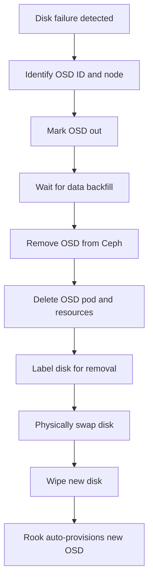

# How to Replace a Failed OSD Disk in Rook-Ceph

Author: [nawazdhandala](https://www.github.com/nawazdhandala)

Tags: Rook, Ceph, Kubernetes, OSD, Disk, Replace, Maintenance, BlueStore

Description: Step-by-step guide to replacing a failed physical disk hosting a Rook-Ceph OSD, including safe removal, disk swap, and re-provisioning the OSD on the new disk.

---

Replacing a failed OSD disk in Rook requires removing the OSD from the Ceph cluster, swapping the physical disk, wiping the new disk, and allowing Rook to re-provision an OSD automatically.

## Disk Replacement Flow



## Step 1: Identify the Failed OSD

```bash
# Check cluster status for down OSDs
kubectl exec -n rook-ceph deploy/rook-ceph-tools -- ceph status
kubectl exec -n rook-ceph deploy/rook-ceph-tools -- ceph osd tree

# Find OSD pod and its node
kubectl get pods -n rook-ceph -l app=rook-ceph-osd -o wide | grep -v Running

# Get OSD ID from pod label
kubectl get pod <osd-pod-name> -n rook-ceph \
  -o jsonpath='{.metadata.labels.ceph-osd-id}'

# Find which disk the OSD is on
kubectl get pod <osd-pod-name> -n rook-ceph \
  -o jsonpath='{.spec.volumes[*].name}'
```

## Step 2: Mark OSD Out

```bash
OSD_ID=<osd-id>

kubectl exec -n rook-ceph deploy/rook-ceph-tools -- \
  ceph osd out osd.$OSD_ID

# Monitor data migration
watch kubectl exec -n rook-ceph deploy/rook-ceph-tools -- \
  ceph status
```

Wait until recovery is complete before proceeding:

```bash
kubectl exec -n rook-ceph deploy/rook-ceph-tools -- \
  ceph health detail | grep -v "^HEALTH_OK"
```

## Step 3: Remove OSD from Ceph

```bash
# Remove from CRUSH map
kubectl exec -n rook-ceph deploy/rook-ceph-tools -- \
  ceph osd crush remove osd.$OSD_ID

# Remove auth key
kubectl exec -n rook-ceph deploy/rook-ceph-tools -- \
  ceph auth del osd.$OSD_ID

# Remove OSD from cluster
kubectl exec -n rook-ceph deploy/rook-ceph-tools -- \
  ceph osd rm osd.$OSD_ID

# Verify removal
kubectl exec -n rook-ceph deploy/rook-ceph-tools -- \
  ceph osd tree
```

## Step 4: Delete OSD Kubernetes Resources

```bash
# Delete the OSD pod
kubectl delete pod -n rook-ceph <osd-pod-name>

# Delete the OSD deployment (Rook uses deployments per OSD)
kubectl delete deployment -n rook-ceph \
  -l ceph-osd-id=$OSD_ID

# If PVC-based OSD, delete the PVC
kubectl delete pvc -n rook-ceph \
  $(kubectl get pvc -n rook-ceph -l ceph-osd-id=$OSD_ID -o name)

# Delete the ConfigMap for this OSD
kubectl delete configmap -n rook-ceph \
  $(kubectl get configmap -n rook-ceph | grep "osd-$OSD_ID" | awk '{print $1}')
```

## Step 5: Label the Disk for Replacement in CephCluster

Annotate the node to tell Rook to reprovisioning once the new disk is in:

```bash
# If using spec.storage.nodes, update CephCluster to remove the old device
kubectl edit cephcluster rook-ceph -n rook-ceph
# Under spec.storage.nodes.<node>.devices, remove the old device path
```

## Step 6: Physically Swap the Disk

1. Identify the disk device path on the node (e.g., `/dev/sdb`)
2. Follow hardware procedures to hot-swap or cold-swap the disk
3. Confirm the new disk is detected by the OS

```bash
# On the node after disk swap
kubectl debug node/<node-name> -it --image=ubuntu -- chroot /host bash
lsblk  # New disk should appear
```

## Step 7: Wipe the New Disk

```bash
# On the node (as root)
DISK=/dev/sdb

sgdisk --zap-all $DISK
dd if=/dev/zero of=$DISK bs=4096 count=100 oflag=direct

# Clear any partition table
wipefs -a $DISK

# Remove LVM artifacts if present
pvremove $DISK || true
```

## Step 8: Trigger Rook to Provision New OSD

Rook automatically discovers new clean disks if `useAllDevices: true` or the device is listed in `spec.storage.nodes`. Restart the operator to trigger immediate discovery:

```bash
kubectl rollout restart deployment rook-ceph-operator -n rook-ceph

# Watch OSD provisioning
kubectl get pods -n rook-ceph -l app=rook-ceph-osd -w
```

Or manually add the device to the CephCluster spec:

```yaml
spec:
  storage:
    nodes:
      - name: <node-name>
        devices:
          - name: sdb
```

## Step 9: Verify New OSD

```bash
# Confirm new OSD is in the cluster
kubectl exec -n rook-ceph deploy/rook-ceph-tools -- ceph osd tree

# Check cluster health
kubectl exec -n rook-ceph deploy/rook-ceph-tools -- ceph status
kubectl exec -n rook-ceph deploy/rook-ceph-tools -- ceph pg stat
```

## Summary

Replacing a failed OSD disk in Rook requires a careful sequence: mark the OSD out, wait for data backfill, remove it from Ceph, delete Kubernetes resources, swap the physical disk, wipe the new disk, and allow Rook to auto-provision the replacement OSD. Never remove an OSD from Ceph before data backfill completes -- doing so risks data loss in under-replicated pools.
