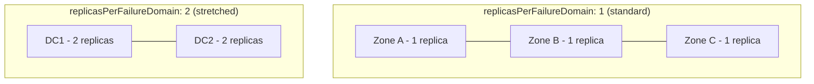

# How to Set Replicas Per Failure Domain in Rook Block Pools

Author: [nawazdhandala](https://www.github.com/nawazdhandala)

Tags: Rook, Ceph, Kubernetes, Storage

Description: Configure the replicasPerFailureDomain setting in Rook CephBlockPool to control how many replicas are placed within each failure domain.

---

## Introduction

The `replicasPerFailureDomain` field in a CephBlockPool spec controls how many replicas of each Placement Group (PG) are placed within each failure domain bucket. This is distinct from the overall replication size: the total replication size equals `replicasPerFailureDomain` multiplied by the number of failure domains used.

This feature enables scenarios like placing 2 replicas in each of 2 data centers (4 total replicas) for stretched cluster deployments.

## Replication Distribution Diagram



## Prerequisites

- Rook-Ceph cluster with OSDs distributed across at least 2 failure domain buckets
- The failure domain bucket type must be configured in the CRUSH map
- Enough OSDs per failure domain bucket to satisfy the replica count

## Step 1: Understand the Relationship Between Settings

```text
total replicas = replicasPerFailureDomain x (number of failure domain buckets used)
```

For example:
- `replicasPerFailureDomain: 2` with `failureDomain: datacenter` and 2 datacenters = 4 total replicas
- `replicasPerFailureDomain: 1` with `failureDomain: host` and 3 hosts = 3 total replicas (standard)

## Step 2: Configure a CephBlockPool with replicasPerFailureDomain

```yaml
# blockpool-replicas-per-fd.yaml
apiVersion: ceph.rook.io/v1
kind: CephBlockPool
metadata:
  name: stretched-pool
  namespace: rook-ceph
spec:
  replicated:
    # Total replica count across all failure domains
    size: 4
    requireSafeReplicaSize: true
    # Number of replicas to place in each failure domain bucket
    replicasPerFailureDomain: 2
    # The failure domain type (datacenter, zone, rack, host, osd)
    failureDomain: datacenter
    # Optional: sub-failure domain for secondary CRUSH rule
    subFailureDomain: host
```

```bash
kubectl apply -f blockpool-replicas-per-fd.yaml

# Verify the pool was created with the correct settings
kubectl get cephblockpool stretched-pool -n rook-ceph -o yaml
```

## Step 3: Verify the CRUSH Rule Was Created

```bash
# Check the CRUSH rules Rook created
kubectl -n rook-ceph exec -it deploy/rook-ceph-tools -- \
  ceph osd crush rule ls

# Inspect the rule for the pool
kubectl -n rook-ceph exec -it deploy/rook-ceph-tools -- \
  ceph osd crush rule dump stretched-pool

# Verify the pool is using the correct rule
kubectl -n rook-ceph exec -it deploy/rook-ceph-tools -- \
  ceph osd pool get stretched-pool crush_rule
```

## Step 4: Standard Deployment - 1 Replica Per Host

For a standard 3-replica pool across 3 hosts:

```yaml
# blockpool-standard.yaml
apiVersion: ceph.rook.io/v1
kind: CephBlockPool
metadata:
  name: replicapool
  namespace: rook-ceph
spec:
  replicated:
    size: 3
    requireSafeReplicaSize: true
    # Default: 1 replica per host
    replicasPerFailureDomain: 1
    failureDomain: host
```

## Step 5: Two-Site Stretched Deployment

For a deployment spanning two data centers with local redundancy:

```yaml
# blockpool-two-site.yaml
apiVersion: ceph.rook.io/v1
kind: CephBlockPool
metadata:
  name: twosite-pool
  namespace: rook-ceph
spec:
  replicated:
    # 2 replicas per datacenter x 2 datacenters = 4 total
    size: 4
    requireSafeReplicaSize: true
    replicasPerFailureDomain: 2
    failureDomain: datacenter
    # Within each datacenter, replicate across different hosts
    subFailureDomain: host
```

## Step 6: Verify PG Distribution

```bash
kubectl -n rook-ceph exec -it deploy/rook-ceph-tools -- bash

# Check PG distribution across failure domains
ceph pg dump | grep -E "^[0-9]" | awk '{print $1, $15}' | head -20

# Verify OSDs are mapped to correct buckets
ceph osd tree

# Check PG acting sets to confirm replica distribution
ceph pg map <pgid>
```

## Step 7: Create a StorageClass Using the Pool

```yaml
# storageclass-stretched.yaml
apiVersion: storage.k8s.io/v1
kind: StorageClass
metadata:
  name: rook-ceph-block-stretched
provisioner: rook-ceph.rbd.csi.ceph.com
parameters:
  clusterID: <cluster-fsid>
  pool: stretched-pool
  imageFormat: "2"
  imageFeatures: layering,fast-diff,object-map,deep-flatten,exclusive-lock
  csi.storage.k8s.io/provisioner-secret-name: rook-csi-rbd-provisioner
  csi.storage.k8s.io/provisioner-secret-namespace: rook-ceph
  csi.storage.k8s.io/controller-expand-secret-name: rook-csi-rbd-provisioner
  csi.storage.k8s.io/controller-expand-secret-namespace: rook-ceph
  csi.storage.k8s.io/node-stage-secret-name: rook-csi-rbd-node
  csi.storage.k8s.io/node-stage-secret-namespace: rook-ceph
reclaimPolicy: Delete
allowVolumeExpansion: true
```

## Constraint: Minimum OSDs per Failure Domain

When using `replicasPerFailureDomain: 2`, each failure domain bucket must have at least 2 OSDs. If it does not, placement will fail.

```bash
# Count OSDs per datacenter
kubectl -n rook-ceph exec -it deploy/rook-ceph-tools -- \
  ceph osd tree | grep -E "datacenter|osd\."

# Check for undersized PGs
kubectl -n rook-ceph exec -it deploy/rook-ceph-tools -- \
  ceph health detail | grep -i undersized
```

## Troubleshooting

```bash
# If the pool is stuck in undersized state
kubectl -n rook-ceph exec -it deploy/rook-ceph-tools -- \
  ceph osd pool get stretched-pool size

# Reduce size if insufficient OSDs exist per domain
kubectl -n rook-ceph exec -it deploy/rook-ceph-tools -- \
  ceph osd pool set stretched-pool size 2

# Check CephBlockPool status for error messages
kubectl describe cephblockpool stretched-pool -n rook-ceph | grep -A10 "Status:"
```

## Summary

The `replicasPerFailureDomain` setting in Rook CephBlockPool allows precise control over replica distribution within CRUSH failure domain buckets. Setting it to 2 with a `failureDomain` of `datacenter` enables two-site redundancy where each data center holds two copies of every PG. The total pool size must equal `replicasPerFailureDomain` times the number of participating failure domain buckets, and each bucket must have enough OSDs to host the configured number of replicas.
