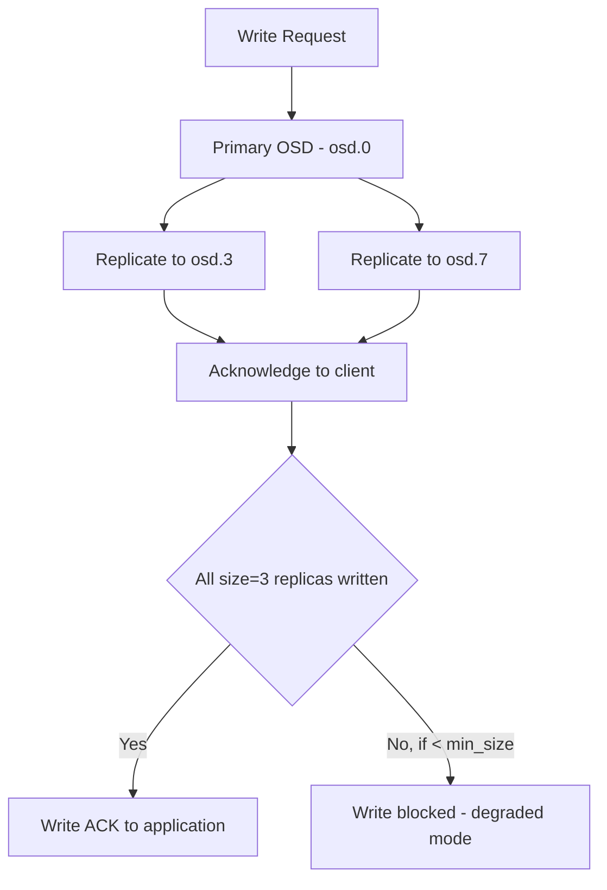

# How to Set Replication Factor for Ceph Pools in Rook

Author: [nawazdhandala](https://www.github.com/nawazdhandala)

Tags: Rook, Ceph, Kubernetes, Replication, Pool, DataDurability

Description: Learn how to configure replication factors for Rook-Ceph storage pools, including setting size, min_size, and understanding the durability tradeoffs.

---

## How Replication Works in Ceph

Ceph replication is configured per pool. The `size` parameter (also called replication factor) controls how many copies of each piece of data are stored across different OSDs. The `min_size` parameter controls the minimum number of replicas that must be available before Ceph accepts writes - preventing data loss when OSDs are temporarily unavailable.



## Standard Three-Replica Pool

Three replicas is the standard production configuration. It can survive the failure of any one OSD or host while maintaining full read and write availability:

```yaml
apiVersion: ceph.rook.io/v1
kind: CephBlockPool
metadata:
  name: replicapool
  namespace: rook-ceph
spec:
  failureDomain: host
  replicated:
    # 3 copies of all data
    size: 3
    # Require all 3 replicas before acknowledging writes
    requireSafeReplicaSize: true
```

With `requireSafeReplicaSize: true`, Rook ensures `min_size` is set to at least 2, preventing data corruption from split-brain scenarios.

## Two-Replica Pool (Space-Efficient)

Two replicas halves storage overhead but only tolerates one OSD failure before the pool becomes read-only:

```yaml
apiVersion: ceph.rook.io/v1
kind: CephBlockPool
metadata:
  name: two-replica-pool
  namespace: rook-ceph
spec:
  failureDomain: host
  replicated:
    size: 2
    # Still require both replicas for writes (safe)
    requireSafeReplicaSize: true
```

Two-replica pools are suitable for non-critical data or test environments where storage efficiency matters more than durability.

## Five-Replica Pool (Maximum Durability)

For critical data requiring maximum fault tolerance:

```yaml
apiVersion: ceph.rook.io/v1
kind: CephBlockPool
metadata:
  name: critical-data-pool
  namespace: rook-ceph
spec:
  failureDomain: host
  replicated:
    size: 5
    requireSafeReplicaSize: true
```

Requires at least 5 nodes with OSDs to place all replicas in different failure domains.

## Failure Domain Impact on Durability

The `failureDomain` field determines what type of failure a replication factor can survive:

```yaml
# Survives failure of any one host (recommended)
spec:
  failureDomain: host
  replicated:
    size: 3
```

```yaml
# Survives failure of any one rack (requires CRUSH rack topology)
spec:
  failureDomain: rack
  replicated:
    size: 3
```

```yaml
# Survives failure of any one OSD only (less protection)
spec:
  failureDomain: osd
  replicated:
    size: 3
```

Use `host` failure domain for most clusters. Use `rack` or `zone` only when you have multiple physical racks or availability zones properly configured in your CRUSH map.

## Understanding size vs. min_size

`size` is the target replication factor. `min_size` is the minimum replicas required for writes.

```bash
# Check current pool settings
kubectl -n rook-ceph exec deploy/rook-ceph-tools -- \
  ceph osd pool get replicapool all | grep -E "^size|^min_size"
```

```text
size: 3
min_size: 2
```

Adjust `min_size` carefully:

```bash
# Allow writes with 1 replica (DANGEROUS - risk of data loss if that OSD fails)
kubectl -n rook-ceph exec deploy/rook-ceph-tools -- \
  ceph osd pool set replicapool min_size 1

# Require 2 replicas for writes (safe for size=3 pools)
kubectl -n rook-ceph exec deploy/rook-ceph-tools -- \
  ceph osd pool set replicapool min_size 2
```

Never set `min_size` to 1 in production except during emergency maintenance.

## Changing Replication Factor on an Existing Pool

Change the size of an existing pool. Ceph will immediately begin replicating or removing copies:

```bash
# Increase from 2 to 3 replicas
kubectl -n rook-ceph exec deploy/rook-ceph-tools -- \
  ceph osd pool set replicapool size 3

# Update min_size to match
kubectl -n rook-ceph exec deploy/rook-ceph-tools -- \
  ceph osd pool set replicapool min_size 2
```

Monitor replication progress:

```bash
kubectl -n rook-ceph exec deploy/rook-ceph-tools -- ceph status
```

## Setting Replication in the CephCluster for All Pools

You can set a default replication policy per device class in the CephCluster:

```yaml
spec:
  storage:
    useAllNodes: true
    useAllDevices: true
    config:
      # Number of OSDs per device
      osdsPerDevice: "1"
```

Individual pools set their own replication via their CephBlockPool or CephFilesystem CR.

## Durability vs. Capacity Tradeoffs

| Replication | Raw Overhead | Survives | Use Case |
|-------------|-------------|----------|----------|
| size=1 | 1x | Nothing (no redundancy) | Dev/test only |
| size=2 | 2x | 1 OSD or 1 host failure | Non-critical data |
| size=3 | 3x | 2 OSD or 1 host failure | Production standard |
| EC 2+1 | 1.5x | 1 OSD failure | Large data, cost-sensitive |
| EC 4+2 | 1.5x | 2 OSD failures | Archive storage |

Erasure coding provides better capacity efficiency than 3-way replication for large data pools while maintaining similar durability.

## Summary

The replication factor in Rook-Ceph is set via `spec.replicated.size` in CephBlockPool and the dataPools section of CephFilesystem. Use `size: 3` with `failureDomain: host` as the production standard - this survives any single host failure and keeps pools writable when one OSD is down (via `min_size: 2`). Use `requireSafeReplicaSize: true` to prevent Rook from creating pools with unsafe minimum replica counts. For cost-sensitive large-capacity pools, consider erasure coding instead of 3-way replication.
