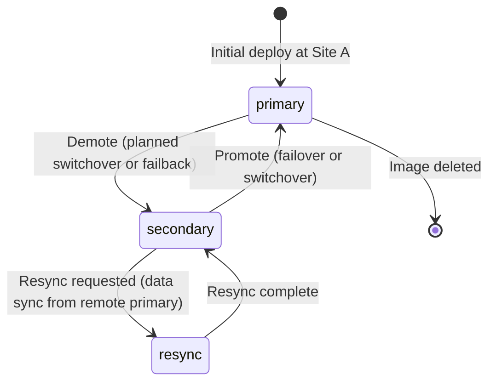

# How to Manage Replication States (Primary, Secondary, Resync) in Rook

Author: [nawazdhandala](https://www.github.com/nawazdhandala)

Tags: Rook, Ceph, Kubernetes, Storage

Description: Understand and manage the Primary, Secondary, and Resync replication states for RBD mirroring in Rook using VolumeReplication CRDs.

---

## Introduction

RBD mirroring in Rook uses three core replication states to control data flow between clusters: `primary`, `secondary`, and `resync`. Understanding when and how to transition between these states is fundamental to operating a disaster recovery setup. The Volume Replication Operator (VRO) exposes these state transitions through the `VolumeReplication` custom resource.

## Replication State Machine



## State Definitions

| State | Description | Direction |
|-------|-------------|-----------|
| `primary` | Image is writable; replication flows OUT to secondary | Read/Write |
| `secondary` | Image is read-only; replication flows IN from primary | Read-Only |
| `resync` | Secondary requests full resync from primary | Read-Only |

## Prerequisites

- Two Rook-Ceph clusters with RBD mirroring configured
- Volume Replication Operator installed
- VolumeReplicationClass configured with appropriate scheduling interval
- VolumeReplication objects created for the PVCs being replicated

## Step 1: Check Current Replication State

```bash
# List all VolumeReplication objects and their states
kubectl get volumereplication -A -o wide

# Example output:
# NAMESPACE    NAME                   AGE   VOLREPCLASS         PVCNAME        DESIREDSTATE  CURRENTSTATE
# production   db-volume-replication  2d    rook-vrc-15min      database-pvc   primary       primary

# Get detailed status
kubectl describe volumereplication db-volume-replication -n production
```

## Step 2: Set a Volume to Primary State

The `primary` state makes the RBD image writable and enables outbound replication:

```yaml
# set-primary.yaml
apiVersion: replication.storage.openshift.io/v1alpha1
kind: VolumeReplication
metadata:
  name: db-volume-replication
  namespace: production
spec:
  volumeReplicationClass: rook-vrc-15min
  dataSource:
    apiGroup: ""
    kind: PersistentVolumeClaim
    name: database-pvc
  replicationState: primary
```

```bash
kubectl apply -f set-primary.yaml

# Verify via Ceph CLI
kubectl -n rook-ceph exec -it deploy/rook-ceph-tools -- \
  rbd mirror image status replicapool/csi-vol-<image-id>
# Expected state: up+stopped (primary, not receiving)
```

## Step 3: Set a Volume to Secondary State

The `secondary` state makes the RBD image read-only and enables inbound replication from the primary:

```yaml
# set-secondary.yaml
apiVersion: replication.storage.openshift.io/v1alpha1
kind: VolumeReplication
metadata:
  name: db-volume-replication
  namespace: production
spec:
  volumeReplicationClass: rook-vrc-15min
  dataSource:
    apiGroup: ""
    kind: PersistentVolumeClaim
    name: database-pvc
  replicationState: secondary
```

```bash
kubectl apply -f set-secondary.yaml

# Verify via Ceph CLI
kubectl -n rook-ceph exec -it deploy/rook-ceph-tools -- \
  rbd mirror image status replicapool/csi-vol-<image-id>
# Expected state: up+replaying (secondary, receiving updates)
```

## Step 4: Trigger a Resync

The `resync` state is used when a secondary site has been promoted, used for failover, and then needs to be resynchronized with the current primary (typically during failback):

```yaml
# trigger-resync.yaml
apiVersion: replication.storage.openshift.io/v1alpha1
kind: VolumeReplication
metadata:
  name: db-volume-replication
  namespace: production
spec:
  volumeReplicationClass: rook-vrc-15min
  dataSource:
    apiGroup: ""
    kind: PersistentVolumeClaim
    name: database-pvc
  # Triggers resync from the active primary
  replicationState: resync
```

```bash
kubectl apply -f trigger-resync.yaml

# Watch the resync progress
kubectl get volumereplication db-volume-replication -n production -w
```

## Step 5: Monitor Resync Progress via Ceph CLI

```bash
kubectl -n rook-ceph exec -it deploy/rook-ceph-tools -- bash

# Check image replication status during resync
rbd mirror image status replicapool/csi-vol-<image-id>
# During resync shows:
# state: up+replaying
# description: replaying, 2048 MiB remaining

# Check pool-level mirror status
rbd mirror pool status replicapool --verbose

# Monitor progress every 30 seconds
watch -n 30 "rbd mirror pool status replicapool 2>&1 | tail -20"
```

## Step 6: Automate State Transitions with Scripts

For complex DR workflows, script the state transitions:

```bash
#!/bin/bash
# dr-promote.sh - Promote a VolumeReplication to primary

NAMESPACE=${1:-production}
VR_NAME=${2:-db-volume-replication}

echo "Promoting ${VR_NAME} in ${NAMESPACE} to primary..."

kubectl patch volumereplication "${VR_NAME}" \
  -n "${NAMESPACE}" \
  --type='merge' \
  -p='{"spec":{"replicationState":"primary"}}'

echo "Waiting for promotion to complete..."
# Poll until desired state matches current state
for i in $(seq 1 60); do
  CURRENT=$(kubectl get volumereplication "${VR_NAME}" -n "${NAMESPACE}" \
    -o jsonpath='{.status.state}')
  if [ "$CURRENT" = "Primary" ]; then
    echo "Promotion successful. Current state: $CURRENT"
    exit 0
  fi
  echo "  Attempt $i/60 - Current state: $CURRENT"
  sleep 10
done

echo "ERROR: Promotion did not complete within 10 minutes"
exit 1
```

## Step 7: Verify Application Access After State Changes

After promoting to primary, verify the PVC is writable:

```bash
# Test write access inside the pod
kubectl exec -n production deploy/my-app -- \
  sh -c "echo 'test-write' > /data/test.txt && cat /data/test.txt"

# For databases, perform a health check
kubectl exec -n production deploy/my-database -- \
  psql -U postgres -c "INSERT INTO health_check (ts) VALUES (now()) RETURNING id;"
```

After setting to secondary, verify the PVC is read-only:

```bash
# This should fail with "read-only filesystem" error
kubectl exec -n production deploy/my-app -- \
  sh -c "echo 'should fail' > /data/test.txt" 2>&1
```

## Step 8: Understand State in VolumeReplication Status

```bash
# Full status fields
kubectl get volumereplication db-volume-replication -n production \
  -o jsonpath='{.status}' | python3 -m json.tool

# Key status fields:
# .status.state         - Current replication state (Primary/Secondary/Resync)
# .status.conditions    - Condition array with detailed messages
# .status.lastSyncTime  - Timestamp of last successful sync
# .status.lastSyncDuration - Duration of last sync operation
# .status.lastSyncBytes - Bytes transferred in last sync
```

## Troubleshooting State Transitions

```bash
# State stuck in transition
kubectl describe volumereplication db-volume-replication -n production | \
  grep -A20 "Conditions:"

# Check VRO operator logs for errors
kubectl logs -n volume-replication-system deploy/volume-replication-operator | \
  grep -E "error|state|promote|demote" | tail -30

# Force state via Ceph CLI if VRO is unavailable
kubectl -n rook-ceph exec -it deploy/rook-ceph-tools -- bash
rbd mirror image demote replicapool/csi-vol-<image-id>
rbd mirror image promote replicapool/csi-vol-<image-id>
rbd mirror image resync replicapool/csi-vol-<image-id>
```

## Summary

Rook RBD mirroring uses three replication states managed through VolumeReplication CRDs: `primary` (writable, outbound replication), `secondary` (read-only, inbound replication), and `resync` (triggers a full data pull from the active primary). Transitioning between states is done by updating the `replicationState` field in the VolumeReplication spec. The `resync` state is specifically used during failback procedures when a previously-failed-over secondary needs to catch up with new writes from the restored primary site.
