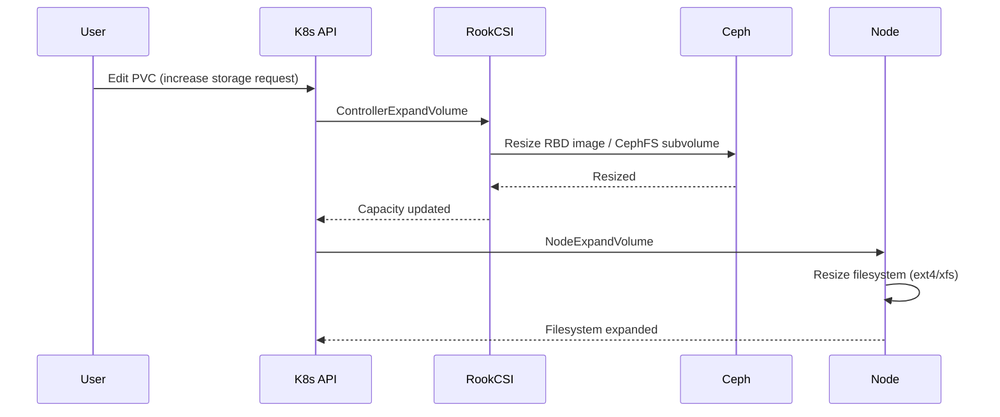

# How to Resize a PVC Backed by Rook-Ceph

Author: [nawazdhandala](https://www.github.com/nawazdhandala)

Tags: Rook, Ceph, Kubernetes, PVC, Storage, Resize

Description: Learn how to resize Kubernetes PersistentVolumeClaims backed by Rook-Ceph RBD and CephFS, including StorageClass configuration and online resize steps.

---

## How PVC Resizing Works with Rook-Ceph

Kubernetes supports online volume expansion for PVCs through the CSI driver. Rook-Ceph's CSI drivers for both RBD (block storage) and CephFS (shared filesystem) support volume expansion. When you increase the storage request in a PVC, the CSI driver expands the underlying Ceph image or CephFS subvolume, then signals the node to expand the filesystem.



## Prerequisites

- The StorageClass must have `allowVolumeExpansion: true`
- The Rook-Ceph CSI driver version must support volume expansion (Rook 1.3+)
- For filesystem expansion to happen automatically on the node, the pod using the PVC must be running

## Enabling Volume Expansion in StorageClass

Ensure your StorageClass has volume expansion enabled. This is the RBD StorageClass example:

```yaml
apiVersion: storage.k8s.io/v1
kind: StorageClass
metadata:
  name: rook-ceph-block
provisioner: rook-ceph.rbd.csi.ceph.com
parameters:
  clusterID: rook-ceph
  pool: replicapool
  imageFormat: "2"
  imageFeatures: layering
  csi.storage.k8s.io/provisioner-secret-name: rook-csi-rbd-provisioner
  csi.storage.k8s.io/provisioner-secret-namespace: rook-ceph
  csi.storage.k8s.io/controller-expand-secret-name: rook-csi-rbd-provisioner
  csi.storage.k8s.io/controller-expand-secret-namespace: rook-ceph
  csi.storage.k8s.io/node-stage-secret-name: rook-csi-rbd-node
  csi.storage.k8s.io/node-stage-secret-namespace: rook-ceph
reclaimPolicy: Delete
allowVolumeExpansion: true
```

For CephFS:

```yaml
apiVersion: storage.k8s.io/v1
kind: StorageClass
metadata:
  name: rook-cephfs
provisioner: rook-ceph.cephfs.csi.ceph.com
parameters:
  clusterID: rook-ceph
  fsName: myfs
  pool: myfs-replicated
  csi.storage.k8s.io/provisioner-secret-name: rook-csi-cephfs-provisioner
  csi.storage.k8s.io/provisioner-secret-namespace: rook-ceph
  csi.storage.k8s.io/controller-expand-secret-name: rook-csi-cephfs-provisioner
  csi.storage.k8s.io/controller-expand-secret-namespace: rook-ceph
  csi.storage.k8s.io/node-stage-secret-name: rook-csi-cephfs-node
  csi.storage.k8s.io/node-stage-secret-namespace: rook-ceph
reclaimPolicy: Delete
allowVolumeExpansion: true
```

## Resizing an RBD-backed PVC

Check the current PVC size before resizing:

```bash
kubectl get pvc my-pvc -o jsonpath='{.spec.resources.requests.storage}'
```

Edit the PVC to increase the storage request. You can patch it directly:

```bash
kubectl patch pvc my-pvc -p '{"spec":{"resources":{"requests":{"storage":"20Gi"}}}}'
```

Or edit it manually:

```bash
kubectl edit pvc my-pvc
```

Change the `storage` field under `spec.resources.requests`:

```yaml
spec:
  resources:
    requests:
      storage: 20Gi
```

Watch the PVC for the resize to complete:

```bash
kubectl get pvc my-pvc -w
```

The status should transition through `Resizing` and then back to `Bound` with the new capacity.

## Verifying the Resize on the Node

Once the PVC shows the new capacity, verify the filesystem inside the pod has also been expanded:

```bash
kubectl exec -it my-pod -- df -h /data
```

For RBD volumes, the filesystem resize happens automatically when the pod is running and the volume is mounted. If the pod is not running, the filesystem will be resized on the next pod start.

Check the PVC status conditions for any errors:

```bash
kubectl describe pvc my-pvc
```

## Resizing an Offline PVC

If the pod is not running (for example a StatefulSet with 0 replicas), the node-side filesystem resize cannot happen until the pod is scheduled again. The PVC will show the new size in `status.capacity` but the filesystem inside will only expand on the next mount.

To force the resize, temporarily scale the StatefulSet up:

```bash
kubectl scale statefulset my-app --replicas=1
```

Then verify the filesystem is expanded before scaling back if needed.

## Verifying the Underlying Ceph Image Size

Confirm the Ceph RBD image was resized at the storage layer:

```bash
kubectl -n rook-ceph exec -it deploy/rook-ceph-tools -- \
  rbd info replicapool/csi-vol-abc123
```

Look for the `size` field in the output, which should reflect the new capacity.

## Common Issues

If the PVC is stuck in `Resizing` state, check the Rook CSI provisioner logs:

```bash
kubectl -n rook-ceph logs -l app=csi-rbdplugin-provisioner -c csi-provisioner --tail=50
```

If you see permission errors, ensure the CSI provisioner secret has the `osd pool application set` capability on the pool.

## Summary

Resizing a PVC backed by Rook-Ceph requires the StorageClass to have `allowVolumeExpansion: true` and the Rook CSI driver to be version 1.3 or higher. Increase the `spec.resources.requests.storage` field in the PVC, and Rook's CSI driver will expand the underlying Ceph image and signal the node to resize the filesystem. For the filesystem resize to complete, the pod using the volume must be running at the time of the expansion.
