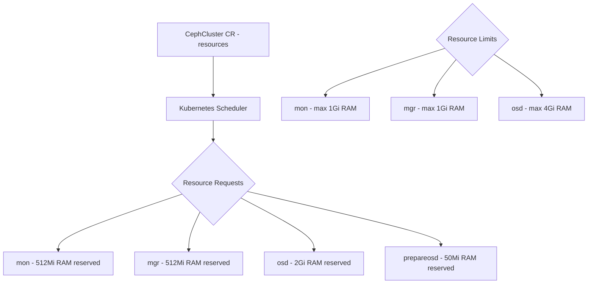

# How to Configure Rook-Ceph Resource Limits and Requests

Author: [nawazdhandala](https://www.github.com/nawazdhandala)

Tags: Rook, Ceph, Kubernetes, Resources, Limits, QoS

Description: Learn how to configure CPU and memory resource requests and limits for all Rook-Ceph daemons to ensure stable coexistence with application workloads.

---

## Why Resource Configuration Matters for Rook-Ceph

Without resource requests, Ceph daemons compete with application pods for CPU and memory, which can cause OSD evictions under memory pressure or degraded performance when nodes are loaded. Without limits, a misbehaving OSD can consume all node memory and trigger a node-wide OOM kill cascade.



## Resource Requirements by Daemon Type

| Daemon | Min CPU | Rec CPU | Min RAM | Rec RAM |
|--------|---------|---------|---------|---------|
| mon | 100m | 500m | 512Mi | 1Gi |
| mgr | 250m | 1 | 512Mi | 1Gi |
| osd (SSD) | 500m | 2 | 2Gi | 4Gi |
| osd (HDD) | 250m | 1 | 1Gi | 2Gi |
| mds | 500m | 2 | 1Gi | 4Gi |
| rgw | 250m | 1 | 512Mi | 2Gi |
| prepareosd | 100m | 500m | 50Mi | 800Mi |

## Full Resource Configuration in CephCluster

Configure resources for all daemon types in the CephCluster CR:

```yaml
apiVersion: ceph.rook.io/v1
kind: CephCluster
metadata:
  name: rook-ceph
  namespace: rook-ceph
spec:
  # ... other fields ...
  resources:
    # Monitor daemon
    mon:
      requests:
        cpu: 500m
        memory: 512Mi
      limits:
        cpu: "1"
        memory: 1Gi

    # Manager daemon
    mgr:
      requests:
        cpu: 500m
        memory: 512Mi
      limits:
        cpu: "1"
        memory: 1Gi

    # Manager sidecar (small helper container)
    mgr-sidecar:
      requests:
        cpu: 100m
        memory: 40Mi
      limits:
        cpu: 200m
        memory: 100Mi

    # OSD daemon (most resource-intensive)
    osd:
      requests:
        cpu: "1"
        memory: 2Gi
      limits:
        cpu: "2"
        memory: 4Gi

    # OSD prepare job (short-lived, runs once per disk)
    prepareosd:
      requests:
        cpu: 500m
        memory: 50Mi
      limits:
        cpu: "1"
        memory: 800Mi

    # Crash collector sidecar
    crashcollector:
      requests:
        cpu: 15m
        memory: 60Mi
      limits:
        cpu: 500m
        memory: 60Mi

    # Log collector sidecar
    logcollector:
      requests:
        cpu: 100m
        memory: 100Mi
      limits:
        cpu: "1"
        memory: 1Gi

    # Cleanup job (runs on cluster deletion)
    cleanup:
      requests:
        cpu: 500m
        memory: 100Mi
      limits:
        cpu: "1"
        memory: 1Gi
```

## Resources for CephFilesystem MDS

Set MDS resources in the CephFilesystem CR:

```yaml
apiVersion: ceph.rook.io/v1
kind: CephFilesystem
metadata:
  name: myfs
  namespace: rook-ceph
spec:
  metadataServer:
    activeCount: 1
    activeStandby: true
    resources:
      requests:
        cpu: 500m
        memory: 1Gi
      limits:
        cpu: "2"
        memory: 4Gi
```

## Resources for CephObjectStore RGW

Set RGW resources in the CephObjectStore CR:

```yaml
apiVersion: ceph.rook.io/v1
kind: CephObjectStore
metadata:
  name: my-store
  namespace: rook-ceph
spec:
  gateway:
    instances: 2
    resources:
      requests:
        cpu: 500m
        memory: 512Mi
      limits:
        cpu: "2"
        memory: 2Gi
```

## Adjusting Resources Without Restarting the Cluster

You can update resources for running daemons by patching the CephCluster CR. The operator applies the changes by rolling out updated pods:

```bash
# Update OSD resource limits
kubectl -n rook-ceph patch cephcluster rook-ceph \
  --type=json \
  -p '[
    {
      "op": "replace",
      "path": "/spec/resources/osd/limits/memory",
      "value": "6Gi"
    }
  ]'
```

Watch the OSD pods roll out with new resource specs:

```bash
kubectl -n rook-ceph rollout status daemonset/rook-ceph-osd
```

## Checking Actual Resource Usage

Monitor actual daemon memory and CPU consumption to validate your settings:

```bash
# Check all Rook pod resource usage
kubectl -n rook-ceph top pods --sort-by=memory

# Check a specific OSD pod
kubectl -n rook-ceph top pod rook-ceph-osd-0-xxxx
```

Look for OSDs approaching their memory limits:

```bash
kubectl -n rook-ceph get pods -l app=rook-ceph-osd -o json | \
  jq -r '.items[] | "\(.metadata.name): \(.spec.containers[0].resources.limits.memory)"'
```

## OSD Memory Auto-tuning

Ceph BlueStore can automatically tune its memory usage based on the limit you set. Enable auto-tuning by setting the Ceph config:

```bash
kubectl -n rook-ceph exec deploy/rook-ceph-tools -- bash -c "
  # Enable osd_memory_target auto-tuning
  ceph config set osd osd_memory_target_autotune true
  # Set the base memory target (should match the Kubernetes limit)
  ceph config set osd osd_memory_target 4294967296
"
```

With auto-tuning enabled, Ceph adjusts its cache sizes to stay within the configured memory target.

## QoS Class Considerations

Setting equal requests and limits gives the pod `Guaranteed` QoS, which prevents the Kubernetes kubelet from evicting it under node memory pressure:

```yaml
# Guaranteed QoS: requests == limits
resources:
  requests:
    cpu: "2"
    memory: 4Gi
  limits:
    cpu: "2"
    memory: 4Gi
```

For non-critical daemons like the log collector, `Burstable` QoS (requests < limits) is acceptable:

```yaml
# Burstable QoS: requests < limits
resources:
  requests:
    cpu: 100m
    memory: 100Mi
  limits:
    cpu: "1"
    memory: 1Gi
```

Use `Guaranteed` QoS for `osd`, `mon`, and `mgr` pods to prevent eviction.

## Summary

Configuring resource requests and limits for Rook-Ceph daemons is essential for cluster stability. Set requests high enough to guarantee scheduler placement on nodes with sufficient capacity, and set limits to prevent any single daemon from consuming all available memory. Use `Guaranteed` QoS (equal requests and limits) for critical daemons like OSD, mon, and mgr. Enable BlueStore memory auto-tuning so Ceph adjusts its internal cache to stay within the configured limit. Monitor actual usage with `kubectl top` to validate your settings and adjust over time.
