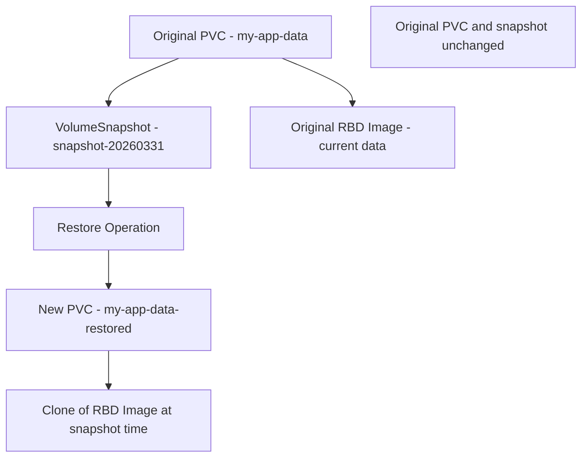

# How to Restore a PVC from a Ceph Snapshot in Rook

Author: [nawazdhandala](https://www.github.com/nawazdhandala)

Tags: Rook, Ceph, Kubernetes, Snapshot, Restore, DataRecovery

Description: Step-by-step guide to restoring a Kubernetes PersistentVolumeClaim from a Rook-Ceph VolumeSnapshot for data recovery scenarios.

---

## How PVC Restore from Snapshot Works

Restoring a PVC from a snapshot creates a new PVC pre-populated with the data from the snapshot. For RBD, the CSI driver clones the RBD snapshot into a new image. For CephFS, it creates a new subvolume from the directory snapshot. The original PVC and snapshot remain unchanged after the restore.



## Prerequisites

Ensure the snapshot is ready before attempting restore:

```bash
kubectl get volumesnapshot -n default
```

```text
NAME                        READYTOUSE   SOURCEPVC     RESTORESIZE
myapp-snapshot-20260331     true         my-app-data   20Gi
```

`READYTOUSE` must be `true`.

## Step 1 - Create a New PVC from the Snapshot

Reference the VolumeSnapshot in the `dataSource` field of a new PVC:

```yaml
apiVersion: v1
kind: PersistentVolumeClaim
metadata:
  name: my-app-data-restored
  namespace: default
spec:
  accessModes:
    - ReadWriteOnce
  resources:
    requests:
      # Must be >= the snapshot's restoreSize
      storage: 20Gi
  storageClassName: rook-ceph-block
  dataSource:
    name: myapp-snapshot-20260331
    kind: VolumeSnapshot
    apiGroup: snapshot.storage.k8s.io
```

```bash
kubectl apply -f restore-pvc.yaml
kubectl get pvc my-app-data-restored -w
```

The PVC binds when the CSI driver finishes cloning the snapshot:

```text
NAME                     STATUS   VOLUME       CAPACITY   ACCESS MODES   STORAGECLASS       AGE
my-app-data-restored     Bound    pvc-new-xx   20Gi       RWO            rook-ceph-block    15s
```

## Step 2 - Verify the Restored Data

Mount the restored PVC in a verification pod to inspect its contents:

```yaml
apiVersion: v1
kind: Pod
metadata:
  name: restore-verify
  namespace: default
spec:
  containers:
    - name: verify
      image: busybox
      command: ["/bin/sh", "-c", "ls -la /data && du -sh /data && sleep 3600"]
      volumeMounts:
        - name: restored-data
          mountPath: /data
  volumes:
    - name: restored-data
      persistentVolumeClaim:
        claimName: my-app-data-restored
  restartPolicy: Never
```

```bash
kubectl apply -f verify-pod.yaml
kubectl logs restore-verify
```

## Step 3 - Switch Application to Restored PVC

### Option A: Direct Deployment Update

Update the application Deployment to use the restored PVC:

```yaml
apiVersion: apps/v1
kind: Deployment
metadata:
  name: my-app
spec:
  template:
    spec:
      volumes:
        - name: data
          persistentVolumeClaim:
            # Point to restored PVC
            claimName: my-app-data-restored
```

```bash
kubectl apply -f updated-deployment.yaml
kubectl rollout status deployment/my-app
```

### Option B: Rename by Swapping PVCs

If you need to restore to the original PVC name (e.g., for StatefulSets), do a controlled swap:

```bash
# 1. Scale down the application
kubectl scale deployment my-app --replicas=0

# 2. Wait for pods to terminate
kubectl wait --for=delete pods -l app=my-app --timeout=60s

# 3. Verify data in the restored PVC (using verify-pod from above)

# 4. Delete the original (corrupted/lost) PVC
kubectl delete pvc my-app-data

# 5. Create a new PVC with the original name, sourced from the restored PVC
kubectl apply -f - <<'EOF'
apiVersion: v1
kind: PersistentVolumeClaim
metadata:
  name: my-app-data
spec:
  accessModes:
    - ReadWriteOnce
  resources:
    requests:
      storage: 20Gi
  storageClassName: rook-ceph-block
  dataSource:
    name: myapp-snapshot-20260331
    kind: VolumeSnapshot
    apiGroup: snapshot.storage.k8s.io
EOF

# 6. Wait for new PVC to bind
kubectl get pvc my-app-data -w

# 7. Scale the application back up
kubectl scale deployment my-app --replicas=1
```

## Cross-Namespace Restore

To restore a snapshot from one namespace into another, use a VolumeSnapshotContent (cluster-scoped):

```yaml
# First, reference the VolumeSnapshotContent directly
apiVersion: snapshot.storage.k8s.io/v1
kind: VolumeSnapshot
metadata:
  name: snapshot-from-another-ns
  namespace: target-namespace
spec:
  volumeSnapshotClassName: csi-rbdplugin-snapclass
  source:
    # Reference the cluster-scoped VolumeSnapshotContent
    volumeSnapshotContentName: snapcontent-xxxx-xxxx-xxxx
```

## Monitoring Restore Progress

Large restores take time as Ceph flattens the snapshot into a new image. Monitor restore progress:

```bash
# Check if the PVC is binding
kubectl describe pvc my-app-data-restored | grep -A 5 Events

# Check CSI provisioner logs for restore activity
kubectl -n rook-ceph logs deployment/csi-rbdplugin-provisioner \
  -c csi-provisioner --tail=50 | grep -i restore
```

## Summary

Restoring a PVC from a Rook-Ceph snapshot involves creating a new PVC with `dataSource.kind: VolumeSnapshot` pointing to the ready snapshot. The CSI driver clones the snapshot into a new RBD image or CephFS subvolume automatically. Verify the restored data before switching your application to use the new PVC. For in-place restore (keeping the original PVC name), scale down the application, delete the original PVC, create a new one with the same name from the snapshot, then scale back up. Restore operations are bounded by Ceph's copy-on-write clone performance, which is fast for recent snapshots with few changed blocks.
