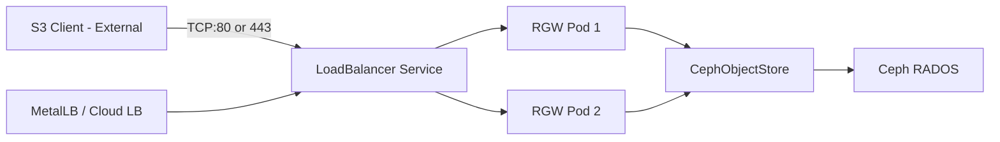

# How to Configure Load Balancer Service for RGW in Rook

Author: [nawazdhandala](https://www.github.com/nawazdhandala)

Tags: Rook, Ceph, Kubernetes, RGW, LoadBalancer, ObjectStore, Networking

Description: Learn how to expose the Rook RGW S3 endpoint via a Kubernetes LoadBalancer service using service annotations for cloud and bare-metal deployments.

---

For direct external access to RGW without an Ingress controller, configure a `LoadBalancer` type service in the `CephObjectStore` spec. This is common on cloud Kubernetes and bare-metal setups using MetalLB.

## LoadBalancer Architecture



## CephObjectStore with LoadBalancer Service

```yaml
apiVersion: ceph.rook.io/v1
kind: CephObjectStore
metadata:
  name: my-store
  namespace: rook-ceph
spec:
  metadataPool:
    failureDomain: host
    replicated:
      size: 3
  dataPool:
    failureDomain: host
    replicated:
      size: 3
  preservePoolsOnDelete: true
  gateway:
    port: 80
    instances: 2
    resources:
      requests:
        cpu: "1"
        memory: "1Gi"
      limits:
        cpu: "4"
        memory: "4Gi"
    # Service type for the RGW service
    externalRgwEndpoints:
      - ip: ""   # leave blank -- will be assigned by LB
    service:
      annotations:
        # MetalLB annotation for bare-metal
        metallb.universe.tf/address-pool: rgw-pool
```

## Explicit Service Annotations

Different cloud providers use different annotations:

```yaml
# AWS NLB
service:
  annotations:
    service.beta.kubernetes.io/aws-load-balancer-type: nlb
    service.beta.kubernetes.io/aws-load-balancer-scheme: internet-facing

# GCP
service:
  annotations:
    networking.gke.io/load-balancer-type: External

# MetalLB bare-metal with specific IP
service:
  annotations:
    metallb.universe.tf/address-pool: rgw-pool
    metallb.universe.tf/loadBalancerIPs: "192.168.1.100"

# Azure
service:
  annotations:
    service.beta.kubernetes.io/azure-load-balancer-internal: "false"
```

## Get the Assigned External IP

```bash
# Wait for the LoadBalancer IP
kubectl get svc -n rook-ceph -l app=rook-ceph-rgw -w

# Example output:
# rook-ceph-rgw-my-store  LoadBalancer  10.96.100.5  192.168.1.100  80:30080/TCP
```

## Configure External DNS (Optional)

Use ExternalDNS to automatically create DNS records:

```yaml
apiVersion: ceph.rook.io/v1
kind: CephObjectStore
metadata:
  name: my-store
  namespace: rook-ceph
spec:
  # ...
  gateway:
    port: 80
    instances: 2
    service:
      annotations:
        external-dns.alpha.kubernetes.io/hostname: s3.example.com
```

## Test the LoadBalancer Endpoint

```bash
LB_IP=$(kubectl get svc -n rook-ceph rook-ceph-rgw-my-store \
  -o jsonpath='{.status.loadBalancer.ingress[0].ip}')

echo "RGW endpoint: http://$LB_IP"

# Test with curl
curl -v "http://$LB_IP/"

# Configure AWS CLI
aws configure set default.s3.endpoint_url "http://$LB_IP"
aws s3 ls --endpoint-url "http://$LB_IP"
```

## MetalLB IPAddressPool for RGW

```yaml
# Define an address pool specifically for RGW
apiVersion: metallb.io/v1beta1
kind: IPAddressPool
metadata:
  name: rgw-pool
  namespace: metallb-system
spec:
  addresses:
    - 192.168.1.100-192.168.1.110
---
apiVersion: metallb.io/v1beta1
kind: L2Advertisement
metadata:
  name: rgw-l2
  namespace: metallb-system
spec:
  ipAddressPools:
    - rgw-pool
```

## RGW with TLS on LoadBalancer

If RGW itself terminates TLS (not an Ingress):

```yaml
gateway:
  securePort: 443
  instances: 2
  sslCertificateRef: rgw-tls-cert
  service:
    annotations:
      metallb.universe.tf/address-pool: rgw-pool
```

```bash
# Test HTTPS directly
curl -v --cacert /path/to/ca.crt "https://$LB_IP:443/"
```

## Summary

Configure a LoadBalancer service for Rook RGW by setting service annotations in the `CephObjectStore` `gateway.service.annotations` field. For bare-metal clusters, use MetalLB with a dedicated IPAddressPool. For cloud clusters, use the provider-specific load balancer annotations. The assigned external IP becomes the S3 endpoint for all clients outside the cluster.
