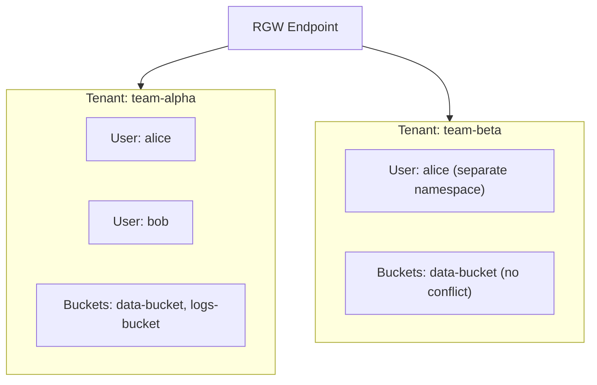

# How to Configure Ceph RGW Multi-Tenancy in Rook

Author: [nawazdhandala](https://www.github.com/nawazdhandala)

Tags: Rook, Ceph, Kubernetes, S3, Object Storage, Multi-Tenancy, RGW

Description: Configure Ceph RadosGW multi-tenancy in Rook-Ceph to isolate S3 buckets and users between tenants with independent namespaces and access controls.

---

## How RGW Multi-Tenancy Works

Ceph RGW supports multi-tenancy by organizing users into tenants (also called tenant namespaces). Each tenant has its own namespace for users and buckets, preventing naming conflicts between different teams or customers. Bucket names are globally unique within a tenant, and access from one tenant cannot reach another tenant's buckets without explicit grants.



## Prerequisites

- A running `CephObjectStore` deployed via Rook
- `rook-ceph-tools` pod available
- AWS CLI or S3 client configured for the RGW endpoint

## Step 1 - Create a Tenant and User

In RGW, tenants are created implicitly when you create a user with a `--tenant` flag.

Create a user in the `team-alpha` tenant:

```bash
kubectl -n rook-ceph exec -it deploy/rook-ceph-tools -- \
  radosgw-admin user create \
  --tenant=team-alpha \
  --uid=alice \
  --display-name="Alice (Team Alpha)" \
  --access-key=alpha-alice-key \
  --secret-key=alpha-alice-secret
```

Create another user in the `team-beta` tenant with the same UID (no conflict):

```bash
kubectl -n rook-ceph exec -it deploy/rook-ceph-tools -- \
  radosgw-admin user create \
  --tenant=team-beta \
  --uid=alice \
  --display-name="Alice (Team Beta)" \
  --access-key=beta-alice-key \
  --secret-key=beta-alice-secret
```

## Step 2 - List Tenants and Users

List all users across all tenants:

```bash
kubectl -n rook-ceph exec -it deploy/rook-ceph-tools -- \
  radosgw-admin user list
```

Tenanted users appear as `<tenant>$<uid>` in the output, for example `team-alpha$alice`.

Get info for a specific tenanted user:

```bash
kubectl -n rook-ceph exec -it deploy/rook-ceph-tools -- \
  radosgw-admin user info --tenant=team-alpha --uid=alice
```

## Step 3 - Create Buckets Within a Tenant

With the AWS CLI, specify the tenanted user credentials. The bucket name is scoped within the tenant:

```bash
AWS_ACCESS_KEY_ID=alpha-alice-key \
AWS_SECRET_ACCESS_KEY=alpha-alice-secret \
aws s3api create-bucket \
  --bucket team-data \
  --endpoint-url http://<rgw-endpoint> \
  --no-sign-request
```

When accessed with `team-beta` credentials, `team-data` is a different bucket entirely (in the beta namespace).

## Step 4 - Manage Tenant Quotas

Set a bucket quota for a tenanted user:

```bash
kubectl -n rook-ceph exec -it deploy/rook-ceph-tools -- \
  radosgw-admin quota set \
  --tenant=team-alpha \
  --uid=alice \
  --quota-scope=user \
  --max-size=50G \
  --max-objects=1000000
```

Enable the quota:

```bash
kubectl -n rook-ceph exec -it deploy/rook-ceph-tools -- \
  radosgw-admin quota enable \
  --tenant=team-alpha \
  --uid=alice \
  --quota-scope=user
```

Set a bucket-level quota for the tenant:

```bash
kubectl -n rook-ceph exec -it deploy/rook-ceph-tools -- \
  radosgw-admin quota set \
  --tenant=team-alpha \
  --uid=alice \
  --quota-scope=bucket \
  --max-size=10G
```

## Step 5 - Create Subusers for Delegated Access

A subuser allows delegating limited access within a tenant. Create a subuser with read-only access:

```bash
kubectl -n rook-ceph exec -it deploy/rook-ceph-tools -- \
  radosgw-admin subuser create \
  --tenant=team-alpha \
  --uid=alice \
  --subuser=alice:reader \
  --access=read
```

Generate a key for the subuser:

```bash
kubectl -n rook-ceph exec -it deploy/rook-ceph-tools -- \
  radosgw-admin key create \
  --tenant=team-alpha \
  --uid=alice \
  --subuser=alice:reader \
  --key-type=s3
```

## Step 6 - Configure Tenant-Aware ObjectBucketClaims

When using OBCs with Rook, configure the StorageClass to scope bucket provisioning within a tenant by setting the `objectStoreUser` parameter, or by creating per-tenant StorageClasses:

```yaml
apiVersion: storage.k8s.io/v1
kind: StorageClass
metadata:
  name: rook-ceph-bucket-alpha
provisioner: rook-ceph.ceph.rook.io/bucket
reclaimPolicy: Delete
parameters:
  objectStoreName: my-store
  objectStoreNamespace: rook-ceph
  region: us-east-1
```

## Step 7 - Bucket Sharing Across Tenants

To grant cross-tenant access, use bucket ACLs or bucket policies. Grant read access to a user in another tenant:

```bash
kubectl -n rook-ceph exec -it deploy/rook-ceph-tools -- \
  radosgw-admin bucket link \
  --bucket=team-data \
  --tenant=team-alpha \
  --uid=team-beta\$alice \
  --bucket-id=<bucket-id>
```

Or use an S3 bucket policy (applied via the S3 API):

```bash
cat > bucket-policy.json << 'EOF'
{
  "Version": "2012-10-17",
  "Statement": [
    {
      "Effect": "Allow",
      "Principal": {
        "AWS": "arn:aws:iam::team-beta:root"
      },
      "Action": ["s3:GetObject"],
      "Resource": ["arn:aws:s3:::team-data/*"]
    }
  ]
}
EOF

aws s3api put-bucket-policy \
  --bucket team-data \
  --policy file://bucket-policy.json \
  --endpoint-url http://<rgw-endpoint> \
  --profile rook-alpha
```

## Checking Tenant Usage

View storage usage per tenant:

```bash
kubectl -n rook-ceph exec -it deploy/rook-ceph-tools -- \
  radosgw-admin usage show --tenant=team-alpha
```

List all buckets in a tenant:

```bash
kubectl -n rook-ceph exec -it deploy/rook-ceph-tools -- \
  radosgw-admin bucket list --tenant=team-alpha
```

## Summary

Ceph RGW multi-tenancy in Rook isolates users and buckets into tenant namespaces using the `--tenant` flag in `radosgw-admin`. Users in different tenants can have identical UIDs without conflict, and bucket names are scoped within each tenant. Quotas, subusers, and cross-tenant bucket policies allow fine-grained access control. This enables a single Rook-Ceph object store to serve multiple teams or customers with strong isolation.
