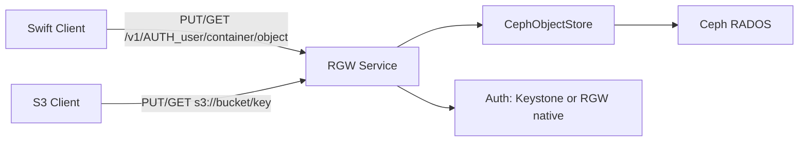

# How to Configure RGW Swift API in Rook Object Store

Author: [nawazdhandala](https://www.github.com/nawazdhandala)

Tags: Rook, Ceph, Kubernetes, RGW, Swift, ObjectStore, OpenStack

Description: Learn how to enable and use the OpenStack Swift-compatible API on Rook CephObjectStore RGW, including user creation, URL format, and client usage.

---

Ceph RGW supports the OpenStack Swift object storage API alongside S3. This enables legacy OpenStack workloads and Swift clients to use a Rook-managed object store without migration.

## Swift API Architecture



## CephObjectStore with Swift Enabled

No special CRD field is needed -- Swift is enabled by default on all RGW instances. Configure the object store normally:

```yaml
apiVersion: ceph.rook.io/v1
kind: CephObjectStore
metadata:
  name: my-store
  namespace: rook-ceph
spec:
  metadataPool:
    failureDomain: host
    replicated:
      size: 3
  dataPool:
    failureDomain: host
    replicated:
      size: 3
  preservePoolsOnDelete: true
  gateway:
    port: 80
    instances: 2
    resources:
      requests:
        cpu: "500m"
        memory: "1Gi"
      limits:
        cpu: "2"
        memory: "2Gi"
```

## Create a Swift-Enabled User

RGW users access Swift via a subuser with a secret key:

```bash
# Create the base RGW user
kubectl exec -n rook-ceph deploy/rook-ceph-tools -- \
  radosgw-admin user create \
    --uid=swiftuser \
    --display-name="Swift User" \
    --email=swift@example.com

# Create a Swift subuser
kubectl exec -n rook-ceph deploy/rook-ceph-tools -- \
  radosgw-admin subuser create \
    --uid=swiftuser \
    --subuser=swiftuser:swift \
    --access=full

# Generate a Swift secret key
kubectl exec -n rook-ceph deploy/rook-ceph-tools -- \
  radosgw-admin key create \
    --subuser=swiftuser:swift \
    --key-type=swift \
    --gen-secret

# Display user info including Swift key
kubectl exec -n rook-ceph deploy/rook-ceph-tools -- \
  radosgw-admin user info --uid=swiftuser
```

## Get the RGW Service Endpoint

```bash
kubectl get svc -n rook-ceph | grep rgw
# Example: rook-ceph-rgw-my-store  ClusterIP  10.96.100.5  80/TCP
```

## Swift URL Format

```
http://<rgw-endpoint>/swift/v1/AUTH_<username>/<container>/<object>
```

Example:

```bash
SWIFT_ENDPOINT="http://rook-ceph-rgw-my-store.rook-ceph.svc:80/swift/v1"
SWIFT_USER="swiftuser:swift"
SWIFT_KEY="<your-secret-key>"
```

## Using the Swift CLI (python-swiftclient)

```bash
# Install python-swiftclient
pip install python-swiftclient

# List containers
swift \
  --auth-version 1 \
  --auth "$SWIFT_ENDPOINT/auth/v1" \
  --user "$SWIFT_USER" \
  --key "$SWIFT_KEY" \
  list

# Create a container
swift \
  --auth-version 1 \
  --auth "$SWIFT_ENDPOINT/auth/v1" \
  --user "$SWIFT_USER" \
  --key "$SWIFT_KEY" \
  post my-container

# Upload an object
swift \
  --auth-version 1 \
  --auth "$SWIFT_ENDPOINT/auth/v1" \
  --user "$SWIFT_USER" \
  --key "$SWIFT_KEY" \
  upload my-container /path/to/file.txt

# Download an object
swift \
  --auth-version 1 \
  --auth "$SWIFT_ENDPOINT/auth/v1" \
  --user "$SWIFT_USER" \
  --key "$SWIFT_KEY" \
  download my-container file.txt
```

## Using curl with Swift API

```bash
# Authenticate and get token
curl -i \
  -H "X-Auth-User: swiftuser:swift" \
  -H "X-Auth-Key: $SWIFT_KEY" \
  http://rook-ceph-rgw-my-store.rook-ceph.svc:80/auth/v1

# The response headers contain X-Auth-Token and X-Storage-Url
AUTH_TOKEN="<token-from-response>"
STORAGE_URL="<url-from-response>"

# List containers
curl -i \
  -H "X-Auth-Token: $AUTH_TOKEN" \
  "$STORAGE_URL"

# Create container
curl -i -X PUT \
  -H "X-Auth-Token: $AUTH_TOKEN" \
  "$STORAGE_URL/my-container"

# Upload object
curl -i -X PUT \
  -H "X-Auth-Token: $AUTH_TOKEN" \
  -T /path/to/file.txt \
  "$STORAGE_URL/my-container/file.txt"
```

## Enabling Keystone Auth (Optional)

For OpenStack Keystone integration, add to the RGW config:

```bash
kubectl exec -n rook-ceph deploy/rook-ceph-tools -- \
  ceph config set client.rgw.my-store.a rgw_keystone_url http://keystone.openstack.svc:5000

kubectl exec -n rook-ceph deploy/rook-ceph-tools -- \
  ceph config set client.rgw.my-store.a rgw_keystone_api_version 3

kubectl exec -n rook-ceph deploy/rook-ceph-tools -- \
  ceph config set client.rgw.my-store.a rgw_keystone_accepted_roles "member,admin"
```

## Summary

RGW's Swift API is active by default on every Rook `CephObjectStore`. Create a Swift-capable user with a subuser and Swift key type, then point any Swift client to the RGW service endpoint using the v1 auth URL. This makes Rook a drop-in replacement for legacy OpenStack Swift deployments without any code changes in client applications.
