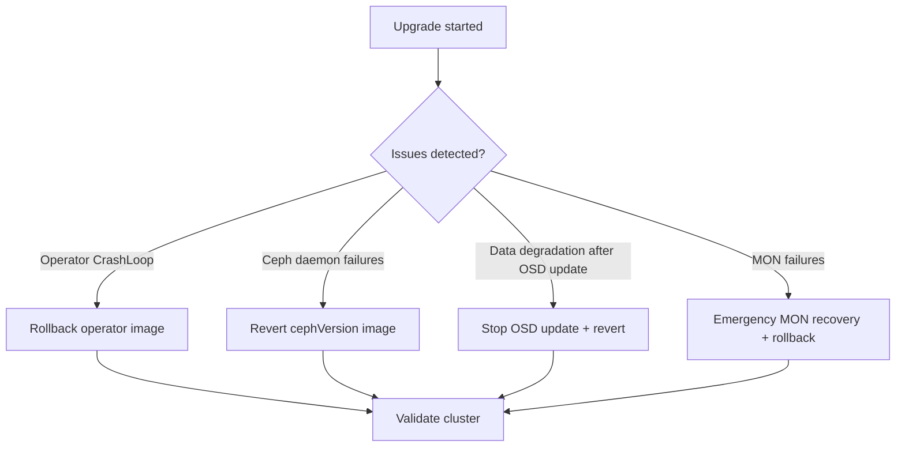

# How to Roll Back a Failed Rook-Ceph Upgrade

Author: [nawazdhandala](https://www.github.com/nawazdhandala)

Tags: Rook, Ceph, Kubernetes, Upgrade, Rollback, Recovery, Operator

Description: Learn how to roll back a failed Rook operator or Ceph version upgrade, covering Helm rollback, image reversion, and cluster recovery procedures.

---

If a Rook-Ceph upgrade results in daemon failures, cluster degradation, or operator errors, rolling back requires reverting both the operator image and the Ceph daemon image. The rollback sequence mirrors the upgrade sequence in reverse.

## When to Roll Back



## Pre-Rollback: Assess the Damage

```bash
# Check operator status
kubectl get deployment rook-ceph-operator -n rook-ceph
kubectl logs -n rook-ceph deploy/rook-ceph-operator --tail=100

# Check Ceph cluster health
kubectl exec -n rook-ceph deploy/rook-ceph-tools -- ceph status 2>/dev/null || echo "Toolbox unreachable"

# Check which daemons have been updated
kubectl exec -n rook-ceph deploy/rook-ceph-tools -- ceph versions 2>/dev/null

# Check daemon pod images
kubectl get pods -n rook-ceph -o jsonpath='{range .items[*]}{.metadata.name}{"\t"}{.spec.containers[0].image}{"\n"}{end}' | grep -E "osd|mon|mds|rgw|mgr"
```

## Option 1: Helm Rollback (Operator)

```bash
# View helm history
helm history rook-ceph -n rook-ceph

# Roll back to previous revision
helm rollback rook-ceph <previous-revision> -n rook-ceph

# Watch rollback
kubectl rollout status deployment rook-ceph-operator -n rook-ceph

# Verify operator version
kubectl get deployment rook-ceph-operator -n rook-ceph \
  -o jsonpath='{.spec.template.spec.containers[0].image}'
```

## Option 2: Manual Operator Image Revert

```bash
# Get the previous operator image tag
PREV_IMAGE="rook/ceph:v1.13.9"

kubectl set image deployment rook-ceph-operator \
  rook-ceph-operator=$PREV_IMAGE \
  -n rook-ceph

kubectl rollout status deployment rook-ceph-operator -n rook-ceph
```

## Revert Ceph Daemon Version

Patch the CephCluster to point back to the previous Ceph image:

```yaml
apiVersion: ceph.rook.io/v1
kind: CephCluster
metadata:
  name: rook-ceph
  namespace: rook-ceph
spec:
  cephVersion:
    image: quay.io/ceph/ceph:v18.2.2   # Previous working version
    allowUnsupported: false
```

```bash
kubectl apply -f cephcluster.yaml

# Monitor rolling revert of daemons
kubectl get pods -n rook-ceph -w
```

## Stop an In-Progress OSD Rolling Update

If OSD upgrades have started but are causing failures, pause the update by patching the CephCluster:

```bash
# Pause the operator reconciliation temporarily
kubectl annotate cephcluster rook-ceph -n rook-ceph \
  rook.io/do-not-reconcile=true

# Revert Ceph version image
kubectl patch cephcluster rook-ceph -n rook-ceph \
  --type merge \
  -p '{"spec":{"cephVersion":{"image":"quay.io/ceph/ceph:v18.2.2"}}}'

# Resume reconciliation
kubectl annotate cephcluster rook-ceph -n rook-ceph \
  rook.io/do-not-reconcile-

# Operator will now downgrade in-progress daemons
```

## Rollback a Specific Daemon Deployment

For fine-grained control, roll back a single daemon deployment:

```bash
# Check rollout history
kubectl rollout history deployment rook-ceph-mgr-a -n rook-ceph

# Roll back to previous revision
kubectl rollout undo deployment rook-ceph-mgr-a -n rook-ceph

# For OSD (replace with actual deployment name)
kubectl rollout undo deployment rook-ceph-osd-3 -n rook-ceph
```

## Verify Cluster After Rollback

```bash
# Check daemon versions are consistent
kubectl exec -n rook-ceph deploy/rook-ceph-tools -- ceph versions

# Check cluster health
kubectl exec -n rook-ceph deploy/rook-ceph-tools -- ceph status
kubectl exec -n rook-ceph deploy/rook-ceph-tools -- ceph health detail

# Verify all OSDs are up
kubectl exec -n rook-ceph deploy/rook-ceph-tools -- ceph osd stat

# Verify PVCs are accessible
kubectl get pvc --all-namespaces | grep Bound
```

## Ceph Version Downgrade Limitations

Ceph supports downgrading within a minor version (e.g., 18.2.4 -> 18.2.2) but not across major versions (e.g., 18.x -> 17.x). Check the Ceph docs for the specific version's downgrade support:

```bash
# Check if downgrade is supported
kubectl exec -n rook-ceph deploy/rook-ceph-tools -- \
  ceph tell mon.* version
```

## Post-Rollback: Investigate Root Cause

```bash
# Review operator logs from the failed upgrade attempt
kubectl logs -n rook-ceph deploy/rook-ceph-operator --tail=200 > operator-logs.txt

# Check Ceph log for daemon errors
kubectl exec -n rook-ceph deploy/rook-ceph-tools -- \
  ceph log last 100

# Review CephCluster conditions
kubectl describe cephcluster rook-ceph -n rook-ceph | grep -A20 Conditions
```

## Summary

Rolling back a failed Rook-Ceph upgrade involves reverting the operator image (via Helm rollback or `kubectl set image`) and patching the `CephCluster` CRD to the previous Ceph version image. If an OSD rolling update is in progress, annotate the CephCluster to pause reconciliation before reverting. Always verify daemon version consistency with `ceph versions` and cluster health with `ceph status` after the rollback completes.
