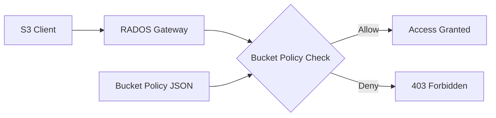

# How to Create Bucket Policies in Rook-Ceph Object Store

Author: [nawazdhandala](https://www.github.com/nawazdhandala)

Tags: Rook, Ceph, Kubernetes, S3, BucketPolicy, ObjectStorage

Description: Create and apply S3-compatible bucket policies in Rook-Ceph object store to control access permissions for users, applications, and public access.

---

Rook-Ceph's RADOS Gateway (RGW) implements S3-compatible bucket policies, allowing you to define fine-grained access control using IAM-style JSON policy documents. Bucket policies are applied per-bucket and can grant or deny access to specific users, prefixes, or actions.

## Bucket Policy Architecture



## Prerequisites

- CephObjectStore deployed and RGW running
- Object store users created
- AWS CLI or s3cmd configured

## Configure AWS CLI for RGW

```bash
# Export RGW endpoint
export RGW_ENDPOINT=$(kubectl get svc -n rook-ceph rook-ceph-rgw-my-store -o jsonpath='{.status.loadBalancer.ingress[0].hostname}')

# Configure AWS CLI with RGW credentials
aws configure set aws_access_key_id <access-key>
aws configure set aws_secret_access_key <secret-key>
aws configure set default.region us-east-1

# Test connection
aws s3 ls --endpoint-url http://${RGW_ENDPOINT}
```

## Allow Read Access to a Specific User

Grant a second user read-only access to a bucket owned by another user:

```json
{
  "Version": "2012-10-17",
  "Statement": [
    {
      "Effect": "Allow",
      "Principal": {
        "AWS": "arn:aws:iam:::user/reader-user"
      },
      "Action": [
        "s3:GetObject",
        "s3:ListBucket"
      ],
      "Resource": [
        "arn:aws:s3:::my-bucket",
        "arn:aws:s3:::my-bucket/*"
      ]
    }
  ]
}
```

Apply the policy:

```bash
aws s3api put-bucket-policy \
  --bucket my-bucket \
  --policy file://bucket-policy.json \
  --endpoint-url http://${RGW_ENDPOINT}
```

## Restrict Access by IP Prefix

```json
{
  "Version": "2012-10-17",
  "Statement": [
    {
      "Effect": "Deny",
      "Principal": "*",
      "Action": "s3:*",
      "Resource": [
        "arn:aws:s3:::secure-bucket",
        "arn:aws:s3:::secure-bucket/*"
      ],
      "Condition": {
        "NotIpAddress": {
          "aws:SourceIp": [
            "10.0.0.0/8",
            "192.168.0.0/16"
          ]
        }
      }
    }
  ]
}
```

## Grant Cross-User Write Access

Allow a service account to write to a bucket owned by another user:

```json
{
  "Version": "2012-10-17",
  "Statement": [
    {
      "Effect": "Allow",
      "Principal": {
        "AWS": "arn:aws:iam:::user/backup-service"
      },
      "Action": [
        "s3:PutObject",
        "s3:DeleteObject",
        "s3:GetObject",
        "s3:ListBucket"
      ],
      "Resource": [
        "arn:aws:s3:::backup-bucket",
        "arn:aws:s3:::backup-bucket/*"
      ]
    }
  ]
}
```

## Restrict to a Specific Path Prefix

Grant access only to objects under a specific prefix:

```json
{
  "Version": "2012-10-17",
  "Statement": [
    {
      "Effect": "Allow",
      "Principal": {
        "AWS": "arn:aws:iam:::user/app-user"
      },
      "Action": [
        "s3:GetObject",
        "s3:PutObject"
      ],
      "Resource": "arn:aws:s3:::shared-bucket/app-data/*"
    }
  ]
}
```

## Read the Current Policy

```bash
aws s3api get-bucket-policy \
  --bucket my-bucket \
  --endpoint-url http://${RGW_ENDPOINT} \
  --output text | python3 -m json.tool
```

## Delete a Bucket Policy

```bash
aws s3api delete-bucket-policy \
  --bucket my-bucket \
  --endpoint-url http://${RGW_ENDPOINT}
```

## Apply Policies via Kubernetes Job

For GitOps-style management, apply policies using a Kubernetes Job:

```yaml
apiVersion: batch/v1
kind: Job
metadata:
  name: apply-bucket-policy
  namespace: default
spec:
  template:
    spec:
      restartPolicy: OnFailure
      containers:
        - name: aws-cli
          image: amazon/aws-cli:latest
          command:
            - sh
            - -c
            - |
              aws s3api put-bucket-policy \
                --bucket my-bucket \
                --policy '{"Version":"2012-10-17","Statement":[{"Effect":"Allow","Principal":{"AWS":"arn:aws:iam:::user/reader"},"Action":["s3:GetObject","s3:ListBucket"],"Resource":["arn:aws:s3:::my-bucket","arn:aws:s3:::my-bucket/*"]}]}' \
                --endpoint-url http://rook-ceph-rgw-my-store.rook-ceph.svc
          env:
            - name: AWS_ACCESS_KEY_ID
              valueFrom:
                secretKeyRef:
                  name: rook-ceph-object-user-my-store-admin
                  key: AccessKey
            - name: AWS_SECRET_ACCESS_KEY
              valueFrom:
                secretKeyRef:
                  name: rook-ceph-object-user-my-store-admin
                  key: SecretKey
            - name: AWS_DEFAULT_REGION
              value: us-east-1
```

## Summary

Rook-Ceph RGW supports S3-compatible bucket policies for fine-grained access control. Use JSON policy documents with `Principal`, `Action`, `Resource`, and optional `Condition` fields to grant or restrict access per user, per prefix, or by IP range. Manage policies with the AWS CLI pointed at the RGW endpoint, or automate application via Kubernetes Jobs for GitOps workflows.
