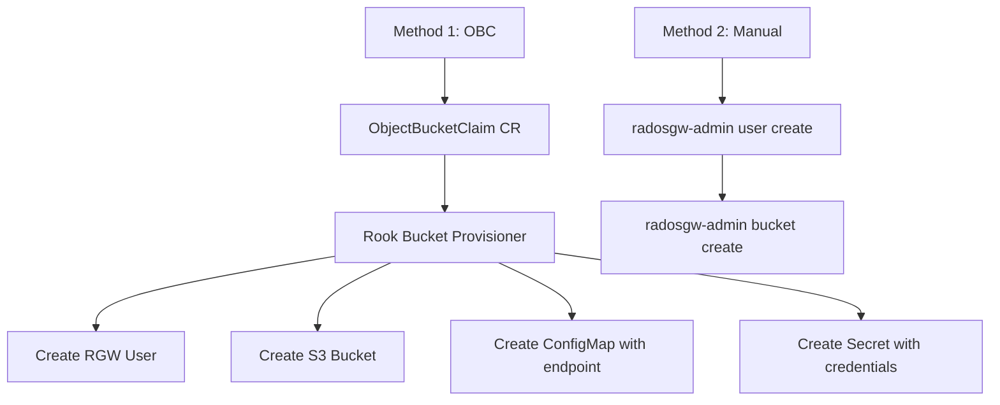

# How to Create an S3-Compatible Bucket in Rook-Ceph

Author: [nawazdhandala](https://www.github.com/nawazdhandala)

Tags: Rook, Ceph, Kubernetes, S3, Bucket, ObjectStorage, OBC

Description: Learn how to create S3-compatible buckets in Rook-Ceph using ObjectBucketClaims and the radosgw-admin CLI for both dynamic and manual provisioning.

---

## Two Ways to Create Buckets in Rook-Ceph

Rook-Ceph supports two methods for creating S3 buckets: ObjectBucketClaim (OBC), which is the Kubernetes-native approach using the lib-bucket-provisioner API, and manual creation using `radosgw-admin` from the toolbox. OBCs are preferred for application workloads because they automatically create the bucket, user credentials, and a ConfigMap with the endpoint information.



## Method 1 - ObjectBucketClaim (Kubernetes Native)

### Create a StorageClass for Bucket Provisioning

First, create a StorageClass that the bucket provisioner uses:

```yaml
apiVersion: storage.k8s.io/v1
kind: StorageClass
metadata:
  name: rook-ceph-bucket
provisioner: rook-ceph.ceph.rook.io/bucket
reclaimPolicy: Delete
parameters:
  objectStoreName: my-store
  objectStoreNamespace: rook-ceph
```

### Create an ObjectBucketClaim

Create a bucket by defining an ObjectBucketClaim:

```yaml
apiVersion: objectbucket.io/v1alpha1
kind: ObjectBucketClaim
metadata:
  name: my-bucket-claim
  namespace: default
spec:
  bucketName: my-application-bucket
  storageClassName: rook-ceph-bucket
  additionalConfig:
    # Optional: set maximum bucket size in bytes
    maxSize: "5368709120"
    # Optional: maximum number of objects
    maxObjects: "1000"
```

```bash
kubectl apply -f obc.yaml
kubectl get obc my-bucket-claim -w
```

### Access the Auto-Created Credentials

After the OBC is bound, Rook creates a ConfigMap and Secret with the same name as the OBC in the same namespace:

```bash
# Get the bucket endpoint information
kubectl get configmap my-bucket-claim -o yaml

# Get the access credentials
kubectl get secret my-bucket-claim -o yaml
```

The ConfigMap contains:

```text
BUCKET_HOST: rook-ceph-rgw-my-store-a.rook-ceph.svc.cluster.local
BUCKET_PORT: "80"
BUCKET_NAME: my-application-bucket
BUCKET_REGION: us-east-1
BUCKET_SUBREGION: ""
```

The Secret contains:

```text
AWS_ACCESS_KEY_ID: <base64-encoded>
AWS_SECRET_ACCESS_KEY: <base64-encoded>
```

### Use OBC Credentials in an Application Pod

Reference the OBC-generated ConfigMap and Secret directly in your pod:

```yaml
apiVersion: apps/v1
kind: Deployment
metadata:
  name: s3-app
spec:
  replicas: 1
  selector:
    matchLabels:
      app: s3-app
  template:
    metadata:
      labels:
        app: s3-app
    spec:
      containers:
        - name: app
          image: amazon/aws-cli
          command: ["/bin/sh", "-c", "sleep 3600"]
          envFrom:
            - configMapRef:
                name: my-bucket-claim
            - secretRef:
                name: my-bucket-claim
          env:
            - name: AWS_DEFAULT_REGION
              value: us-east-1
```

```bash
kubectl apply -f deployment.yaml

# Test bucket access
kubectl exec deploy/s3-app -- aws \
  --endpoint-url http://$(kubectl get cm my-bucket-claim -o jsonpath='{.data.BUCKET_HOST}') \
  s3 ls
```

## Method 2 - Manual Bucket Creation with radosgw-admin

Use the toolbox to create users and buckets manually:

```bash
# Open a shell in the toolbox
kubectl -n rook-ceph exec -it deploy/rook-ceph-tools -- bash

# Create a new S3 user
radosgw-admin user create \
  --uid=myuser \
  --display-name="My Application User" \
  --email=app@example.com

# Note the access_key and secret_key from the output

# Create a bucket under the user
radosgw-admin bucket create \
  --bucket=my-manual-bucket \
  --uid=myuser

# List all buckets
radosgw-admin bucket list

# Check bucket stats
radosgw-admin bucket stats --bucket=my-manual-bucket
```

## Bucket Policies and ACLs

Apply an S3 bucket policy to restrict access. Upload the policy using the AWS CLI:

```bash
cat <<'EOF' > bucket-policy.json
{
  "Version": "2012-10-17",
  "Statement": [
    {
      "Effect": "Allow",
      "Principal": {
        "AWS": "arn:aws:iam:::user/myuser"
      },
      "Action": ["s3:GetObject", "s3:PutObject", "s3:ListBucket"],
      "Resource": [
        "arn:aws:s3:::my-manual-bucket",
        "arn:aws:s3:::my-manual-bucket/*"
      ]
    }
  ]
}
EOF

aws --endpoint-url http://rook-ceph-rgw-my-store-a.rook-ceph.svc.cluster.local \
  s3api put-bucket-policy \
  --bucket my-manual-bucket \
  --policy file://bucket-policy.json
```

## Verifying Buckets

List buckets from the toolbox:

```bash
kubectl -n rook-ceph exec deploy/rook-ceph-tools -- radosgw-admin bucket list
```

Check bucket metadata:

```bash
kubectl -n rook-ceph exec deploy/rook-ceph-tools -- \
  radosgw-admin bucket stats --bucket=my-application-bucket
```

```text
{
    "bucket": "my-application-bucket",
    "num_shards": 11,
    "tenant": "",
    "zonegroup": "xxxxx",
    "placement_rule": "default-placement",
    "usage": {
        "rgw.main": {
            "size_kb": 0,
            "num_objects": 0
        }
    }
}
```

## Summary

Rook-Ceph provides two bucket creation methods: ObjectBucketClaims for Kubernetes-native provisioning where credentials and endpoint info are automatically injected as ConfigMaps and Secrets, and manual `radosgw-admin` commands for direct management. OBCs are recommended for application workloads because they integrate naturally with Kubernetes pod configurations. Always use `bucket stats` to monitor storage consumption and `bucket list` to audit existing buckets from the toolbox.
