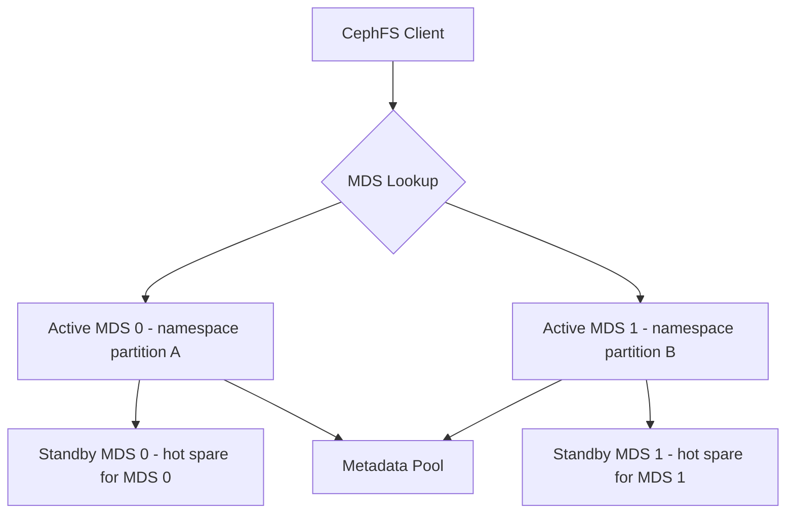

# How to Scale a CephFilesystem MDS Deployment in Rook

Author: [nawazdhandala](https://www.github.com/nawazdhandala)

Tags: Rook, Ceph, Kubernetes, CephFS, MDS, Scaling

Description: Learn how to scale Ceph Metadata Server (MDS) deployments in Rook for improved CephFS performance and high availability.

---

## How MDS Scaling Works in Ceph

The Metadata Server (MDS) handles CephFS filesystem namespace operations: directory listings, file attribute lookups, and access control. For most workloads, one active MDS is sufficient. For metadata-intensive workloads (millions of small files, many simultaneous directory operations), multiple active MDS daemons with namespace partitioning can improve throughput.



## Single Active MDS with Standby (Default)

The default configuration has one active MDS and one standby. This is appropriate for most workloads:

```yaml
apiVersion: ceph.rook.io/v1
kind: CephFilesystem
metadata:
  name: myfs
  namespace: rook-ceph
spec:
  metadataPool:
    replicated:
      size: 3
  dataPools:
    - name: replicated
      replicated:
        size: 3
  preservePoolsOnDelete: true
  metadataServer:
    # 1 active MDS
    activeCount: 1
    # Keep one standby ready for failover
    activeStandby: true
    resources:
      requests:
        cpu: 500m
        memory: 1Gi
      limits:
        cpu: "2"
        memory: 4Gi
```

With `activeStandby: true` and `activeCount: 1`, Rook deploys 2 MDS pods: one active and one hot standby.

## Scaling to Multiple Active MDS Daemons

Increase `activeCount` for workloads with high metadata concurrency:

```yaml
spec:
  metadataServer:
    # 2 active MDS daemons with namespace partitioning
    activeCount: 2
    activeStandby: true
```

With `activeCount: 2` and `activeStandby: true`, Rook deploys 4 MDS pods: 2 active and 2 standbys.

Apply the change:

```bash
kubectl -n rook-ceph patch cephfilesystem myfs \
  --type=merge \
  -p '{"spec":{"metadataServer":{"activeCount":2,"activeStandby":true}}}'
```

Watch new MDS pods start:

```bash
kubectl -n rook-ceph get pods -l app=rook-ceph-mds -w
```

## Verifying MDS Status After Scaling

Check MDS status from the toolbox:

```bash
kubectl -n rook-ceph exec deploy/rook-ceph-tools -- ceph fs status myfs
```

With 2 active MDS:

```text
myfs - 2 clients
====
RANK  STATE   MDS   ACTIVITY    DNS  INOS  DIRS  CAPS
   0  active  a     Reqs:    0  100   150    80     0
   1  active  b     Reqs:    0   50    75    40     0
           STANDBY
         c
         d

POOL                TYPE     USED  AVAIL
myfs-metadata       metadata  100M  280G
myfs-replicated     data      5G    280G
```

Check the MDS configuration is applied:

```bash
kubectl -n rook-ceph exec deploy/rook-ceph-tools -- ceph mds stat
```

## MDS Resource Tuning

For metadata-intensive workloads, tune MDS memory cache:

```yaml
spec:
  metadataServer:
    activeCount: 2
    activeStandby: true
    resources:
      requests:
        cpu: "1"
        memory: 4Gi
      limits:
        cpu: "4"
        memory: 8Gi
```

MDS is memory-hungry: it caches inode metadata in RAM. More memory = fewer metadata cache misses = better performance.

Set the MDS cache size via Ceph configuration:

```bash
kubectl -n rook-ceph exec deploy/rook-ceph-tools -- bash -c "
  # Set cache size to 4GB per MDS
  ceph config set mds mds_cache_memory_limit 4294967296
  # Set cache target (percentage of max to actively use)
  ceph config set mds mds_cache_trim_threshold 0.95
"
```

## MDS Placement Configuration

Spread MDS pods across nodes for high availability:

```yaml
spec:
  metadataServer:
    activeCount: 2
    activeStandby: true
    placement:
      podAntiAffinity:
        requiredDuringSchedulingIgnoredDuringExecution:
          - labelSelector:
              matchExpressions:
                - key: app
                  operator: In
                  values:
                    - rook-ceph-mds
            topologyKey: kubernetes.io/hostname
      nodeAffinity:
        requiredDuringSchedulingIgnoredDuringExecution:
          nodeSelectorTerms:
            - matchExpressions:
                - key: role
                  operator: In
                  values:
                    - storage-node
```

## Standby-Only Mode

If you do not need multiple active MDS daemons but still want failover without extra standby overhead:

```yaml
spec:
  metadataServer:
    activeCount: 1
    # false = use standby-replay daemons (lower cost than hot standby)
    activeStandby: false
```

With `activeStandby: false`, standby daemons are cold standbys that have not preloaded the MDS journal.

## Monitoring MDS Performance

Check per-MDS performance metrics:

```bash
kubectl -n rook-ceph exec deploy/rook-ceph-tools -- \
  ceph tell mds.myfs.0 perf dump | jq '.mds.request'
```

Check MDS session count:

```bash
kubectl -n rook-ceph exec deploy/rook-ceph-tools -- \
  ceph tell mds.myfs.0 session ls | jq 'length'
```

Check slow MDS requests:

```bash
kubectl -n rook-ceph exec deploy/rook-ceph-tools -- \
  ceph tell mds.myfs.0 dump_ops_in_flight
```

## Summary

Scaling CephFS MDS in Rook is controlled by `activeCount` and `activeStandby` in the CephFilesystem CR. Most workloads need `activeCount: 1` with `activeStandby: true` for HA. For metadata-heavy workloads with millions of files and concurrent directory operations, increase `activeCount` to 2 or more to enable namespace partitioning across multiple active MDS daemons. Always use `podAntiAffinity` to spread MDS pods across different nodes. Monitor performance with `ceph tell mds perf dump` and tune the MDS memory cache for your workload size.
