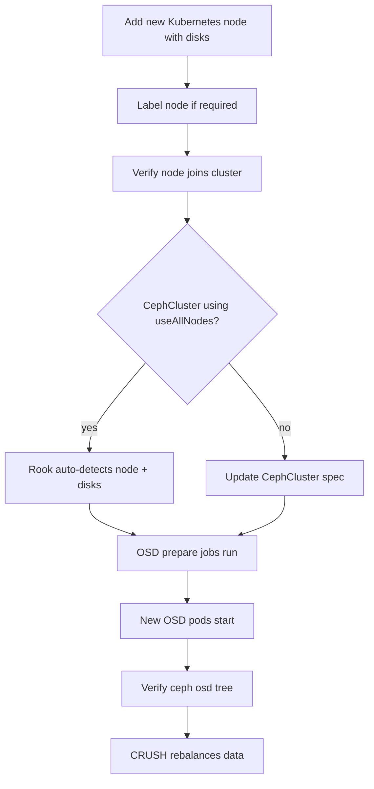

# How to Scale Out Rook-Ceph by Adding New Worker Nodes

Author: [nawazdhandala](https://www.github.com/nawazdhandala)

Tags: Rook, Ceph, Kubernetes, Node, ScaleOut, OSD, Capacity, Storage

Description: Learn how to expand Rook-Ceph storage capacity by adding new worker nodes, configuring disk selection, and verifying OSD provisioning on the new nodes.

---

Scaling out Rook-Ceph capacity means adding new Kubernetes nodes with storage disks and allowing Rook to provision OSDs on them. This adds both storage capacity and IOPS to the cluster.

## Scale-Out Flow



## Option 1: Auto-Discovery (useAllNodes: true)

If the CephCluster is configured with `useAllNodes: true`, Rook automatically detects new nodes and provisions OSDs on clean disks:

```yaml
apiVersion: ceph.rook.io/v1
kind: CephCluster
metadata:
  name: rook-ceph
  namespace: rook-ceph
spec:
  storage:
    useAllNodes: true
    useAllDevices: true
    deviceFilter: "^sd[b-z]"
```

When a new node joins the Kubernetes cluster with matching disks, the Rook operator provisions OSDs automatically.

## Option 2: Explicit Node Configuration

For controlled disk selection, add the new node explicitly to the `CephCluster` spec:

```bash
kubectl edit cephcluster rook-ceph -n rook-ceph
```

```yaml
spec:
  storage:
    useAllNodes: false
    nodes:
      # Existing nodes
      - name: worker-01
        devices:
          - name: sdb
          - name: sdc
      - name: worker-02
        devices:
          - name: sdb
          - name: sdc
      # NEW node being added
      - name: worker-04
        devices:
          - name: sdb
          - name: sdc
          - name: sdd
```

## Step 1: Prepare the New Node

```bash
# Verify the node is joined to Kubernetes
kubectl get nodes
# worker-04 should appear as Ready

# Check disk availability
kubectl debug node/worker-04 -it --image=ubuntu -- chroot /host bash
lsblk  # Confirm disks are clean and unpartitioned
```

## Step 2: Apply Node Labels (if required)

If the CephCluster uses node selectors:

```bash
kubectl label node worker-04 role=storage-node
kubectl label node worker-04 topology.kubernetes.io/zone=zone-a
```

## Step 3: Verify Disk Prerequisites

```bash
kubectl debug node/worker-04 -it --image=ubuntu -- chroot /host bash

# Disks should be raw, unformatted
lsblk -f  # No filesystem listed for target disks

# Check kernel modules
lsmod | grep -E "rbd|ceph"

# Check OS version for Ceph compatibility
uname -r
```

## Step 4: Trigger OSD Provisioning

After updating the CephCluster spec (or with auto-discovery), restart the operator to trigger immediate scanning:

```bash
kubectl rollout restart deployment rook-ceph-operator -n rook-ceph

# Watch OSD prepare jobs
kubectl get jobs -n rook-ceph -l app=rook-ceph-osd-prepare -w

# Watch OSD pods coming up
kubectl get pods -n rook-ceph -l app=rook-ceph-osd -w
```

## Step 5: Verify New OSDs

```bash
# Check OSD tree includes the new node
kubectl exec -n rook-ceph deploy/rook-ceph-tools -- ceph osd tree

# Expected output includes worker-04 with its OSDs:
# -5   0.05539  host worker-04
#  6   0.01846      osd.6   up  1.00000  1.00000
#  7   0.01846      osd.7   up  1.00000  1.00000

# Check total cluster capacity
kubectl exec -n rook-ceph deploy/rook-ceph-tools -- ceph df

# Check overall cluster status
kubectl exec -n rook-ceph deploy/rook-ceph-tools -- ceph status
```

## Step 6: Monitor CRUSH Rebalancing

After new OSDs are added, Ceph rebalances data across the expanded cluster:

```bash
# Watch rebalancing
watch kubectl exec -n rook-ceph deploy/rook-ceph-tools -- ceph status

# Recovery / rebalance progress appears in:
# "recovery io X MiB/s"
# "X objects misplaced"
```

Rebalancing completes when:

```
health: HEALTH_OK
0 bytes misplaced
```

## Step 7: Update CRUSH Map Weight (Optional)

For different disk sizes, the CRUSH weight is set automatically. Verify:

```bash
kubectl exec -n rook-ceph deploy/rook-ceph-tools -- \
  ceph osd crush tree --show-shadow

# Reweight if needed for specific OSDs
kubectl exec -n rook-ceph deploy/rook-ceph-tools -- \
  ceph osd crush reweight osd.6 1.8
```

## Summary

Scaling out Rook-Ceph by adding worker nodes requires either auto-discovery (with `useAllNodes: true`) or explicitly adding the node to the `CephCluster` `spec.storage.nodes` list. Rook provisions OSDs on the new node's clean disks automatically, and CRUSH rebalances data across the expanded cluster. Monitor the rebalancing with `ceph status` until all misplaced objects are redistributed.
