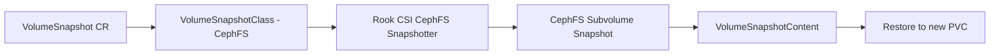

# How to Configure Snapshot Class for CephFS in Rook

Author: [nawazdhandala](https://www.github.com/nawazdhandala)

Tags: Rook, Ceph, Kubernetes, CephFS, Snapshot, VolumeSnapshotClass

Description: Configure a VolumeSnapshotClass for Rook-Ceph CephFS volumes to enable Kubernetes-native snapshots of shared filesystem PVCs.

---

`VolumeSnapshotClass` for CephFS enables Kubernetes-native snapshot operations on `ReadWriteMany` PVCs backed by CephFS subvolumes. Unlike RBD snapshots, CephFS snapshots are directory-level and are performed using the Ceph subvolume snapshot feature.

## Architecture



## Prerequisites

- Kubernetes snapshot CRDs and snapshot controller installed
- Rook CSI CephFS driver with snapshotter sidecar
- CephFS `CephFilesystem` deployed

## Install Snapshot CRDs and Controller

```bash
# Install snapshot CRDs
kubectl apply -f https://raw.githubusercontent.com/kubernetes-csi/external-snapshotter/v6.3.0/client/config/crd/snapshot.storage.k8s.io_volumesnapshotclasses.yaml
kubectl apply -f https://raw.githubusercontent.com/kubernetes-csi/external-snapshotter/v6.3.0/client/config/crd/snapshot.storage.k8s.io_volumesnapshotcontents.yaml
kubectl apply -f https://raw.githubusercontent.com/kubernetes-csi/external-snapshotter/v6.3.0/client/config/crd/snapshot.storage.k8s.io_volumesnapshots.yaml

# Install snapshot controller
kubectl apply -f https://raw.githubusercontent.com/kubernetes-csi/external-snapshotter/v6.3.0/deploy/kubernetes/snapshot-controller/rbac-snapshot-controller.yaml
kubectl apply -f https://raw.githubusercontent.com/kubernetes-csi/external-snapshotter/v6.3.0/deploy/kubernetes/snapshot-controller/setup-snapshot-controller.yaml

# Verify
kubectl get pods -n kube-system -l app=snapshot-controller
```

## Create VolumeSnapshotClass for CephFS

```yaml
apiVersion: snapshot.storage.k8s.io/v1
kind: VolumeSnapshotClass
metadata:
  name: csi-cephfsplugin-snapclass
  annotations:
    snapshot.storage.kubernetes.io/is-default-class: "false"
driver: rook-ceph.cephfs.csi.ceph.com
deletionPolicy: Delete
parameters:
  clusterID: rook-ceph
  csi.storage.k8s.io/snapshotter-secret-name: rook-csi-cephfs-provisioner
  csi.storage.k8s.io/snapshotter-secret-namespace: rook-ceph
```

Apply:

```bash
kubectl apply -f volumesnapshotclass-cephfs.yaml
kubectl get volumesnapshotclass
```

## Retain Policy Snapshot Class

For snapshots that should persist after the `VolumeSnapshot` object is deleted:

```yaml
apiVersion: snapshot.storage.k8s.io/v1
kind: VolumeSnapshotClass
metadata:
  name: csi-cephfsplugin-snapclass-retain
driver: rook-ceph.cephfs.csi.ceph.com
deletionPolicy: Retain
parameters:
  clusterID: rook-ceph
  csi.storage.k8s.io/snapshotter-secret-name: rook-csi-cephfs-provisioner
  csi.storage.k8s.io/snapshotter-secret-namespace: rook-ceph
```

## Create a CephFS VolumeSnapshot

```yaml
apiVersion: snapshot.storage.k8s.io/v1
kind: VolumeSnapshot
metadata:
  name: cephfs-snap
  namespace: default
spec:
  volumeSnapshotClassName: csi-cephfsplugin-snapclass
  source:
    persistentVolumeClaimName: shared-data    # must be a CephFS PVC
```

```bash
kubectl apply -f cephfs-snapshot.yaml
kubectl describe volumesnapshot cephfs-snap -n default
kubectl get volumesnapshotcontent
```

## Restore from Snapshot

```yaml
apiVersion: v1
kind: PersistentVolumeClaim
metadata:
  name: cephfs-restore
  namespace: default
spec:
  accessModes:
    - ReadWriteMany
  resources:
    requests:
      storage: 50Gi
  storageClassName: rook-cephfs
  dataSource:
    name: cephfs-snap
    kind: VolumeSnapshot
    apiGroup: snapshot.storage.k8s.io
```

## Verify Snapshots in Ceph

```bash
kubectl exec -n rook-ceph deploy/rook-ceph-tools -- bash

# List subvolumes and their snapshots
ceph fs subvolume ls myfs csi
ceph fs subvolume snapshot ls myfs <subvolume-name> csi

# Get snapshot info
ceph fs subvolume snapshot info myfs <subvolume-name> <snapshot-name> csi
```

## Schedule Regular Snapshots with CephBlockPool

While CephFS snapshot scheduling is typically managed via the Ceph snapshot scheduler or external tooling, you can also use VolumeSnapshotSchedule solutions:

```bash
kubectl exec -n rook-ceph deploy/rook-ceph-tools -- bash

# Enable snapshot scheduler module
ceph mgr module enable snap_schedule

# Schedule hourly snapshots for a CephFS path
ceph fs snap-schedule add / 1h --fs myfs
ceph fs snap-schedule retention add / h 24 --fs myfs   # keep 24 hourly snaps

# Check schedule
ceph fs snap-schedule list --fs myfs
```

## Troubleshooting

```bash
# Check CSI provisioner pods for snapshotter sidecar
kubectl get pods -n rook-ceph -l app=csi-cephfsplugin-provisioner

# Check snapshotter logs
kubectl logs -n rook-ceph deploy/csi-cephfsplugin-provisioner \
  -c csi-snapshotter

# Check VolumeSnapshotContent for errors
kubectl describe volumesnapshotcontent <name>
```

## Summary

The `VolumeSnapshotClass` for CephFS in Rook uses the `rook-ceph.cephfs.csi.ceph.com` driver to create subvolume-level snapshots. This enables crash-consistent point-in-time backups of `ReadWriteMany` PVCs. Use `deletionPolicy: Retain` for long-lived backup snapshots and `Delete` for short-lived development snapshots.
