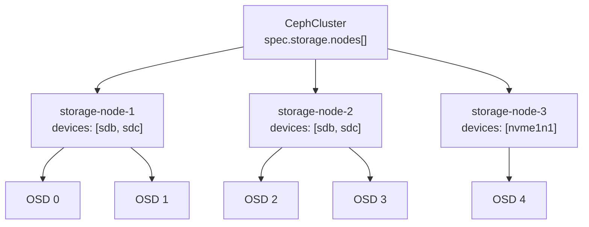

# How to Configure Specific Devices and Nodes for Rook-Ceph Storage

Author: [nawazdhandala](https://www.github.com/nawazdhandala)

Tags: Rook, Ceph, Kubernetes, Storage, OSD, Configuration

Description: Configure Rook-Ceph to provision OSDs on specific named nodes and devices using the nodes array, enabling precise control over storage topology and disk assignment.

---

## Why Specify Nodes and Devices Explicitly

Explicit node and device specification gives operators full control over which hardware contributes to the Ceph cluster. This prevents:

- Accidental OSD creation on OS or swap disks
- OSDs on nodes that should not run storage (control plane, GPU nodes)
- Unintended capacity additions when new nodes are added to the cluster



## Basic Node and Device Configuration

```yaml
apiVersion: ceph.rook.io/v1
kind: CephCluster
metadata:
  name: rook-ceph
  namespace: rook-ceph
spec:
  cephVersion:
    image: quay.io/ceph/ceph:v19.2.0
  dataDirHostPath: /var/lib/rook
  mon:
    count: 3
    allowMultiplePerNode: false
  storage:
    useAllNodes: false
    useAllDevices: false
    nodes:
      - name: storage-node-1
        devices:
          - name: sdb
          - name: sdc
      - name: storage-node-2
        devices:
          - name: sdb
          - name: sdc
      - name: storage-node-3
        devices:
          - name: sdb
          - name: sdc
```

The `name` field under `devices` is the kernel device name without `/dev/`.

## Using Full Device Paths

For devices identified by path rather than kernel name:

```yaml
    nodes:
      - name: storage-node-1
        devices:
          - name: /dev/disk/by-id/wwn-0x5000c500a1234567
          - name: /dev/disk/by-path/pci-0000:00:1f.2-ata-2
```

By-id and by-path names are stable across reboots, unlike kernel names (`sdb` may become `sdc` after a reboot if disk enumeration order changes).

## Per-Node Configuration Options

Each node in the `nodes` array supports individual configuration:

```yaml
    nodes:
      - name: storage-node-1
        devices:
          - name: nvme1n1
            config:
              deviceClass: nvme
          - name: nvme2n1
            config:
              deviceClass: nvme
      - name: storage-node-2
        devices:
          - name: sdb
            config:
              deviceClass: hdd
          - name: sdc
            config:
              deviceClass: hdd
```

`deviceClass` lets you assign OSDs to CRUSH device classes (nvme, ssd, hdd), enabling tiered storage pools that target specific device types.

## Metadata Device Configuration

Place OSD WAL and RocksDB on a faster device:

```yaml
    nodes:
      - name: storage-node-1
        devices:
          - name: sdb
            config:
              metadataDevice: nvme0n1p1
```

This places the OSD data on `sdb` (HDD) but WAL and RocksDB on the NVMe partition, significantly improving small-write performance.

## Per-Node Global Config

Apply configuration to all devices on a specific node:

```yaml
    nodes:
      - name: storage-node-1
        config:
          osdsPerDevice: "1"
          encryptedDevice: "true"
        devices:
          - name: sdb
          - name: sdc
```

`encryptedDevice: "true"` enables dm-crypt encryption for all OSDs on that node.

## Mixed Hardware Across Nodes

Different nodes can have different hardware:

```yaml
    nodes:
      - name: nvme-node-1
        devices:
          - name: nvme1n1
            config:
              deviceClass: nvme
          - name: nvme2n1
            config:
              deviceClass: nvme
      - name: sata-node-1
        devices:
          - name: sdb
            config:
              deviceClass: hdd
          - name: sdc
            config:
              deviceClass: hdd
          - name: sdd
            config:
              deviceClass: hdd
```

## Verifying Explicit Node and Device Selection

After deploying, confirm only the specified devices have OSDs:

```bash
kubectl -n rook-ceph exec -it deploy/rook-ceph-tools -- ceph osd tree
```

Check that no OSD is on a device not in your list:

```bash
kubectl -n rook-ceph get pods -l app=rook-ceph-osd -o wide
```

Inspect OSD pod environment variables to see which device it uses:

```bash
OSD_POD=$(kubectl -n rook-ceph get pods -l app=rook-ceph-osd -o name | head -1)
kubectl -n rook-ceph exec $OSD_POD -- env | grep -E "ROOK_OSD_ID|ROOK_BLOCK_PATH"
```

## Adding a New Node

To add a new storage node after initial deployment, add it to the `nodes` array and re-apply:

```yaml
    nodes:
      - name: storage-node-1
        devices:
          - name: sdb
      # ... existing nodes ...
      - name: storage-node-4   # new node
        devices:
          - name: sdb
          - name: sdc
```

```bash
kubectl apply -f cluster.yaml
```

Rook detects the new node and provisions OSDs automatically.

## Summary

Explicit node and device specification in the CephCluster `storage.nodes` array is the safest and most predictable configuration for production Rook-Ceph deployments. List each storage node by name and specify exactly which block devices (by kernel name or stable by-id/by-path symlinks) should become OSDs. Use per-device `config.deviceClass` to enable tiered storage and `config.metadataDevice` to boost OSD performance with a fast metadata disk. Add new nodes by appending to the array and re-applying the manifest.
